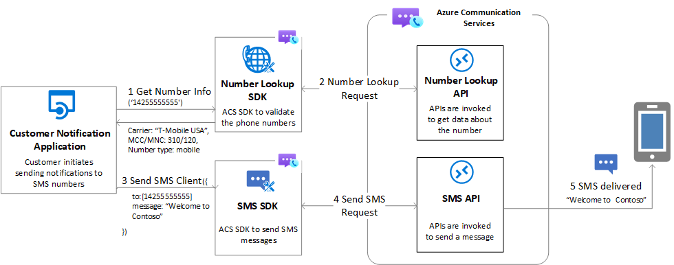

# Number Lookup overview

[!INCLUDE [Private Preview Notice](../../includes/public-preview-include.md)]

Azure Communication Services Number Lookup enables you to retrieve insights and look up a specific phone number. It's part of the Phone Numbers SDK and can be used to support customer service scenarios, appointment reminders, two-factor authentication, and other real-time communication needs. Azure Communication Services Number Lookup enables you to reliably retrieve number insights before engaging with end-users.

## Number Lookup features

Key features of Azure Communication Services Number Lookup include:

- **Simple:** Our API is easy to integrate with your application. We provide detailed documentation to guide you through the process. Our team of experts is always available to assist you.

- **High accuracy:** We gather data from the most reliable suppliers to ensure that you receive accurate data. Our data is updated regularly to guarantee the highest quality possible.

- **High velocity:** Our API delivers fast and accurate data, even when dealing with high volumes of data. The API is optimized for speed and performance to ensure you always receive the information you need quickly and reliably.

- **Number format:** Developers can validate national and international phone number formats to increase call or message completion.

- **Number capability check:** Our API provides the associated number type to help determine if an SMS can be sent to a particular number. This helps avoid frustrating attempts to send messages to numbers that aren't SMS capable.

- **Carrier details:** We provide information about the country or region of destination and carrier information which helps to estimate potential costs and find alternative messaging methods (such as sending an email).

## Value Proposition

Benefits of providing this solution to Azure Communication Services customers include:

- **Reduce Cost:** Optimize your communication expenses by sending messages only to phone numbers that are SMS-ready.

- **Increase efficiency:** Better target customers based on subscribers’ data (name, type, location, and so on). Choose the best communication channel to choose based on status. For example, use SMS or email while a customer is roaming instead of a phone call.

## Key Use Cases

- **Validate the number format before placing a call or sending a message:** Validate national and international phone number format.

- **Validate the number can receive the SMS before you send it:** Check if a number has SMS capabilities and decide if you need to use a different communication channel.

   *Contoso bank collected the phone numbers of the people who are interested in their services. Contoso wants to send an invite to register for a promotional offer. Before sending the link regarding the offer, Contoso checks whether SMS is a possible channel for each customer-provided number. Checking for SMS capability saves time and money by not sending SMS messages to non mobile numbers.*

- **Estimate the total cost of an SMS campaign before you launch it:** Get the current carrier of the target number and compare that with the list of known carrier surcharges.

   *Contoso, a marketing company, wants to launch a large SMS campaign to promote a product. Contoso checks the current carrier details for the different target numbers with this campaign to estimate the cost based on Azure Communication Services pricing.*

## Pricing

| Request | Price per API query |
| --- | --- |
| Get number format | Free |
| Get number format, type, and carrier details, per phone number. | $0.005 |

## Next steps

> [!div class="nextstepaction"]
> [Get started with Number Lookup API](../../quickstarts/telephony/number-lookup.md)

## Related articles

- Familiarize yourself with the [Number Lookup SDK](../numbers/number-lookup-sdk.md)
