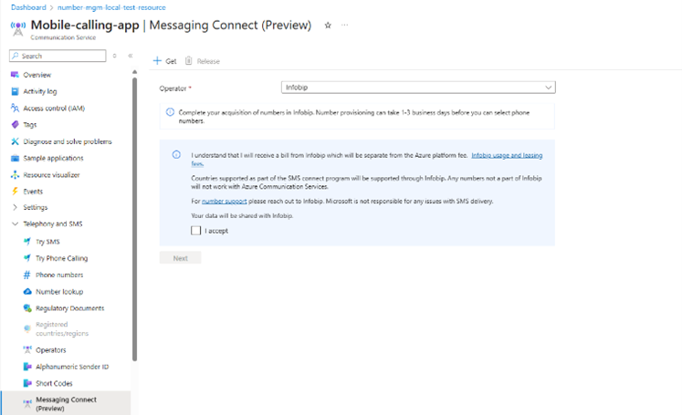

# Messaging Connect

[!INCLUDE [Public Preview Disclaimer](../../includes/public-preview-include.md)]

## Introduction

Welcome to Messaging Connect—the new way to deliver Short Message Service (SMS) globally with Azure Communication Services.

This isn't just a new feature—it represents a major evolution in the  platform's approach to global messaging. Messaging Connect is a partner-powered model that dramatically expands Azure’s messaging reach while preserving everything developers love about ACS: unified APIs, strong observability, and deep integration across Microsoft services.

With Messaging Connect, you don’t need to build and maintain separate integrations with providers around the world. Instead, you connect once through Azure Communication Services to access global SMS coverage via trusted partners. Number leasing and compliance are handled through the partner, but everything else—messaging, observability, and AI workflows—stays in your Azure environment, where you already build, monitor, and scale.

This model offers the best of both worlds. You get global coverage, local compliance, and faster provisioning—without giving up the rich analytics, developer experience, and integration surface that Microsoft delivers. Whether you're sending appointment reminders, booking confirmations, or intelligent Copilot prompts, Messaging Connect turns Azure into the central nervous system for SMS engagement at scale.

This is Microsoft’s approach to global messaging—smart, scalable, and ready for what’s next.

## Conceptual Overview

Messaging Connect gives you a way to bring global SMS into your applications using Azure Communication Services.

If you’ve worked with messaging before, you know it can be complex: different regulations in every region, separate vendors for different markets, and fragmented delivery infrastructure that’s hard to monitor. For that, we are bringing partners and experts in the field who will help you navigate through it. With Messaging Connect, you lease numbers directly from one of our trusted messaging partners and use them through Azure Communication Services (ACS) as if they were native ACS numbers.

The process starts in the Azure portal. When you search for an SMS number type and country, and ACS doesn’t offer direct provisioning, you’ll be guided to connect with a pre-integrated partner. From there, you’re redirected to the partner’s portal to purchase the number. Depending on the country and sender type, you may need to complete registration steps, submit documentation, or wait for approval. Once the partner assigns the number to you, they initiate the sync to Azure. You then return to the Azure portal, where the numbers will appear—ready to use.

:::image type="content" source="./media/mc-provision-concept.png" alt-text="Messaging Connect number provisioning flow in Azure." lightbox="./media/mc-provision-concept.png":::


You can send and receive SMS using the standard ACS SMS APIs. When you send messages, you’ll authenticate with ACS as usual and include a key from your Messaging Connect partner at runtime so we can route your traffic appropriately. Message delivery is handled by the partner, but observability—like delivery receipts, diagnostics, and logging—remains in Azure, alongside your other services.

This model works well in real-world scenarios. For example, if you're a logistics company needing local sender IDs in Brazil and India, Azure Communication Services via Messaging Connect helps you acquire them through a partner and use them via a single Azure Communication Services SMS SDK (software development kit). If you're building an AI-powered appointment assistant with Copilot Studio, you can use Messaging Connect numbers to send reminders in markets where ACS doesn’t provide direct coverage. If you're managing bookings, alerts, or re-engagement campaigns across dozens of countries, you can use Messaging Connect to reach users globally—while keeping control and insight inside Azure.

:::image type="content" source="./media/mc-runtime-concept.png" alt-text="Runtime architecture using Messaging Connect and ACS API."lightbox="./media/mc-runtime-concept.png":::

### Capabilities

The following table summarizes capabilities available when using Messaging Connect during Public Preview. Some capabilities are provided directly by Azure, others by Messaging Connect partners.

| Capability                          | Supported |
|------------------------------------|-----------|
| Long Codes                         |    ✔️     |
| Dynamic Alphanumeric Sender ID     |    ✔️     |
| Short Codes                        |    ❌     |
| Pre-Registered Alpha Sender ID     |    ❌     |
| Two-way messaging                  |    ✔️     |
| One-way messaging                  |    ✔️     |
| 1:1 (single recipient)             |    ✔️     |
| 1:N (bulk messaging)               |    ✔️     |
| Coverage in 190+ countries         |    ✔️     |
| Delivery Reports (DLRs)            |    ✔️     |
| Event Grid for inbound messages    |    ✔️     |
| Partner-managed Opt Out            |    ✔️     |
| ACS-level blocking (via partner)   |    ✔️     |
| Local regulatory enforcement       |    ✔️     |
| C# SDK                             |    ✔️     |
| JavaScript SDK                     |    ✔️     |
| Python SDK                         |    ❌     |
| Java SDK                           |    ❌     |
| Supported partners                 | Infobip (additional partners coming soon) |
| Automatic Country Sender selection (partner-managed)   | Infobip ✔️  |

> **Note**: Future updates will include support for more SDKs, sender types, and additional partners.

### Authentication: Secure Access with Azure Identity

To send messages through Messaging Connect, your application must authenticate with Azure Communication Services (ACS) using one of the supported identity models. This step verifies that your app has permission to send messages through your ACS resource and ensures your messages are associated with the correct Azure subscription.

ACS supports the following authentication methods:

- Access Key Authentication (Connection strings)
- Microsoft Entra ID Authentication

You’ll authenticate with ACS the same way you would for any other SMS request. Messaging Connect does not change the way authentication works at the platform level—it simply adds a partner-based routing step after your message is validated.

Learn more: [Authenticate to Azure Communication Services](https://learn.microsoft.com/azure/communication-services/concepts/authentication)

Once authenticated, your application also includes a partner API key at runtime to route the message through the correct Messaging Connect partner. This is part of the message payload and is explained further in the next section.

### How Messaging Connect Validates Your Requests 

Before a message can be sent using Messaging Connect, Azure checks that your request contains the necessary routing information and is correctly authenticated. To do this, your payload must include specific metadata that identifies the Messaging Connect partner and allows ACS to route the message through their infrastructure.

#### Required Payload Format

When you send a message using a Messaging Connect number, your request must include a `messagingConnect` object. This object contains the API key provided by the Messaging Connect partner (e.g., Infobip) and the partner’s name. Azure uses this information to authorize the request and determine how to route the message.

```json
{
  "from": "+447700900123",
  "to": ["+14155550100"],
  "message": "Hello from Messaging Connect!",
  "options": {
    "messagingConnect": {
      "apiKey": "your-partner-api-key",
      "partner": "[PARTNER NAME]"
    }
  }
}
```
The `messagingConnect` object is required whenever you use a number provisioned through Messaging Connect. If it’s missing or misconfigured, your message will not be accepted.
Once this metadata is included, Azure performs validation checks in two stages: first, immediately upon receiving your request, and later, after it’s submitted to the partner.

##### 1. Synchronous Validation
This is the first layer of validation, and it happens the moment your message request is received. If something is missing or invalid—such as the partner name, the API key, or the association between the number and your ACS resource—you’ll receive an immediate error response. This prevents messages from being sent incorrectly or routed to the wrong provider.
Common validation outcomes:

| Scenario                                                    | Response                                                                 |
|-------------------------------------------------------------|--------------------------------------------------------------------------|
| Missing `messagingConnect` fields                           | 400 Bad Request with validation details                                  |
| Unauthorized sender number                                  | 401 Unauthorized                                                         |
| Missing `messagingConnect` for Messaging Connect phone number | 400 Bad Request – “MessagingConnect option hasn't been provided.”       |
| Partner mismatch                                            | 400 Bad Request – “MessagingConnect option is not matching with the number information.” |


These errors are returned synchronously in your API response and will also appear in Azure diagnostics and logs.

##### 2. Asynchronous Delivery Errors

If your request passes synchronous validation, it’s not guaranteed to be handed off to the Messaging Connect partner. There are scenarios where ACS will stop the message before handoff—for example, if the recipient has previously opted out or if there’s a known delivery block from the partner. These situations still result in a delivery report, so you’re always informed of the message outcome.
Once a message is passed to the partner, any downstream delivery failures—like number unreachable, expired validity period, or carrier-level rejection—are also returned asynchronously via delivery reports. You can view delivery statuses in:

- Azure delivery reports <- Event Grid events (if configured)

Learn more: [Delivery Reports on Azure Event Grid Events](https://learn.microsoft.com/azure/event-grid/communication-services-telephony-sms-events)

> [!TIP] 
> To ensure full visibility into your message traffic, we strongly recommend configuring event subscriptions for delivery reports. This allows you to monitor message status, troubleshoot failures, and integrate with your existing telemetry systems.
Learn how to configure SMS events : [Handle SMS events](https://learn.microsoft.com/azure/communication-services/quickstarts/sms/handle-sms-events) 

> [!NOTE]
> If your message fails, check the `messagingConnect` object for accuracy, review the delivery report, and consult partner documentation for downstream error codes.

> [!IMPORTANT]
> Microsoft does not retain any credentials used to access external Messaging Connect partners. Partner API keys are used solely for the purpose of processing an individual message request and are immediately discarded once the request is completed. These credentials are not stored, logged, or persisted in any form.

### Country Availability

Messaging Connect significantly expands the number of countries you can reach with Azure Communication Services—supporting over 190 countries through our global partner network.
During Public Preview, you can acquire and use two types of sender identities from the Messaging Connect Partner:

- Long Codes – Standard local phone numbers or mobile numbers that support two-way SMS. Often known as Virtual Long codes. 
- Dynamic Alphanumeric Sender IDs – One-way, branded senders (e.g., “CONTOSO”) where permitted. You can enable DASID only in non-ACS supported countries.

When you search for a country and number type in the Azure portal, you’ll be offered Messaging Connect as an option if ACS doesn’t support that configuration directly. You’ll then complete the provisioning process through the partner’s portal.

🌐 Country availability is determined by the Messaging Connect partner. The number types, compliance requirements, and onboarding steps vary by country and are handled entirely by the Messaging Connect partner (e.g., Infobip).

📌 Short codes are not yet supported in Public Preview but are planned for General Availability.

### Global Access with Secure and Compliant Messaging

Messaging Connect is built for global use—whether you're operating from Asia, Africa, South America, or the European Union. This section explains how data flows across regions, how privacy is maintained, and how Azure ensures compliance with residency requirements.

#### 1. Message Routing and Data Flow

Messaging Connect separates message delivery (handled by the partner) from processing and observability (handled by Azure). Here’s how it works:

- Outbound messages: You send an SMS using the ACS API and include partner routing info via `messagingConnect` object. Azure logs the message, performs validation, and then routes it to the selected Messaging Connect partner.
- Inbound messages: The partner receives the SMS and forwards it to Azure’s infrastructure. From there, it’s handled just like messages sent to ACS-native numbers—events through Event Grid.

Although the partner handles delivery, Azure provides:

- Delivery receipts and observability- 
- Standard ACS APIs and SDKs
- Transient message processing only—no message content is stored

Azure Communication Services does not retain SMS message content after delivery or failure. Messages and metadata are processed temporarily in memory only as needed for routing and diagnostics.

> [!IMPORTANT]
> Microsoft does not retain any credentials used to access external Messaging Connect partners. Partner API keys are used solely for the purpose of processing an individual message request and are immediately discarded once the request is completed. These credentials are not stored, logged, or persisted in any form.

Learn more: [Data residency and user privacy](https://learn.microsoft.com/azure/communication-services/concepts/privacy#sms)

#### 2. EU Data Boundary (EUDB)

Azure Communication Services guarantees that SMS data within the EUDB is stored in EUDB regions. As of today, we process and store data in the Netherlands, Ireland, or Switzerland regions, ensuring no unauthorized data transfer outside the EEA (European Economic Area). Also, Azure Communication Services employs advanced security measures, including encryption, to protect SMS data both at rest and in transit. Customers can select their preferred data residency within the EUDB, making sure data remains within the designated EU regions.

Learn more: [European Union Data Boundary (EUDB)](https://learn.microsoft.com/azure/communication-services/concepts/european-union-data-boundary#sms)

#### 3.Using Messaging Connect from Anywhere

Messaging Connect is designed for global use. Once you’ve acquired a number through a Messaging Connect partner, you can integrate it into your application using ACS APIs—regardless of where your application is hosted.
That said, some countries may enforce local telecom regulations on how numbers are used, what types of content can be sent, or whether traffic must originate from specific regions. These requirements are handled by the Messaging Connect partner during the number provisioning process.
Delivery routes are optimized by the partner, not by Azure. Messages may be routed through local or regional routing infrastructure, depending on the number type, country regulations, and the Messaging Connect partner account configuration. 

### Opt-out Management

Opt-out and opt-in compliance is a critical part of SMS messaging, particularly in regulated markets. With Messaging Connect, this responsibility is shared between you (the customer), the partner (e.g., Infobip), and Microsoft, each playing a distinct role.

#### Key Responsibilities

- The partner (e.g., Infobip) supports detection of opt-out and opt-in keywords like “STOP” or “START,” but the behavior is not automatic.
These keywords must be explicitly configured by you through the partner's portal.
Infobip can maintain a blocklist of opted-out users, but clients are expected to manage their own list—especially if opt-outs happen through other channels (e.g., email or web forms).
- Confirmation messages such as “You have been unsubscribed” are not sent by default. If desired, you must configure them explicitly with the partner or implement them in your own application.
- You, the customer, are responsible for ensuring your messaging experience complies with local regulations, including opt-out handling, keyword configuration, and end-user consent management.
- ACS does not process opt-out keywords or send any automated responses. However, Microsoft does maintain a set of predefined opt-out keywords for observability.

#### What ACS Does

By default, ACS detects standard Opt-in/out keywords: START and UNSTOP are recognized as Opt-In triggers, while STOP, ARRET, QUIT, END, REVOKE, OPT OUT, CANCEL, and UNSUBSCRIBE are recognized as Opt-out commands. When an incoming message matches one of these keywords exactly, ACS automatically processes the request and update the user’s opt-in status in our database accordingly.

### Pricing and Billing

Messaging Connect uses a dual-fee model to separate Microsoft’s platform usage from the partner’s delivery and leasing services.

#### 1. What You Pay Microsoft

You pay a platform fee to use Azure Communication Services APIs and infrastructure for Messaging Connect. This covers message processing, diagnostics, delivery tracking, and API-level observability.

- $0.0025 per message segment submitted to ACS — This is a platform fee charged for each SMS send request, whether or not the message is ultimately delivered by the partner. Microsoft does not charge for delivery. 
- This fee is MACC (Microsoft Azure Consumption Commitment)-eligible and appears as part of your normal Azure invoice.

Microsoft does not handle the message delivery itself—this is done by the Messaging Connect partner. 

#### 2. What You Pay the Partner

You pay the Messaging Connect partner directly for:

- Phone number leasing (monthly or annually)
- Per-message delivery fees, which vary by country and route

The partner defines commercial terms and support levels. By default, delivery and number leasing fees are billed to you directly by the Messaging Connect partner (e.g., Infobip). These charges do not appear on your Azure invoice unless you explicitly set up Marketplace billing.
There are no subscription restrictions. You can use Messaging Connect with any Azure subscription type, including Pay-as-you-go and Enterprise Agreements. Unlike Microsoft's legacy direct SMS offers, Messaging Connect is not a telecom service—it's a developer platform model.

#### Optional: Consolidated Billing via Azure Marketplace

If you prefer to consolidate charges into your Azure invoice, you can request that the partner offer Messaging Connect through the Azure Marketplace.
Here’s how the Marketplace flow works:
1.	You ask the partner (e.g., Infobip) for a private offer.
2.	Your Azure administrator accepts the offer in the Azure portal.
3.	Each month, the partner sends usage data to Microsoft.
4.	Microsoft bills you on behalf of the partner (a pass-through charge).

This setup simplifies procurement and allows Messaging Connect usage to count toward your Azure MACC commitment.

Learn more: [Azure Marketplace](https://learn.microsoft.com/marketplace/azure-marketplace-overview)

> [!TIP] 
> Whether you choose Partner or Marketplace billing, the technical experience in Azure remains exactly the same.

## Developer Experience

### Get a Phone Number with Messaging Connect

Messaging Connect introduces a new provisioning model: instead of getting numbers directly from Microsoft, you acquire them through a trusted partner—starting with Infobip—and then connect them to your Azure Communication Services (ACS) resource.
This process lets you access SMS numbers in over 190 countries while the partner handles local compliance, documentation, and approval flows. 

Let's go step-by-step:

#### STEP 1: Search for a number in the Azure portal

Go to your Communication Services resource and search for a phone number by country and type. If that configuration isn’t available through ACS directly, you’ll be offered the option to use Messaging Connect. Click on it and select a partner. You’ll be redirected to the partner’s portal.

:::image type="content" source="./media/mc-provision-number-1.png" alt-text="Search for a number in the Azure portal." lightbox="./media/mc-provision-number-1.png":::

Or you can go directly to the Messaging Connect blade and choose a partner from the list. You’ll be redirected to the partner’s website to complete the number acquisition.

<table>
  <tr>
    <td>
      
    </td>
    <td>
      
    </td>
  </tr>
</table>


#### STEP 2: Acquire the number on the partner’s portal

Follow the partner’s prompts to purchase the number. Depending on the country, you may need to upload supporting documents or complete identity verification. Once approved, the number is assigned to your partner account.

:::image type="content" source="./media/mc-provision-number-4.png" alt-text="Partner assigns number and syncs with ACS." lightbox="./media/mc-provision-number-4.png":::

#### STEP 3: Return to Azure and accept terms

After acquiring the number, come back to the Azure portal. You'll need to accept the Messaging Connect terms.

:::image type="content" source="./media/mc-provision-number-5.png" alt-text="Accept Messaging Connect terms in Azure." lightbox="./media/mc-provision-number-5.png":::

#### STEP 4: Number are available in Azure Portal

After the partner assigns the numbers to you, they initiate the sync with ACS. Once the sync is complete, the numbers will automatically appear in your ACS resource—ready to use with the ACS SMS API, just like any number provisioned directly through Azure. No additional setup is required on your end.

:::image type="content" source="./media/mc-provision-number-6.png" alt-text="Provisioned numbers appear in ACS." lightbox="./media/mc-provision-number-6.png":::

> [!NOTE]
> The approval and activation timeline is determined by the Messaging Connect partner and varies by country and number type. Messaging Connect does not currently support instant provisioning, and Microsoft is not involved in the vetting or approval process.

**Important notes:**
- Microsoft does not manage compliance or vetting for Messaging Connect numbers. This is handled entirely by the partner.
- Each partner has different provisioning flows and service-level agreements (SLAs) depending on the region and local telecom regulations.
- Numbers acquired through Messaging Connect will appear in the Azure portal with a “Operator Name” label so you can distinguish them from ACS-managed numbers.
- To send messages with these numbers, don’t forget to include the `MessagingConnect` object in your API request. 


### SMS SDK Tutorial 

Messaging Connect uses the same SMS APIs and SDKs as the rest of Azure Communication Services. If you've already followed the [Send SMS Quickstart](https://learn.microsoft.com/azure/communication-services/quickstarts/sms/send?tabs=linux&pivots=programming-language-csharp), you're already 90% of the way there. Make sure to use the ‘Send SMS with options’ method.

There’s no separate SDK or client for Messaging Connect. You authenticate, create your `SmsClient`, and call the send method just as you would for any other ACS number. The only difference is that your request must include a `MessagingConnect` object in the options field when you're using a number provisioned through Messaging Connect.

> [!IMPORTANT]
> These are the API and SDK versions supported during the Messaging Connect Public Preview:
>
> - **API version:** `2025-05-29-preview`
> - **JavaScript SDK:** [`1.2.0-beta.4`](https://github.com/Azure/azure-sdk-for-js/blob/main/sdk/communication/communication-sms/CHANGELOG.md)
> - **.NET SDK:** [`1.1.0-beta.3`](https://github.com/Azure/azure-sdk-for-net/blob/main/sdk/communication/Azure.Communication.Sms/CHANGELOG.md)


This object contains:
- The partner name (e.g., "infobip")
- The partner API key you received after acquiring the number

Your ACS token continues to authorize the request to Azure, and the partner key tells Azure how to route the message.
Below are example snippets for C# and JavaScript showing how to send a message with Messaging Connect.

**C# Example**

```csharp
smsClient.Send(
    from: "<YOUR-ACS-NUMBER>",
    to: ["<RECIPIENT-NUMBER>"],
    message: $"Hello from Azure Communication Services!",
    options: new SmsSendOptions(true)
    {
        MessagingConnect = new MessagingConnectOptions("<YOUR-INFOBIP-API-KEY>", "infobip")
    });
```

**JavaScript Example**

```javascript
await smsClient.send(
    {
      from: "<YOUR-ACS-NUMBER>",
      to: ["<RECIPIENT-NUMBER>"],
      message: "Hello from Azure Communication Services! JS SDK is working!",
    },
    {
        enableDeliveryReport: true, // Optional: Enable delivery reports
        messagingConnect: {
          apiKey: "<YOUR-INFOBIP-API-KEY>",
          partner: "infobip"
      }
  });
```

> [!TIP]
> If you're using a Messaging Connect number but don’t include the `messagingConnect` object, the request will fail with a validation error. For a list of possible validation errors and responses, [jump to the validation outcomes table](#1-synchronous-validation).

**SMS Error Codes**

When you send SMS messages through Messaging Connect, you may encounter error codes—either as part of synchronous validation (immediate API response) or in asynchronous delivery reports.
Azure Communication Services uses the same error model across all SMS traffic, including Messaging Connect.

Learn more: [See full list of SMS error codes](https://learn.microsoft.com/azure/communication-services/resources/troubleshooting/voice-video-calling/troubleshooting-codes?pivots=sms#sms-error-codes)

## Messaging Connect Partner Directory

Messaging Connect works through direct integrations with trusted global SMS providers. These partners handle number provisioning, compliance, delivery, and opt-out enforcement—while Azure provides the developer platform, observability, and message orchestration.
Below is the list of currently supported partners. More partners will be added over time to provide broader coverage and redundancy.

| Partner | Brief Description | Country/region availability | Pricing |
|---------|-------------------|-----------------------------|---------|
| Infobip | Global communications platform with direct carrier connections in over 70 countries. Infobip supports all sender types including short codes, long codes (virtual long codes or VLNs), and alphanumeric (alphas). [More info](https://www.infobip.com/docs/sms/get-started/senders-and-numbers) | One-way messaging is available for virtually all networks in all countries and territories. Two-way messaging is supported in over 100 countries. [Country coverage](https://www.infobip.com/docs/essentials/getting-started/sms-coverage-and-connectivity) | Infobip offers a flexible pay-as-you-go pricing model for SMS. [View rates](https://www.infobip.com/sms/pricing). For custom pricing, [contact sales](https://www.infobip.com/contact). |


> [!IMPORTANT]
> Messaging Connect partners are selected based on global reach, regulatory expertise, reliability, and strong integration with Microsoft’s ecosystem.


