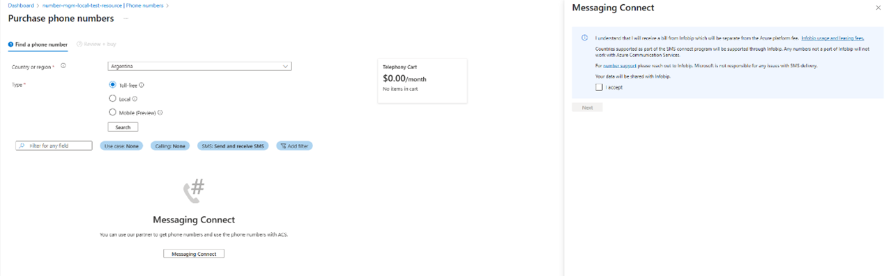
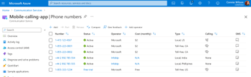

# Messaging Connect

[!INCLUDE [Public Preview Disclaimer](../../includes/public-preview-include.md)]

## Introduction

Welcome to Messaging Connect—the new way to deliver SMS globally with Azure Communication Services.

This is not just a new feature. This is a platform evolution. Messaging Connect is a partner-powered model that dramatically expands Azure’s messaging reach while preserving everything developers love about ACS: unified APIs, strong observability, and deep integration across Microsoft services.

With Messaging Connect, you don’t need to build and maintain separate integrations with providers around the world. Instead, you connect once through Azure Communication Services to access global SMS coverage via trusted partners. Number leasing and compliance are handled through the partner, but everything else—messaging, observability, and AI workflows—stays in your Azure environment, where you already build, monitor, and scale.

This model offers the best of both worlds. You get global coverage, local compliance, and faster provisioning—without giving up the rich analytics, developer experience, and integration surface that Microsoft delivers. Whether you're sending appointment reminders, booking confirmations, or intelligent Copilot prompts, Messaging Connect turns Azure into the central nervous system for SMS engagement at scale.

This is global messaging the Microsoft way—smart, scalable, and ready for what’s next.

## Conceptual Overview

Messaging Connect gives you a way to bring global SMS into your applications using Azure Communication Services.

If you’ve worked with messaging before, you know how complex it can get: different regulations in every region, separate vendors for different markets, and fragmented delivery infrastructure that’s hard to monitor. For that, we are bringing partners and experts in the field who will help you navigate through it. With Messaging Connect, you lease numbers directly from one of our trusted messaging partners and use them through Azure Communication Services (ACS) as if they were native ACS numbers.

The process starts in the Azure portal. When you search for an SMS number type and country, and ACS doesn’t offer direct provisioning, you’ll be guided to connect with a pre-integrated partner. From there, you’re redirected to the partner’s portal to purchase the number. Depending on the country and sender type, you may need to complete registration steps, submit documentation, or wait for approval. Once the partner assigns the number to you, they initiate the sync to Azure. You then return to the Azure portal, where the numbers will appear—ready to use.

:::image type="content" source="./media/mc-provision-concept.png" alt-text="Messaging Connect number provisioning flow in Azure." lightbox="./media/mc-provision-concept.png":::

You can send and receive SMS using the standard ACS SMS APIs. When you send messages, you’ll authenticate with ACS as usual and include a key from your Messaging Connect partner at runtime so we can route your traffic appropriately. Message delivery is handled by the partner, but observability—like delivery receipts, diagnostics, and logging—remains in Azure, alongside your other services.

This model works well in real-world scenarios. For example, if you're a logistics company needing local sender IDs in Brazil and India, Azure Communication Services via Messaging Connect helps you acquire them through a partner and use them via a single Azure Communication Services SMS SDK. If you're building an AI-powered appointment assistant with Copilot Studio, you can use Messaging Connect numbers to send reminders in markets where ACS doesn’t provide direct coverage. If you're managing bookings, alerts, or re-engagement campaigns across dozens of countries, you can use Messaging Connect to reach users globally—while keeping control and insight inside Azure.

:::image type="content" source="./media/mc-runtime-concept.png" alt-text="Runtime architecture using Messaging Connect and ACS API."lightbox="./media/mc-runtime-concept.png":::

### Capabilities

The following table summarizes capabilities available when using Messaging Connect during Public Preview. Some capabilities are provided directly by Azure, others by Messaging Connect partners.

| Capability                          | Supported |
|------------------------------------|-----------|
| Long Codes                         |    ✔️     |
| Dynamic Alphanumeric Sender ID     |    ✔️     |
| Short Codes                        |    ❌     |
| Pre-Registered Alpha Sender ID     |    ❌     |
| Two-way messaging                  |    ✔️     |
| One-way messaging                  |    ✔️     |
| 1:1 (single recipient)             |    ✔️     |
| 1:N (bulk messaging)               |    ✔️     |
| Coverage in 190+ countries         |    ✔️     |
| Delivery Reports (DLRs)            |    ✔️     |
| Event Grid for inbound messages    |    ✔️     |
| Partner-managed Opt Out            |    ✔️     |
| ACS-level blocking (via partner)   |    ✔️     |
| Local regulatory enforcement       |    ✔️     |
| C# SDK                             |    ✔️     |
| JavaScript SDK                     |    ✔️     |
| Python SDK                         |    ❌     |
| Java SDK                           |    ❌     |
| Supported partners                 | Infobip (additional partners coming soon) |
| Automatic Country Sender selection (partner-managed)   | Infobip ✔️  |

> **Note**: Future updates will include support for more SDKs, sender types, and additional partners.

  
  
  
  
  
  
