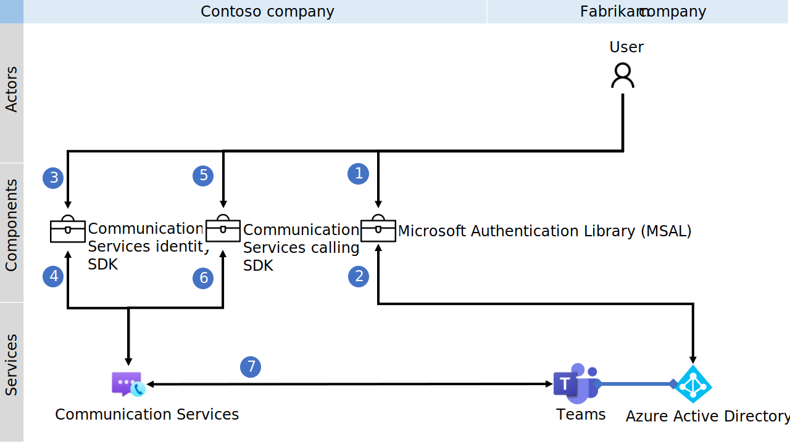
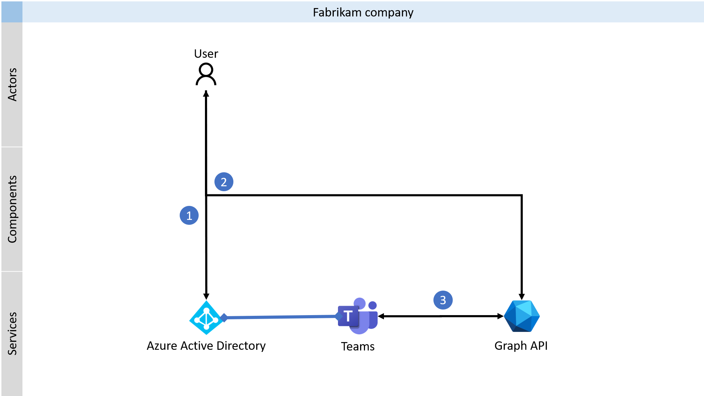

# Communication as a Microsoft 365 user

You can use Azure Communication Services and Graph API to integrate communication as Microsoft 365 users into your products. Microsoft 365 users can communicate with other people in and outside their organization. The benefits for enterprises are:
- No requirement to download Teams desktop, mobile or web clients for Teams users
- Teams users don't lose context by switching between applications for day-to-day work and Teams client for communication
- Teams is a single source for chat messages and call history within the organization
- Teams policies control communication across applications

The benefits of using API surface for developers are:
- Browser support on mobile devices
- User interface (UI) customization
- No additional Teams licenses are required
- Tenants bring policies and configurations inside your app without extra work

You can also use Graph API to implement [chat](/graph/api/resources/chat) and [calling](/graph/api/resources/call) capabilities on the server side. This article concentrates on the client experience.

## Use cases
Here are real-world examples of applications:
- Independent software vendor (ISV) builds a customer service web application for receptionists to route calls within an organization. Receptionists in multiple organizations use this product tailored for their needs to route calls to subject matter experts (SMEs) within the organization.
- Manufacturer of augmented reality headset adds video calling capability into the product to enable remote assistance with subject matter experts joining via Teams clients. Teams user sees an incoming call from a frontline worker that shares the augmented reality and provides guidance directly from Teams client.
- Independent software vendor (ISV) builds an application for customer outreach via multiple channels. ISV adds Teams chat and calling capabilities into their product to enable communication with enterprise users directly from their application. 
- Bank has decided to replace their limited Teams application for wealth management with direct integration of calling as Teams user into their existing wealth management application. This application now integrates calling capability as part of the process instead of incorporating processes inside the Teams client.

## Prototyping
Developers can experiment with the capabilities on multiple levels to evaluate, learn and customize the product. Low/no-code options are currently in development. 

### Single-click deployment

The [Azure Communication Services Authentication Hero Sample](../samples/trusted-auth-sample.md) demonstrates how developers can use Azure Communication Services Identity SDK to get access tokens as Teams users. You can clone the GitHub repository and follow a simple guide to set up your service for authentication in Azure.

The calling and chat hero sample for Teams users is currently in development.

### Coding

Communication as Teams user leverages Graph API for chat and Azure Communication Services for calling. In each case, you need to authenticate the Teams user and then implement the logic for communication. 

The diagrams in the next sections demonstrate multi-tenant use cases where the fictional company Fabrikam is the customer of the fictional company Contoso. Contoso builds multi-tenant SaaS product that Fabrikam's administrator purchases for its employees. 

#### Calling

Voice, video, and screen-sharing capabilities are provided via [Azure Communication Services Calling SDKs](./interop/teams-user-calling.md). The following diagram shows an overview of the process you'll follow as you integrate your calling experiences with Azure Communication Services support Teams identities. 

You can use the Azure Communication Services Identity SDK to exchange Microsoft Entra access tokens of Teams users for Communication Identity access tokens. 

The following articles will guide you in implementing the calling for Teams users:
- [Authenticate as Teams user](../quickstarts/manage-teams-identity.md) 
- [Add video calling as Teams user to your client app](../quickstarts/voice-video-calling/get-started-with-voice-video-calling-custom-teams-client.md)
- [How-to use calling SDK as Teams user](../how-tos/cte-calling-sdk/manage-calls.md)

#### Chat

Use Graph API to integrate 1:1 chat, group chat, meeting chat, and channel capabilities into your product. 

The following articles will guide you in implementing the chat for Teams users:
- [Authenticate as Teams user](/graph/auth-v2-user) 
- [Send message as Teams user](/graph/api/chat-post-messages)
- [Receive message as Teams user on webhook](/graph/teams-changenotifications-chatMessage) and then push message to the client with, for example, [SignalR](../../azure-signalr/signalr-overview.md).
- [Poll messages for Teams user](/graph/api/chat-list-messages)

## Supported use cases

The following table show supported use cases for Teams users with Azure Communication Services and Graph API:

| Scenario | Supported |
| --- | --- |
| Make a voice-over-IP (VoIP) call to Teams user | ✔️ |
| Make a phone (PSTN) call | ✔️ |
| Accept incoming voice-over-IP (VoIP) call for Teams user | ✔️ |
| Accept incoming phone (PSTN) for Teams user | ✔️ |
| Join Teams meeting | ✔️ |
| Join channel Teams meeting | ✔️ |
| Join Teams webinar [1] | ✔️ |
| [Join Teams live events](/microsoftteams/teams-live-events/what-are-teams-live-events).| ❌ |
| Join [Teams meeting scheduled in an application for personal use](https://www.microsoft.com/microsoft-teams/teams-for-home) | ❌ |
| Join Teams 1:1 or group call | ❌ |
| Send a message to 1:1 chat, group chat or Teams meeting chat| ✔️ |
| Get messages from 1:1 chat, group chat or Teams meeting chat | ✔️ |

- [1] Teams users may join a Teams webinar. However, the presenter and attendee roles aren't honored for Teams users. Thus Teams users on Azure Communication Services SDKs could perform actions not intended for attendees, such as screen sharing, turning their camera on/off, or unmuting themselves if your application provides UX for those actions.

## Pricing
Teams users can join the Teams meeting experience, manage calls, and manage chats via existing Teams desktop, mobile, and web clients or Graph API without additional charge. Teams users using Azure Communication Services SDKs will pay
[standard Azure Communication Services consumption](https://azure.microsoft.com/pricing/details/communication-services/) for audio and video. There's no additional fee for the interoperability capability itself. You can find more details on [Teams interoperability pricing here](./pricing/teams-interop-pricing.md).

## Next steps

> [!div class="nextstepaction"]
> [Check use cases for communication as a Teams user](./interop/custom-teams-endpoint-use-cases.md)

Find more details in the following articles:
- [Teams interoperability](./teams-interop.md)
- [Issue a Teams access token](../quickstarts/manage-teams-identity.md)
- [Start a call to Teams user as a Microsoft 365 user](../quickstarts/voice-video-calling/get-started-with-voice-video-calling-custom-teams-client.md)
