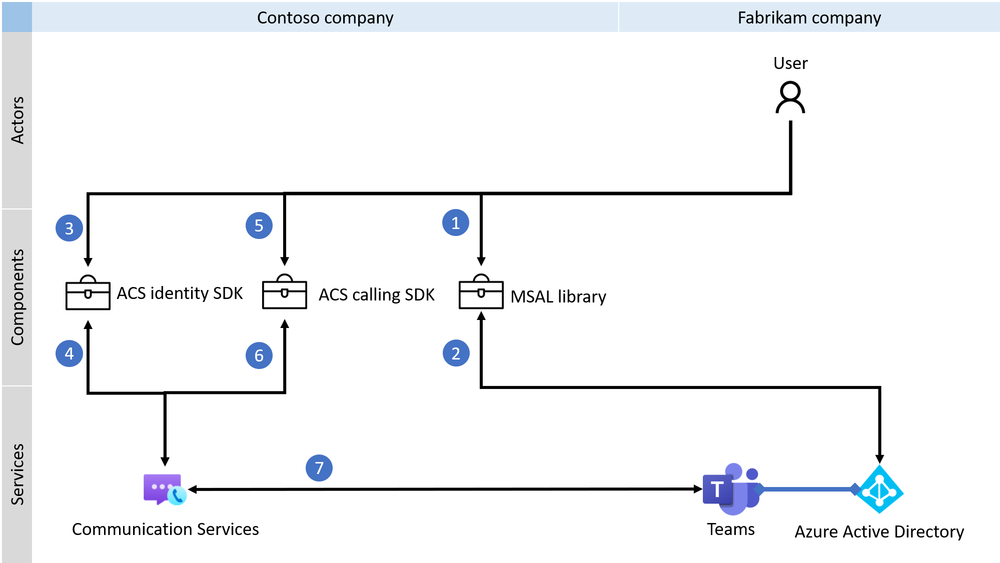
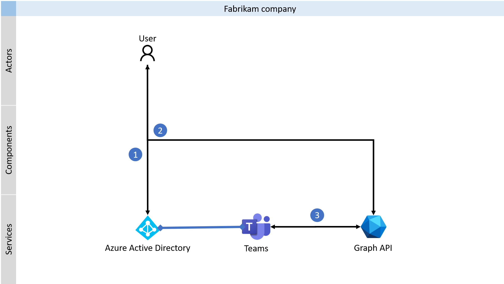

> [!IMPORTANT]
> To enable/disable custom Teams endpoint experience, complete [this form](https://forms.office.com/r/B8p5KqCH19).

# Custom Teams endpoint

Communication Services can be used to build custom Teams endpoint. With ACS SDKs you can customize voice, video, chat, and screen sharing experience for Teams users. Custom Teams endpoint can communicate with Microsoft Teams client or another custom Teams endpoints. 

Developers can use ACS Identity SDK to exchange AAD user tokens for Teams' access tokens. Voice, video, and screen sharing capabilities are provided via ACS Calling SDKs. Following diagram shows overview of the process to integrate calling experience.

*Note: Following diagram shows multitenant use case, where company Fabrikam is customer of company Contoso.*

Chat capability is available via Graph APIs. Communication Services isn't required to use chat. You can learn more about Graph API in [the documentation](https://docs.microsoft.com/graph/api/channel-post-messages). 

*Note: Following diagram shows multitenant use case, where company Fabrikam is customer of company Contoso.*

## Next steps

> [!div class="nextstepaction"]
> [Issue Teams access token](../quickstarts/manage-teams-identity.md)

The following documents may be interesting to you:

- Learn more about [calling with Teams identities](../quickstarts/voice-video-calling/get-started-with-calling-from-teams-identities.md)
- Learn about [Teams interoperability](./teams-interop.md)