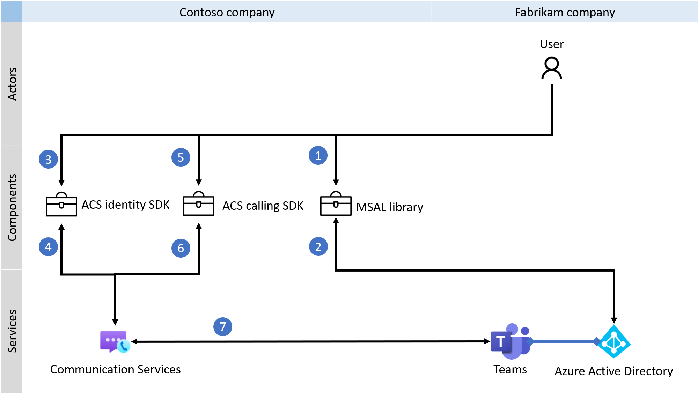

# Custom Teams endpoint

> [!IMPORTANT]
> To enable/disable the custom Teams endpoint experience, complete [this form](https://forms.office.com/r/B8p5KqCH19).

Azure Communication Services can be used to build custom Teams endpoints to communicate with the Microsoft Teams client or other custom Teams endpoints. With custom Teams endpoint you can customize voice, video, chat, and screen sharing experience for Teams users.

You can use the Azure Communication Services Identity SDK to exchange AAD user tokens for Teams' access tokens. In the following diagrams, is demonstrated multitenant use case, where Fabrikam is customer of the company Contoso.

## Calling 

Voice, video, and screen sharing capabilities are provided via Azure Communication Services Calling SDKs. The following diagram shows an overview of the process you'll follow as you integrate your calling experiences with custom Teams endpoints.

## Chat

You can also use custom Teams endpoints to optionally integrate chat capabilities using Graph APIs. Learn more about Graph API in [the documentation](https://docs.microsoft.com/graph/api/channel-post-messages). 

## Next steps

> [!div class="nextstepaction"]
> [Issue Teams access token](../quickstarts/manage-teams-identity.md)

The following documents may be interesting to you:

- Learn about [Teams interoperability](./teams-interop.md)
