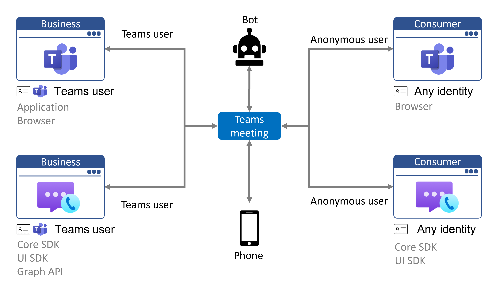
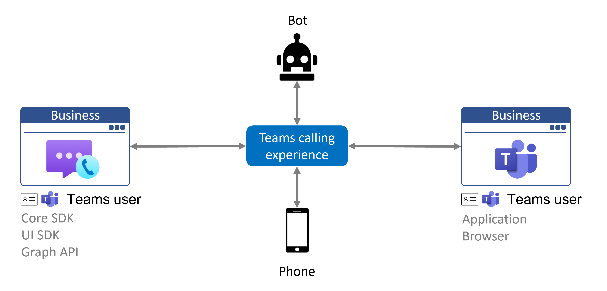

# Teams interoperability

> [!IMPORTANT]
> BYOI interoperability is in public preview and available to all Communication Services applications and Teams organizations.
>
> Microsoft 365 authenticated interoperability is in private preview, and restricted using service controls to Azure Communication Services early adopters. To join early access program, complete [this form](https://forms.office.com/Pages/ResponsePage.aspx?id=v4j5cvGGr0GRqy180BHbR8MfnD7fOYZEompFbYDoD4JUMkdYT0xKUUJLR001ODdQRk1ITTdOMlRZNSQlQCN0PWcu).
>
> Preview APIs and SDKs are provided without a service-level agreement, and are not recommended for production workloads. Certain features might not be supported or might have constrained capabilities. For more information, see [Supplemental Terms of Use for Microsoft Azure Previews](https://azure.microsoft.com/support/legal/preview-supplemental-terms/).

Azure Communication Services can be used to build custom applications that interact with Microsoft Teams. End users of your Communication Services application can interact with Teams participants over voice, video, chat, and screen sharing. The following video demonstrates this capability:

 
 

> [!VIDEO https://www.microsoft.com/en-us/videoplayer/embed/RWGTqQ]

Azure Communication Services supports two types of Teams interoperability depending on the identity of the end user:

- **Bring your own identity.** You control user authentication and users of your custom applications don't need to have Azure Active Directory identities or Teams licenses to join Teams meetings. Teams treats your application as anonymous external user.
- **Microsoft 365 Teams identity.** Your application acts on behalf of an end user's Microsoft 365 identity and their Teams configured resources. These authenticated applications can make calls and join meetings seamlessly on behalf of Microsoft 365 users.

Applications can implement both authentication schemes and leave the choice of authentication up to the end user.

## Overview

There are two ways that users can access the Teams calling experience:

1. Via Teams clients as **Teams users**. This includes the desktop, mobile, and web Teams clients. 
2. Via your application's web experience as **Teams anonymous users**. 

Teams anonymous users don't have to be Teams users. Azure Communication Services allows you to build and customize new Teams calling endpoints for both Teams users and Teams anonymous users. You can use the Communication Services calling SDK and user interface library for customization and integration into any existing application or product. The following diagram demonstrates how a Teams meeting can be joined from multiple endpoints:

Endpoint based on Azure Communication Services client libraries with Teams identity acts as Teams user with Teams client. Teams user can besides joining Teams meetings also start a call to another Teams user, receive a phone call from a phone number or transfer an ongoing call to Teams call queue. The connectivity of the Communication Services endpoint with Teams identity is shown on the diagram below.

## Bring your own identity

Bring your own identity (BYOI) is the common model for using Azure Communication Services and Teams interoperability. It supports any identity provider and authentication scheme. The first scenario that has been enabled allows your application to join Microsoft Teams meetings, and Teams will treat these users as anonymous external accounts, the same as users that join using the Teams anonymous web application. This is ideal for business-to-consumer applications that bring together employees (familiar with Teams) and external users (using a custom application experience) into a meeting experience. In the future we will be enabling additional scenarios including direct calling and chat which will allow your application to initiate calls and chats with Teams users outside the context of a Teams meeting.

The ability for Communication Services users to join Teams meetings as anonymous users is controlled by the existing "allow anonymous meeting join" configuration, which also controls the existing Teams anonymous meeting join.  This setting can be updated in the Teams admin center (https://admin.teams.microsoft.com/meetings/settings) or with the Teams PowerShell cmdlet Set-CsTeamsMeetingConfiguration (https://docs.microsoft.com/powershell/module/skype/set-csteamsmeetingconfiguration). As with Teams anonymous meeting join, your application must have the meeting link to join, which can be retrieved via the Graph API or from the calendar in Microsoft Teams.  The name of Communication Services users displayed in Teams is configurable via the Communication Services Calling SDK.

External users will be able to use core audio, video, screen sharing, and chat functionality via Azure Communication Services SDKs. Features such as raised hand, together mode, and breakout rooms will only be available for Teams users. Communication Services users can send and receive messages only while present in the Teams meeting and if the meeting is not scheduled for a channel.

Your custom application should consider user authentication and other security measures to protect Teams meetings. Be mindful of the security implications of enabling anonymous users to join meetings, and use the [Teams security guide](/microsoftteams/teams-security-guide#addressing-threats-to-teams-meetings) to configure capabilities available to anonymous users.

Additional information on required dataflows for joining Teams meetings is available at the [client and server architecture page](client-and-server-architecture.md). The [Group Calling Hero Sample](../samples/calling-hero-sample.md) provides example code for joining a Teams meeting from a web application.

## Microsoft 365 Teams identity
The Azure Communication Services Calling SDK can be used with Microsoft 365 Teams identities to support Teams-like experiences for Teams interoperability. Microsoft 365 Teams identities are provided and authenticated by Azure Active Directory. Your app can make or accept calls with a regular Microsoft 365 identity. All attributes and details about the user are bound to the Azure Active Directory user.

This identity model is ideal for use cases where a custom user interface is needed, where the Teams client is not available for your platform, or where the Teams client does not support a sufficient level of customization. For example, an application can be used to answer phone calls on behalf of the end user's Teams provisioned PSTN number and have a user interface optimized for a receptionist or call center business process.  

Calling and screen sharing functionality is available via the Communication Services Calling SDK. Calling management is available via Graph API, configuration in the Teams client or Teams Admin Portal. Chat functionality is available via Graph API.

Teams users are authenticated via the MSAL library against Azure Active Directory in the client application. Authentication tokens are exchanged for Microsoft 365 Teams token via the Communication Services Identity SDK. You are encouraged to implement an exchange of tokens in your backend services as exchange requests are signed by credentials for Azure Communication Services. In your backend services, you can require any additional authentication.

To learn more about the functionality, join our TAP program for early access by completing [this form](https://forms.office.com/Pages/ResponsePage.aspx?id=v4j5cvGGr0GRqy180BHbR8MfnD7fOYZEompFbYDoD4JUMkdYT0xKUUJLR001ODdQRk1ITTdOMlRZNSQlQCN0PWcu).

## Comparison

|Criteria|Bring your own identity| Microsoft 365 Teams identity|
|---|---|---|
|Applicable| In business-to-consumer scenarios for consumer applications | In business-to-business or business-to-consumer scenarios on business applications |
|Identity provider|Any|Azure Active Directory|
|Authentication & authorization|Custom*| Azure Active Directory and custom*|
|Calling available via | Communication Services Calling SDKs | Communication Services Calling SDKs |
|Chat available via | Communication Services Chat SDKs | Graph API |
|PSTN support| outbound voice call, outbound direct routing, [details](./telephony-sms/telephony-concept.md) | inbound call assigned to Teams identity, outbound call using calling plan|

\* Server logic issuing access tokens can perform any custom authentication and authorization of the request.

## Privacy
Interoperability between Azure Communication Services and Microsoft Teams enables your applications and users to participate in Teams calls, meetings, and chat. It is your responsibility to ensure that the users of your application are notified when recording or transcription are enabled in a Teams call or meeting.

Microsoft will indicate to you via the Azure Communication Services API that recording or transcription has commenced and you must communicate this fact, in real time, to your users within your application’s user interface. You agree to indemnify Microsoft for all costs and damages incurred as a result of your failure to comply with this obligation.

## Pricing
All usage of Azure Communication Service APIs and SDKs increments [Azure Communication Service billing meters](https://azure.microsoft.com/pricing/details/communication-services/). Interactions with Microsoft Teams, such as joining a meeting or initiating a phone call using a Teams allocated number, will increment these meters but there is no additional fee for the Teams interoperability capability itself, and there is no pricing distinction between the BYOI and Microsoft 365 authentication options.

If your Azure application has an end user spend 10 minutes in a meeting with a user of Microsoft Teams, those two users combined consumed 20 calling minutes. The 10 minutes exercised through the custom application and using Azure APIs and SDKs will be billed to your resource. However the 10 minutes consumed by the end user in the native Teams application is covered by the applicable Teams license and is not metered by Azure.

## Teams in Government Clouds (GCC)
Azure Communication Services interoperability isn't compatible with Teams deployments using [Microsoft 365 government clouds (GCC)](/MicrosoftTeams/plan-for-government-gcc) at this time.

## Next steps

> [!div class="nextstepaction"]
> [Join a BYOI calling app to a Teams meeting](../quickstarts/voice-video-calling/get-started-teams-interop.md)
> [Authenticate Microsoft 365 users](../quickstarts/manage-teams-identity.md)
