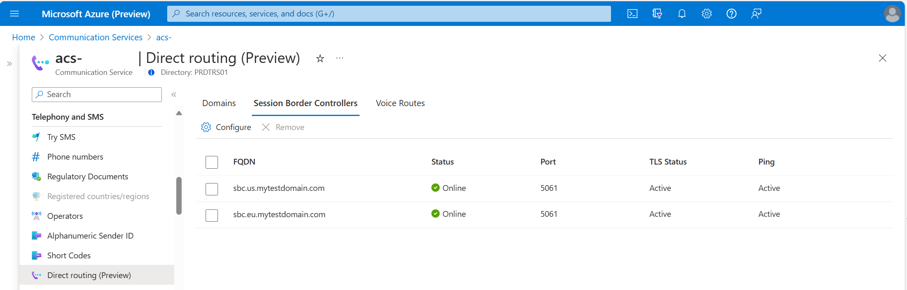

# Use direct routing to connect to existing telephony service
Azure Communication Services direct routing enables you to connect your existing telephony infrastructure to Azure. The article lists the high-level steps required for connecting a supported Session Border Controller (SBC) to direct routing and how voice routing works for the enabled Communication resource. 
 
For information about whether Azure Communication Services direct routing is the right solution for your organization, see [Azure telephony concepts](./telephony-concept.md). For information about prerequisites and planning your deployment, see [Communication Services direct routing infrastructure requirements](./direct-routing-infrastructure.md).

## Connect the SBC with Azure Communication Services

### Validate domain ownership
Follow [these instructions](../../how-tos/telephony/domain-validation.md) to validate a domain ownership of your SBC

## Configure outbound voice routing 
Refer to [Voice routing quickstart](../../quickstarts/telephony/voice-routing-sdk-config.md) to add an SBC and configure outbound voice routing rules.

## Session Border Controller connection status

The health of an SBC connection now exposed in Azure portal. It takes in account Transport Layer Security (TLS) status and SIP OPTIONS. 

   

### Possible values of each health indicator

TLS Status - Status of the TLS connections of a Trunk: 
- Unknown - Indicates an unknown status. 
- Active - Indicates that TLS connection is established. 
- CertExpiring - Indicates that SBC certificate is expiring. 
- CertExpired - Indicates that SBC certificate is expired. 

SIP OPTIONS (Ping) - Status of SIP OPTIONS messages exchange: 
- Unknown - Indicates an unknown status. 
- Active - Indicates that OPTIONS are being sent and received. 
- Expired - Indicates that status is expired. 
- Error - Indicates an error in OPTIONS exchange.  

Status - The overall health status of a Trunk: 
- Unknown - Indicates an unknown health status. 
- Online - Indicates that SBC connection is healthy. 
- Warning - Indicates TLS or Ping is expired. 

> [!IMPORTANT]
> Before placing or receiving calls, make sure that SBC status is *Online*

## Outbound voice routing considerations

Azure Communication Services direct routing has a routing mechanism that allows a call to be sent to a specific SBC based on the called number pattern.

When you add a direct routing configuration to a resource, all calls made from this resource’s instances (identities) try a direct routing trunk first. The routing is based on a dialed number and a match in voice routes configured for the resource. 

- If there's a match, the call goes through the direct routing trunk. 
- If there's no match, the next step is to process the `alternateCallerId` parameter of the `callAgent.startCall` method. 
- If the resource is enabled for Voice Calling (PSTN) and has at least one number purchased from Microsoft, the `alternateCallerId` is checked. 
- If the `alternateCallerId` matches a purchased number for the resource, the call is routed through the Voice Calling (PSTN) using Microsoft infrastructure. 
- If `alternateCallerId` parameter doesn't match any of the purchased numbers, the call fails. 

The diagram demonstrates the Azure Communication Services voice routing logic.

:::image type="content" source="../media/direct-routing-provisioning/voice-routing-diagram.png" alt-text="Diagram of outgoing voice routing flowchart.":::

## Voice routing examples
The following examples display voice routing in a call flow.

> [!NOTE]
> In all examples, while the higher voice route has higher priority, the SBCs in a route are tried in random order.

### One route example:
If you created one voice route with a pattern `^\+1(425|206)(\d{7})$` and added `sbc1.contoso.biz` and `sbc2.contoso.biz` to it, then when the user makes a call to `+1 425 XXX XX XX` or `+1 206 XXX XX XX`, the call is first routed to SBC `sbc1.contoso.biz` or `sbc2.contoso.biz`. If neither SBC is available, the call is dropped.

### Two routes example:
If you created one voice route with a pattern `^\+1(425|206)(\d{7})$` and added `sbc1.contoso.biz` and `sbc2.contoso.biz` to it, and then created a second route with the same pattern with `sbc3.contoso.biz` and `sbc4.contoso.biz`. In this case, when the user makes a call to `+1 425 XXX XX XX` or `+1 206 XXX XX XX`, the call is first routed to SBC `sbc1.contoso.biz` or `sbc2.contoso.biz`. If both sbc1 and sbc2 are unavailable, the route with lower priority is tried (`sbc3.contoso.biz` and `sbc4.contoso.biz`). If none of the SBCs of the second route are available, the call is dropped.

### Three routes example:
If you created one voice route with a pattern `^\+1(425|206)(\d{7})$` and added `sbc1.contoso.biz` and `sbc2.contoso.biz` to it, and then created a second route with the same pattern with `sbc3.contoso.biz` and `sbc4.contoso.biz`, and created a third route with `^+1(\d[10])$` with `sbc5.contoso.biz`. In this case, when the user makes a call to `+1 425 XXX XX XX` or `+1 206 XXX XX XX`, the call is first routed to SBC `sbc1.contoso.biz` or `sbc2.contoso.biz`. If both sbc1 nor sbc2 are unavailable, the route with lower priority is tried (`sbc3.contoso.biz` and `sbc4.contoso.biz`). If none of the SBCs of a second route are available, the third route is tried. If sbc5 is also not available, the call is dropped. Also, if a user dials `+1 321 XXX XX XX`, the call goes to `sbc5.contoso.biz`, and it isn't available, the call is dropped.

> [!NOTE]
> Failover to the next SBC in voice routing works only for response codes 408, 503, and 504.

> [!NOTE]
> In all the examples, if the dialed number does not match the pattern, the call will be dropped unless there is a purchased number exist for the communication resource, and this number was used as `alternateCallerId` in the application. 

## Managing inbound calls
For general inbound call management use [Call Automation SDKs](../call-automation/incoming-call-notification.md) to build an application that listens for and manage inbound calls placed to a phone number or received via ACS direct routing. 
Omnichannel for Customer Service customers, refer to [these instructions](/dynamics365/customer-service/voice-channel-inbound-calling).

## Next steps

### Conceptual documentation

- [Session Border Controllers certified for Azure Communication Services direct routing](./certified-session-border-controllers.md)
- [Call Automation overview](../call-automation/call-automation.md)
- [Pricing](../pricing.md)

### Quickstarts

- [Outbound call to a phone number](../../quickstarts/telephony/pstn-call.md)
- [Redirect inbound telephony calls with Call Automation](../../quickstarts/call-automation/redirect-inbound-telephony-calls.md)
