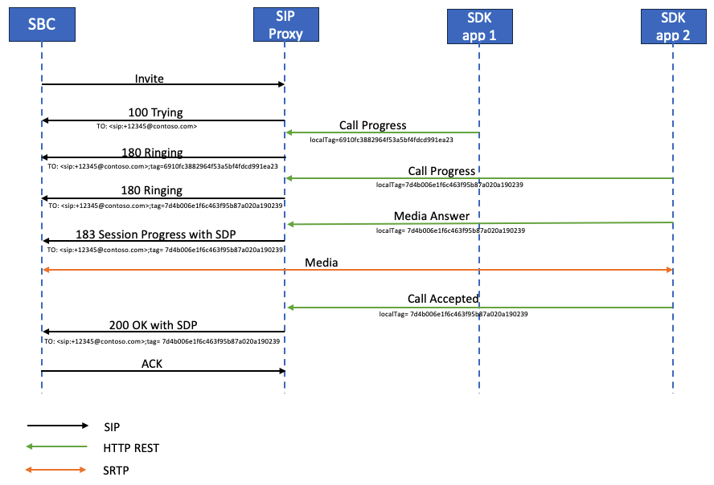
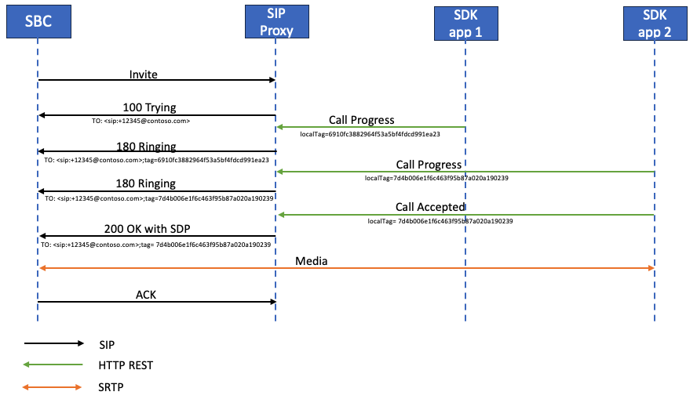
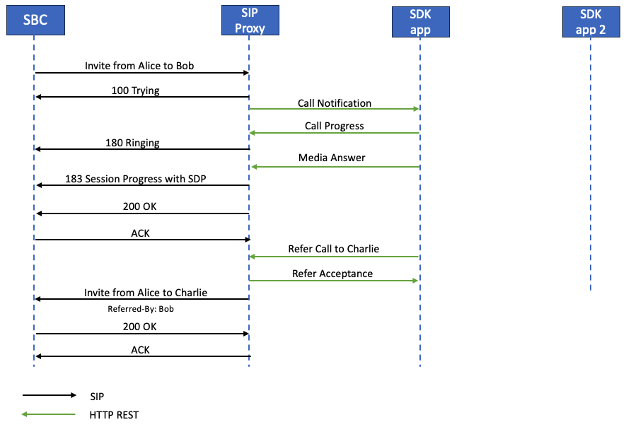
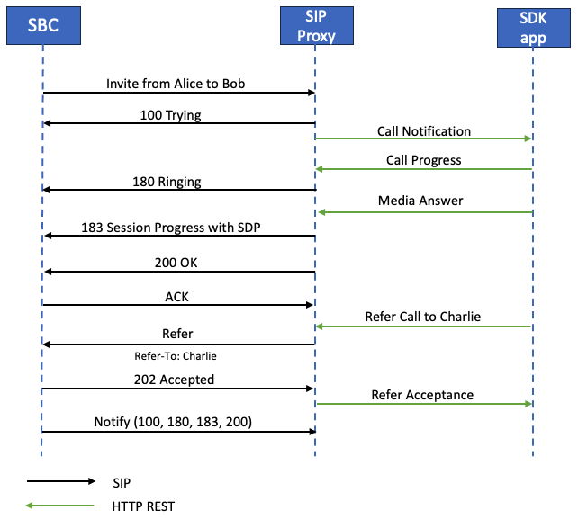

# Azure Communication Services direct routing: SIP protocol details

This article describes how direct routing implements the Session Initiation Protocol (SIP) to ensure proper traffic routes between a Session Border Controller (SBC) and the SIP proxy. It also highlights the importance of certain SIP parameters that require specific values. This article is intended for voice administrators who are responsible for configuring the connection between the SBC and the SIP proxy service.

## Processing the incoming request: finding the Communication Services resource

  > [!NOTE]
  > In Azure Communication Services direct routing SIP OPTIONS are enabled by default and cannot be disabled. SBC must initiate the OPTIONS exchange first, as SIP Proxy waits for SBC to start the exchange.

Before an incoming or outbound call can be processed, OPTIONS messages are exchanged between SIP Proxy and the SBC. These OPTIONS messages allow SIP Proxy to provide the allowed capabilities to SBC. It's important for OPTIONS negotiation to be successful (200 OK response), allowing for further communication between SBC and SIP Proxy for establishing calls. The SIP headers in an OPTIONS messages to SIP Proxy are provided as an example:

| Parameter name | Example of the value | 
| :---------------------  |:---------------------- |
| Request-URI | OPTIONS sip:sip.pstnhub.microsoft.com:5061 SIP /2.0 |
| Via Header | Via: SIP/2.0/TLS sbc1.contoso.com:5061;alias;branch=z9hG4bKac2121518978 | 
| Max-Forwards header | Max-Forwards:68 |
| From Header | From Header From: <sip:sbc1.contoso.com:5061> |
| To Header | To: <sip:sip.pstnhub.microsoft.com:5061> |
| CSeq header | CSeq: 1 INVITE | 
| Contact Header | Contact: <sip:sbc1.contoso.com:5061;transport=tls> |

> [!NOTE]
> The SIP headers do not contain userinfo in the SIP URI in use. As per [RFC 3261, section 19.1.1](https://tools.ietf.org/html/rfc3261#section-19.1.1), the userinfo part of a URI is optional and may be absent when the destination host does not have a notion of users or when the host itself is the resource being identified. If the @ sign is present in a SIP URI, the user field must not be empty.
> Please note, that SIPS URI should not be used with direct routing as it is not supported.
> Check your Session Border Controller configuration and make sure that you are not using "Replaces" headers in SIP requests. Direct routing  will reject SIP requests that have Replaces headers defined.

On an incoming call, the SIP proxy needs to find the Azure Communication resource to which the call is destined. This section describes how the SIP proxy finds the resource, and performs authentication of the SBC on the incoming connection.

The example of the SIP Invite message on an incoming call:

| Parameter name | Example of the value | 
| :---------------------  |:---------------------- |
| Request-URI | INVITE sip:+54321@sip.pstnhub.microsoft.com SIP /2.0 |
| Via Header | Via: SIP/2.0/TLS sbc1.contoso.com:5061;alias;branch=z9hG4bKac2121518978 | 
| Max-Forwards header | Max-Forwards:68 |
| From Header | From Header From: <sip:+12345@sbc1.contoso.com;transport=udp;tag=1c68821811 |
| To Header | To: sip:+54321@sbc1.contoso.com | 
| CSeq header | CSeq: 1 INVITE | 
| Contact Header | Contact: <sip:+12345@sbc1.contoso.com:5061;transport=tls> | 

On receiving the invite, the SIP proxy performs the following steps:

1. Check the certificate. On the initial connection, the direct routing service takes the FQDN name presented in the Contact header and matches it to the Common Name or Subject Alternative name of the presented certificate. The SBC name must match one of the following options:

   - Option 1. The full FQDN name presented in the Contact header must match the Common Name/Subject Alternative Name of the presented certificate.  

   - Option 2. The domain portion of the FQDN name presented in the Contact header (for example contoso.com of the FQDN name sbc1.contoso.com) must match the wildcard value in Common Name/Subject Alternative Name (for example *.contoso.com).

1. Try to find a Microsoft 365 tenant using the full FQDN name presented in the Contact header.  

   Check if the FQDN name from the Contact header (sbc1.contoso.com) is registered as a DNS name in any Microsoft 365 or Office 365 organization. If found, the lookup of the user is performed in the tenant that has the SBC FQDN registered as a Domain name. If not found, Step 3 applies.

1. Try to find an Azure Communication resource using the full FQDN name presented in the Contact header.

   Check if the FQDN name from the Contact header (sbc1.contoso.com) is registered as an SBC FQDN in any Azure Communication resource. If found, call is sent to that resource. If not found, Step 4 applies.

1. Step 4 only applies if Steps 2 and 3 failed.

   Remove the host portion from the FQDN, presented in the Contact header (FQDN: sbc1.contoso.com, after removing the host portion: contoso.com), and check if this name is registered as a DNS name in any Microsoft 365 or Office 365 organization. If found, the user lookup is performed in this tenant. If not found, the call fails.

1. Step 5 only applies if Steps 2, 3, and 4 failed.

   Remove the host portion from the FQDN, presented in the Contact header (FQDN: sbc1.contoso.com, after removing the host portion: contoso.com), and check if this name is registered as an SBC FQDN in any Azure Communication resource. If found, call is sent to that resource. If not found, the call fails.

1. If the resource has a Dynamics Omnichannel deployment associated, perform the lookup of the phone number presented in the Request-URI. Match the presented phone number to an Omnichannel user (queue) found on the previous step.

1. Step 7 only applies if Steps 6 failed.
   
    In case no Omnichannel deployment exists for the Communication resource, or the number in Request-URI doesn't match any configured Omnichannel number, send call to an Event Grid.

1. Step 8 only applies if Steps 7 failed.
   
    If Event Grid isn't configured, or there's no rules to manage the incoming call, call is dropped.

### Detailed requirements for Contact header and Request-URI

#### Contact header

For all incoming SIP messages (OPTIONS, INVITE) to the Microsoft SIP proxy, the Contact header must have the paired SBC FQDN in the URI hostname as follows:

Syntax: Contact:  <sip:phone or sip address@FQDN of the SBC;transport=tls> 

As per [RFC 3261, section 11.1](https://tools.ietf.org/html/rfc3261#section-11.1), a Contact header field MAY be present in an OPTIONS message. In direct routing, the contact header is required. When it comes to OPTIONS messages, the userinfo can be excluded from the SIP URI and only the FQDN can be sent in the following format:  

Syntax: Contact:  <sip:FQDN of the SBC;transport=tls>

This name (FQDN) must also be in the Common Name or Subject Alternative name field(s) of the presented certificate. Microsoft supports using wildcard values of the name(s) in the Common Name or Subject Alternative Name fields of the certificate.
The support for wildcards is described in [RFC 2818, section 3.1](https://tools.ietf.org/html/rfc2818#section-3.1). Specifically:

*"Names may contain the wildcard character \*, which is considered to match any single domain name component or component fragment. For example, \*.a.com matches foo.a.com but not bar.foo.a.com. f\*.com matches foo.com but not bar.com."*

If more than one value in the Contact header presented in a SIP message by the SBC, only the FQDN portion of the first value of the Contact header is used.
As rule of thumb for direct routing, it's important that FQDN is used to populate SIP URI instead of IP. An incoming INVITE or OPTIONS message to SIP Proxy with Contact header where hostname is represented by IP and not FQDN, the connection is refused with 403 Forbidden.

#### Request-URI

For all incoming calls, the Request-URI is used to identify a callee.
Currently the phone number must contain a plus sign (+) as shown in the following example. 

```console
INVITE sip:+12345@sip.pstnhub.microsoft.com SIP /2.0
```

#### From header

For all incoming calls, the From Header is used to match the caller's phone number.

The phone number must contain a + as shown in the following example.

```console
From: <sip:+12345@sbc1.contoso.com;transport=udp;tag=1c68821811
```

## Contact and Record-Route headers considerations

The SIP proxy needs to calculate the next hop FQDN for new in-dialog client transactions (for example Bye or Re-Invite), and when replying to SIP OPTIONS. This can be done using either Contact or Record-Route.
According to [RFC 3261, section 8.1.1.8](https://tools.ietf.org/html/rfc3261#section-8.1.1.8), a Contact header is required in any request that can result in a new dialog. The Record-Route is only required if a proxy wants to stay on the path of future requests in a dialog.

To calculate the next hop, the SIP proxy uses:

- Priority 1. Top-level Record-Route. If the top-level Record-Route contains the FQDN name, the FQDN name is used to make the outbound in-dialog connection.

- Priority 2. Contact header. If Record-Route doesn't exist, the SIP proxy looks up the value of the Contact header to make the outbound connection. (Recommended configuration.)

If both Contact and Record-Route are used, the SBC administrator must keep their values identical, which causes administrative overhead.

### Use of FQDN name in Contact or Record-Route

Use of an IP address isn't supported in either Record-Route or Contact. The only supported option is an FQDN, which must match either the Common Name or Subject Alternative Name of the SBC certificate (wildcard values in the certificate are supported).

- If an IP address is presented in Record-route or Contact, the certificate check fails, and the call fails.

- If the FQDN doesn't match the value of the Common or Subject Alternative Name in the presented certificate, the call fails.

## Inbound call: SIP dialog description

Here are the details of how SIP Proxy processes inbound calls.


| Parameter name | Value |
| :---------------------  |:---------------------- |
| Media candidates in 183 and 200 messages coming from | Media processors |
| Number of 183 messages SBC can receive | One per session |
| Call can be with provisional answer (183) | Yes | 
| Call can be without provisional answer (183) | Yes |

An Azure Communication Services identity might be used in multiple endpoints (applications) at the same time. For example, web app, iPhone app, and Android app. Each endpoint might signal an HTTP rest as follows:

- Call progress – converted by the SIP proxy to the SIP message 180. On receiving message 180, the SBC must generate local ringing.

- Media answer – converted by the SIP proxy to message 183 with media candidates in Session Description Protocol (SDP). On receiving message 183, the SBC expects to connect to the media candidates received in the SDP message.

    > [!NOTE]
    > In some cases, the Media answer might not be generated, and the end point might answer with “Call Accepted” message.

- Call accepted – converted by the SIP proxy to SIP message 200 with SDP. On receiving message 200, the SBC is expected to send and receive media to and from the provided SDP candidates.

    > [!NOTE]
    > Direct routing does not support Delayed Offer Invite (Invite without SDP).

### Multiple endpoints ringing with provisional answer

1. On receiving the first Invite from the SBC, the SIP proxy sends the message "SIP SIP/2.0 100 Trying" and notifies all end user endpoints about the incoming call.

2. Upon notification, each endpoint starts ringing and sending "Call progress” messages to the SIP proxy. As the Azure Communication Services identity is used by multiple endpoints, the SIP proxy might receive multiple Call Progress messages.

3. For every Call Progress message received from the endpoints, the SIP proxy converts the Call Progress message to the SIP message "SIP SIP/2.0 180 Ringing". The interval for sending such messages correlates to the interval of the receiving messages from the Call Controller. In the following diagram, there are two 180 messages generated by the SIP proxy. These messages come from the two SDK endpoints. The endpoints each have a unique Tag ID.  Every message coming from a different endpoint is a separate session (the parameter “tag” in the “To” field is different). But an endpoint might not generate message 180 and send message 183 right away as shown in the following diagram.

4. Once an endpoint generates a Media Answer message with the IP addresses of endpoint’s media candidates, the SIP proxy converts the message received to a "SIP 183 Session Progress" message with the SDP from the endpoint replaced by the SDP from the Media Processor. In the following diagram, the endpoint from Fork 2 answered the call. The 183 SIP message is generated only once. The 183 might come on an existing fork or start a new one.

5. A Call Acceptance message is sent to the SIP Proxy with the final candidates of the endpoint that accepted the call. The Call Acceptance message is converted to SIP message 200.

   [](../media/direct-routing-sip-specification/multiple-endpoints-provisional-answer.png#lightbox)

### Multiple endpoints ringing without provisional answer

1. On receiving the first Invite from the SBC, the SIP proxy sends the message "SIP SIP/2.0 100 Trying" and notifies all end user endpoints about the incoming call. 

2. Upon notification, each endpoint starts ringing and sending the message "Call progress” to the SIP proxy. Because same Azure Communication Services identity can be used in multiple applications, the SIP proxy might receive multiple Call Progress messages.

3. For every Call Progress message received from the endpoints, the SIP proxy converts the Call Progress message to the SIP message "SIP SIP/2.0 180 Ringing". The interval for sending the messages correlates to the interval of receiving the messages from the Call Controller. On the picture there are two 180 messages generated by the SIP proxy, meaning that call is forked to two different clients and each client send the call progress. Every message is a separate session (parameter “tag” in “To” field is different)

4. A Call Acceptance message is sent to the SIP Proxy with the final candidates of the endpoint that accepted the call. The Call Acceptance message is converted to SIP message 200. 

   [](../media/direct-routing-sip-specification/multiple-endpoints-no-provisional-answer.png#lightbox)

## Replaces option

The SBC must support Invite with Replaces.

## Size of SDP considerations

The direct routing interface might send a SIP message exceeding 1,500 bytes. The size of SDP primarily causes such behavior. However, if there's a UDP trunk behind the SBC, it might reject the message if it's forwarded from the Microsoft SIP proxy to the trunk unmodified. Microsoft recommends stripping some values in SDP on the SBC when sending the message to the UDP trunks. For example, the ICE candidates or unused codecs can be removed.

## Call transfer

Direct routing supports two methods for call transfer:

- Option 1. SIP proxy processes Refer from the client locally and acts as a Referee as described in section 7.1 of RFC 3892.

  With this option, the SIP proxy terminates the transfer and adds a new Invite.

- Option 2. SIP proxy sends the Refer to the SBC and acts as a Transferor as describing in Section 6 of RFC 5589.

  With this option, the SIP proxy sends a Refer to the SBC and expects the SBC to handle the Transfer fully.

The SIP proxy selects the method based on the capabilities reported by the SBC. If the SBC indicates that it supports the method “Refer”, the SIP proxy uses Option 2 for call transfers.
The example of an SBC sending the message that the Refer method is supported:

```console
ALLOW: INVITE, OPTIONS, INFO, BYE, CANCEL, ACK, PRACK, UPDATE, REFER, SUBSCRIBE, NOTIFY
```

If the SBC doesn’t indicate that Refer as a supported method, direct routing uses Option 1 (SIP proxy acts as a Referee). The SBC must also signal that it supports the Notify method:
Example of SBC indicating that Refer method isn't supported:

```console
ALLOW: INVITE, ACK, CANCEL, BYE, INFO, NOTIFY, PRACK, UPDATE, OPTIONS
```

### SIP proxy processes Refer from the client locally and acts as a referee

If the SBC indicated that the Refer method isn't supported, the SIP proxy acts as a referee.
The Refer request that comes from the client terminates on the SIP proxy. The Refer request from the client is shown as “Call transfer to Dave” in the following diagram.  For more information, see section 7.1 of [RFC 3892](https://www.ietf.org/rfc/rfc3892.txt).

   [](../media/direct-routing-sip-specification/transfer-sip-proxy-referee.png#lightbox)

### SIP proxy send the Refer to the SBC and acts as a transferor

SIP Proxy as a transferor is the preferred method for call transfers.

The standard is explained in Section 6 of RFC 5589. The related RFCs are:

- [Session Initiation Protocol (SIP) Call Control - Transfer](https://tools.ietf.org/html/rfc5589)

- [Session Initiation Protocol (SIP) "Replaces" Header](https://tools.ietf.org/html/rfc3891)

- [Session Initiation Protocol (SIP) "Referred-By" mechanism](https://tools.ietf.org/html/rfc3892)

This option assumes that the SIP proxy acts as a transferor and sends a Refer message to the SBC. The SBC acts as a transferee and handles the Refer to generate a new offer for transfer. There are two possible cases:

- The call is transferred to an external PSTN participant.
- The call is transferred from one SDK endpoint to another SDK endpoint in the same resource via the SBC.

If the call is transferred from one SDK endpoint to another SDK endpoint via the SBC, the SBC is expected to issue a new Invite (start a new dialog) for the transfer target using the information received in the Refer message.
To populate the To/Transferor fields for the transaction of the request internally, the SIP proxy needs to convey this information inside the REFER-TO/REFERRED-BY headers.
The SIP proxy forms the REFER-TO as a SIP URI comprised of a SIP proxy FQDN in the hostname and either:

- An E.164 phone number in the username part of the URI in case the transfer target is a phone number, or

- x-m and x-t parameters encoding the full transfer target MRI and Communication resource ID respectively.

The REFERRED-BY header has a SIP URI with transferor MRI encoded in it and transferor resource ID and other transfer context parameters as shown in the following table:

| Parameter | Value | Description |  
|:---------------------  |:---------------------- |:---------------------- |
| x-m | MRI | Full MRI of transferor/transfer target as populated by CC |
| x-t | Tenant ID | x-t resource ID Optional resource ID as populated by CC |
| x-ti | Transferor Correlation ID | Correlation ID of the call to the transferor |
| x-tt | Transfer target call URI | Encoded call replacement URI |

The size of the Refer Header can be up to 400 symbols in this case. The SBC must support handling Refer messages with size up to 400 symbols.

   [](../media/direct-routing-sip-specification/transfer-sip-proxy-transferor.png#lightbox)

## Call forwarding

An Azure Communication Services Call Automation SDK can redirect incoming calls to another number or SDK/Teams endpoint, ring other user or users in parallel (simultaneous ring), or ring a group of users or numbers. Things to consider:

- Request-URI in INVITE request from SIP proxy to User C contains the *cause* parameter.

- The History-Info header is populated.

- When User A is another PSTN user, SIP proxy generates the "SIP SIP/2.0 181 Call is being forwarded" provisional response to User A.

- If User A and User C are PSTN users, SIP proxy preserves the "SIP SIP/2.0 181 Call is being forwarded" provisional response.

- The History-Info header should be used for loop-prevention.  

## Session timer

The SIP proxy supports (always offers) the Session Timer. Use of the Session Timer by the SBC isn't mandatory.

## Use of Request-URI parameter user=phone

The SIP proxy analyses the Request-URI and if the parameter user=phone is present, the service handles the Request-URI as a phone number, matching the number to a user. If parameter isn't present, the SIP proxy applies heuristics to determine the Request-URI user type (phone number or a SIP address).

Microsoft recommends always applying the user=phone parameter to simplify the call setup process. 

## History-Info header

  > [!NOTE]
  > In Azure Communication Services direct routing History-Info header is enabled by default and cannot be disabled. 

The History-Info header is used for retargeting SIP requests and “provide(s) a standard mechanism for capturing the request history information to enable a wide variety of services for networks and end-users.” For more information, see [RFC 4244 – Section 1.1](http://www.ietf.org/rfc/rfc4244.txt). For direct routing, this header is used in simultaneous ring and call forwarding scenarios.  

History-Info is enabled as follows:

- The SIP proxy inserts a parameter containing the associated phone number in individual History-Info entries that comprise the History-Info header sent to the PSTN Controller. Using only entries that have the phone number parameter, the PSTN Controller rebuilds a new History-Info header and passes it on to the SIP trunk provider via SIP proxy.

- History-Info header is added for simultaneous ring and call forwarding cases.

- History-Info header isn't added for call transfer cases.

- An individual history entry in the reconstructed History-Info header has the phone number parameter provided combined with the direct routing FQDN (sip.pstnhub.microsoft.com) set as the host part of the URI. A parameter of ‘user=phone’ added as part of the SIP URI. Any other parameters associated with the original History-Info header, except for phone context parameters, passed through in the reconstructed History-Info header.  

  > [!NOTE]
  > Entries that are private (as determined by the mechanisms defined in Section 3.3 of RFC 4244) forwarded as is because the SIP trunk provider is a trusted peer.

- Inbound History-Info is preserved for loop-prevention.

Following is the format of the History-info header sent by the SIP proxy:

```console
<sip:UserB@sip.pstnhub.microsoft.com?Privacy=history&Reason=SIP%3Bcause%3D486>;index=1.2
```

If the call was redirected several times, information about every redirect is included with the appropriate reason in chronological order, in a comma-separated list.

Header Example:

```console
History-Info:
  <sip:+123456@sip.pstnhub.microsoft.com:5061;user=phone?Reason=SIP%3Bcause%3D302%3Btext%3D%22Moved%20temporarily%22>;index=1,
  <sip:+113579@sip.pstnhub.microsoft.com:5061;user=phone?Reason=SIP%3Bcause%3D496%3Btext%3D%22User%20Busy%22>;index=1.1
```

The SIP URI in the History-Info header is formatted as per Section 25 of RFC 3261 (see the definition of `addr-spec`). In the previous example, the original text of the URI header `Reason` is `SIP;cause=496;text="User Busy"`, which gets its `;`, `"`, and `=` characters escaped to their ASCII hex values `%3B`, `%22`, and `3D`, respectively.

The History-Info is protected by a mandatory TLS mechanism. 

## SBC connection to direct routing and failover mechanism

See the section Failover mechanism for SIP signaling in [Direct routing infrastructure requirements](./direct-routing-infrastructure.md#failover-mechanism-for-sip-signaling).

## Retry-After

If a direct routing datacenter is busy, the service can send a Retry-After message with a one-second interval to the SBC. 
When the SBC receives a 503 message with a Retry-After header in response to an INVITE, the SBC must terminate that connection and try the next available Microsoft datacenter.

## Handling retries (603 response)

If an end user observes several missed calls for one call after declining the incoming call, it means that the SBC or PSTN trunk provider's retry mechanism is misconfigured. The SBC must be reconfigured to stop the retry efforts on the 603 response.
