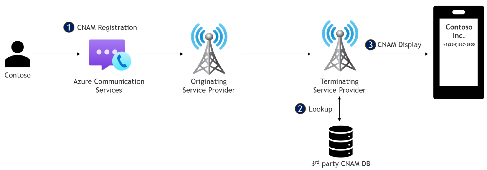

# Define your caller identity

A common challenge faced by businesses is the difficulty of getting their calls answered or even noticed by customers. In many cases, potential customers ignore or block calls from unknown or unfamiliar numbers.

Using an unidentified number can lead to missed opportunities for sales, customer service, and other important interactions. This problem can be especially challenging for businesses that rely heavily on phone-based communication, such as call centers or sales teams.

To address these challenges, Azure Communications Services offers customers the ability to define their caller's name when they place a public switched telephone network (PSTN) call and proposes a new Caller Name Delivery (CNAM) registration process. To avoid their customer calling numbers being flagged as spam, customers should register their PSTN outbound numbers with central registries and to follow best practices described in this article.                                       

## What is Caller Name Delivery (CNAM)                                     

In the US, Caller Name Delivery (CNAM) provides the caller's name or company name in Caller ID, though it can also show as \"restricted\" or \"not available\" due to blocking or technical issues. The terminating carrier retrieves this information through a database lookup (up to eight
providers in the US) using the caller\'s phone number. In Canada, you can add the caller's name using either the client\'s equipment (such as PBX) or the originating carrier, as long as it complies with anti-spoofing and fraud regulations.

## How to register

To request a CNAM registration for an Azure Communication Services number, customers need to send an email to `<acstns@microsoft.com>`, using `"ACS Number Request -- CNAM Registration"` as part of subject line. In the body or the email, provide the following details:

- Customer and Azure account details including:
   - Company name
   - Company website
   - Azure subscription ID
   - Azure Communication Services Resource name
   - Azure Tenant ID
- List a number and the corresponding caller name to register for each number. The customer must own these numbers under the Azure Resource provided. Customer can register only **US local numbers**.

CNAM caller names are limited to 15 characters (including spaces) and support the following special characters:

| Special character | Name |
| --- |:--- |
| **.** | period |
| **,** | comma |
| **&** | ampersand |
| **-** | dash |
| **_** | underscore |
| **'** | single quote (as in Tom's Burgers) |

Once the request is approved by the carrier, it takes **48 hours to be published.**

## Things to consider

- The reliability of CNAM delivery with the call varies depending on the country/region and carriers that handle the call; either as an intermediary or a terminating carrier.
- Inconsistencies in CNAM can be caused when the intermediate or terminating carriers delay refreshing the CNAM information in authoritative databases, such as in the United States. In countries/regions where there are no authoritative databases for CNAM, individual carrier practices can also cause problems with CNAM information arriving intact with the call.
- Azure Communication Services currently doesn't support CNAM registration for countries or regions outside the United States.
- This registration is available only for US local numbers. It doesn't support toll free numbers.
- This service only applies to *outbound* calls for numbers that customer owns.
- CNAM databases aren't always up to date and not consistently updated. There's a potential for misspellings.
- There are multiple CNAM databases across the country/region and terminating carriers may subscribe to one or more databases.
