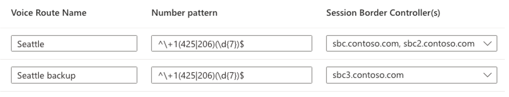

# Monitor direct routing

This article describes how to monitor your direct routing configuration.

The ability to make and receive calls by using direct routing involves the following components:

- Session Border Controllers (SBCs)
- Direct routing components in the Microsoft Cloud
- Telecom trunks

If you have difficulties troubleshooting issues, you can open a support case with your SBC vendor or Microsoft.

Microsoft is working on providing more tools for troubleshooting and monitoring. Check the documentation periodically for updates.

## Monitoring availability of Session Border Controllers using Session Initiation Protocol (SIP) OPTIONS messages

Azure Communication Services direct routing uses SIP OPTIONS sent by the Session Border Controller to monitor SBC health. There are no actions required from the Azure administrator to enable the SIP OPTIONS monitoring. The collected information is taken into consideration when routing decisions are made.

For example, if there are several SBCs available to route a call, direct routing considers the SIP OPTIONS information received from each SBC to determine routing.

Here's an example of the configuration:

](../../media/monitoring-troubleshooting-telephony/sip-options-config-routing.png#lightbox)

When an Azure Communication Services SDK app makes a call to number +1 425 \<any seven digits>, direct routing evaluates the route. There are two SBCs in the route: `sbc.contoso.com` and `sbc2.contoso.com`. Both SBCs have equal priority in the route. Before picking an SBC, the routing mechanism evaluates the health of each SBC, based on when the SBC sent the SIP OPTIONS last time.

An SBC is considered healthy if statistics at the moment of sending the call shows that the SBC sends OPTIONS every minute.  

When a call is made, the following logic applies:

- The SBC was paired at 10:00 AM.  
- The SBC sends OPTIONS at 10:01 AM, 10:02 AM, and so on.  
- At 10:15, a user makes a call and the routing mechanism selects this SBC.

Direct routing takes the regular interval OPTIONS three times (the regular interval is one minute). If OPTIONS were sent during the last three minutes, the SBC is considered healthy.

If the SBC in the example sent OPTIONS at any period between 10:12 AM and 10:15 AM (the time the call was made), it's considered healthy. If not, the SBC is demoted from the route.

Demotion means that the SBC isn't tried. For example, we have `sbc.contoso.com` and `sbc2.contoso.com` with equal priority in the same voice route, and `sbc3.contoso.com` in the lower priority route.  

If `sbc.contoso.com` doesn't send SIP OPTIONS on a regular interval as previously described, it's demoted. Next, `sbc2.contoso.com` tries for the call. If `sbc2.contoso.com` can't deliver the call because of the error codes 408, 503, or 504, the `sbc3.contoso.com` is tried. 

When an SBC stops sending OPTIONS but not yet marked as demoted, Azure will try to establish a call to it from three different datacenters before failover to another voice route. When an SBC is marked as demoted, it is not tried until it starts sending OPTIONS again.

If two (or more) SBCs in one route are considered healthy and equal, Fisher-Yates shuffle is applied to distribute the calls between the SBCs.

## Monitor with Azure portal and SBC logs

In some cases, especially during the initial pairing, there might be issues related to misconfiguration of the SBCs or the direct routing service.

You can use the following tools to monitor your configuration:  

- Azure portal
- SBC logs

In the direct routing section of Azure portal, you can check [SBC connection status](../direct-routing-provisioning.md#session-border-controller-connection-status).
If calls can be made, you can also check [Azure monitors logs](../../analytics/logs/voice-and-video-logs.md) that provide descriptive SIP error codes

SBC logs also is a great source of data for troubleshooting. Reach out to your SBC vendor's documentation on how to configure and collect those logs.

## Next steps

- [Troubleshoot direct routing connectivity](./troubleshoot-tls-certificate-sip-options.md)
- [Troubleshoot outbound calling](./troubleshoot-outbound-calls.md)