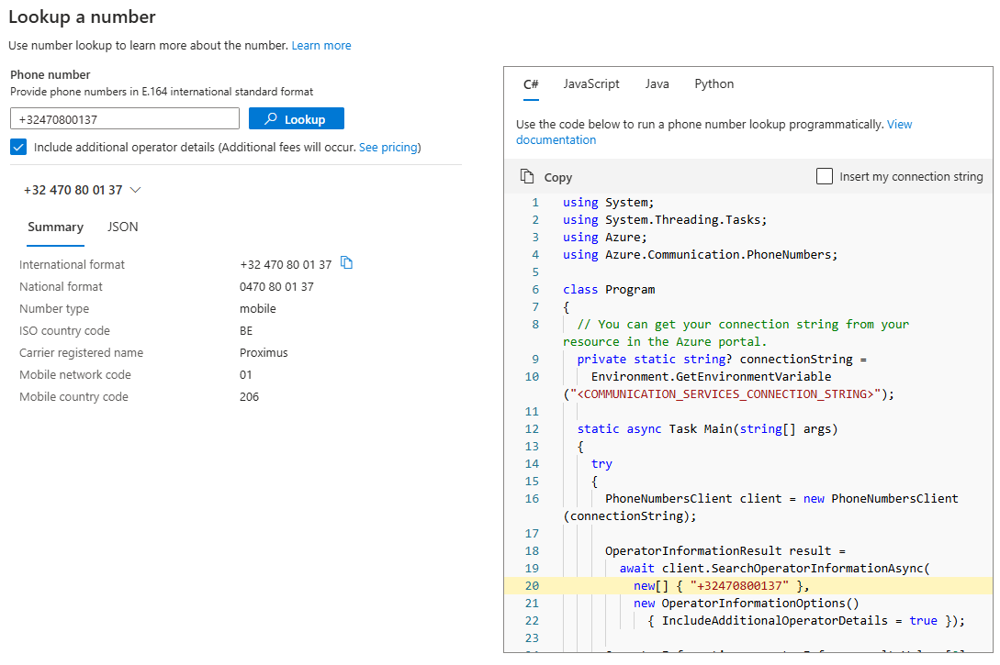

# Try Number Lookup

Try Number Lookup is a tool in Azure portal to help customers confirm that the phone number they want to communicate with is valid. The tool also retrieves number details to identify the country/region, carrier, and type. This enables developers to quickly test Azure Communication Services number lookup capabilities, without an existing app or code on their end.

## Prerequisites

- An Azure account with an active subscription. [Create an account for free](https://azure.microsoft.com/free/).
- A deployed Communication Services resource. Create an [Azure Communication Resource](../../quickstarts/create-communication-resource.md).

## Overview

Open the [Azure portal](https://portal.azure.com/#home) and search for **Number Lookup**. Then enter a phone number that you want to look up or validate. You can either check national and international format for free, or request details about number type, country/region, and carrier for a fee. The tool also generates the associated code. You can select **Use my connection string** to automatically populate the `connection string` for the resource.

You can also copy the generated code into an application and enrich it with other Azure Communication Services features such as chat, SMS, and voice and video calling.

## Next steps

Sending a lookup query is just the start. Now you can integrate other Azure Communication Services features into your application.

- [Number Lookup Concept](../numbers/number-lookup-concept.md)
- [Get started with Number Lookup](/azure/communication-services/concepts/numbers/number-lookup-sdk)
- [Calling SDK overview](../voice-video-calling/calling-sdk-features.md)
- [Chat concepts](../chat/concepts.md)
- [SMS overview](../sms/concepts.md)
