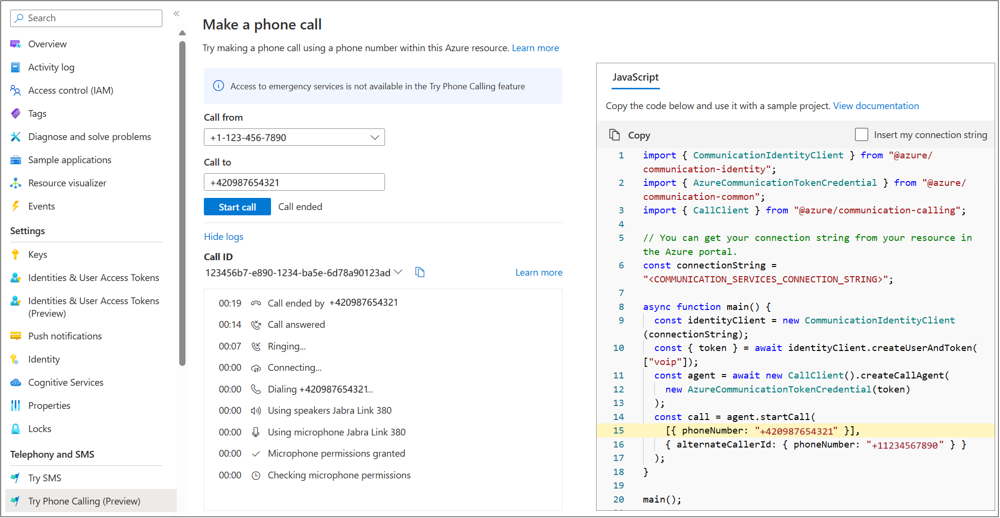

# Try Phone Calling

[!INCLUDE [Public Preview Notice](../../includes/public-preview-include-document.md)]

Try Phone Calling, now in public preview, is a tool in Azure preview portal to help customers confirm the setup of a telephony connection by making a phone call. It applies to both Voice Calling (PSTN) and direct routing. Try Phone Calling enables developers to quickly test Azure Communication Services calling capabilities, without an existing app or code on their end.

## Prerequisites

- An Azure account with an active subscription. [Create an account for free](https://azure.microsoft.com/free/).
- A deployed Communication Services resource. Create an [Azure Communication Resource](../../quickstarts/create-communication-resource.md).
- A [phone number acquired](../../quickstarts/telephony/get-phone-number.md) in your Communication Services resource, or Azure Communication Services Direct routing configured. If you have a free subscription, you can [get a trial phone number](../../quickstarts/telephony/get-trial-phone-number.md).
- A User Access Token to enable the call client. For more information, see [how to get a User Access Token](../../quickstarts/identity/access-tokens.md).

## Overview

Open the [Azure preview portal](https://preview.portal.azure.com/#home) and search for **Try Phone Calling**. Then Enter a phone number, select a caller ID for this call, and the tool generates the code. You can also select **Use my connection string** and Try Phone Calling automatically gets the `connection string` for the resource.

You can run generated code right from the tool page and see the status of the call. You can also copy the generated code into an application and enrich it with other Azure Communication Services features such as chat, SMS, and voice and video calling.

## Azure preview portal

The Try Phone Calling tool is in public preview, and is only available from the [Azure preview portal](https://preview.portal.azure.com/#home).

## Next steps

Making a phone call is just the start. Now you can integrate other Azure Communication Services features into your application.

- [Calling SDK overview](../voice-video-calling/calling-sdk-features.md)
- [Chat concepts](../chat/concepts.md)
- [SMS overview](../sms/concepts.md)
