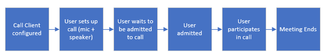

[!INCLUDE [Public Preview Notice](../../../includes/public-preview-include.md)]

Mobile UI Library for iOS and Android supports calling use cases by using the **calling composite**.
Composites enable developers to easily integrate a whole calling experience into their application with only a couple of lines of code; those composites take care of the entire lifecycle of the call from setup to the call ending.

## Calling

| Area                                                                                            | Use Cases                                              |
| ----------------------------------------------------------------------------------------------- | ------------------------------------------------------ |
| Call Types                                                                                      | Join Teams Meeting                                     |
|                                                                                                 | Join Azure Communication Services call with Group ID   |
| [Teams Interop](../../teams-interop.md) | Call Lobby                                             |
|                                                                                                 | Transcription and recording alert banner               |
| Participant Gallery                                                                             | Remote participants are displayed on grid              |
|                                                                                                 | Video preview available throughout call for local user |
|                                                                                                 | Default avatars available when video is off            |
|                                                                                                 | Shared screen content displayed on participant gallery |
|                                                                                     | Participant roster                                     |
| Call configuration                                                                              | Microphone device management                           |
|                                                                                                 | Camera device management                               |
|                                                                                                 | Speaker device management(wired & bluetooth supported)                              |
|                                                                                                 | Local preview available for user to check video        |
| Call Controls                                                                                   | Mute/unmute call                                       |
|                                                                                                 | Video on/off on call                                   |
|                                                                                                 | End call                                               |

## Supported Identities

An Azure Communication Services identity is required to initialize the composites and authenticate to the service.
For more information on authentication, see [Authentication](../../authentication.md) and [Access Tokens](../../../quickstarts/access-tokens.md)

## Teams Interop

For [Teams Interop](../../teams-interop.md) scenarios, developers can use the Mobile UI Library Components to join Teams meetings through Azure Communication Services.
To enable Teams Interop, developers can use the calling composite, which will take care of the lifecycle of joining a Teams Interop call.

:::image type="content" source="../../media/mobile-ui/teams-meet.png" alt-text="Pre-meeting experience":::

## View shared content

The Mobile UI Library provides the capability of the calling participants to view the shared content when other participants share their screens during the calling; also, the participant can zoom on the screen, making the pinching gestures over the screen to get a better look over the shared content.

## Theming

The UI Library Calling Composite for iOS and Android provides the capability for developers to update the theme of the all experience by passing a primary color. The Composite uses that primary color to provide appropriate theming across the experience.

| Android                            | iOS                                     |
| -------------------------------------------------------- | --------------------------------------------------------------- |
| :::image type="content" source="../../media/mobile-ui/android-color.png" alt-text="android theming"::: | :::image type="content" source="../../media/mobile-ui/ios-dark.png" alt-text="iOS theming":::  |

## Screen size

The calling composite offers to adapt to any screen size that would bring support from 5" screens to tablets, get the dynamic participants' roster layout, provide clarity on the view, and focus on the conversation.

|Split mode | Tablet mode|
|---------|---------|
| :::image type="content" source="../../media/mobile-ui/meet-splitscreen.png" alt-text="split screen"::: |  :::image type="content" source="../../media/mobile-ui/tablet-landscape.png" alt-text="tablet mode"::: |

## Localization

Localization is a key to making products that can be used across the world and by people who speak different languages.

Localization is a key to making products that can be used across the world. The Mobile UI Library now provides support for 13 languages: ***English, Spanish, French, German, Italian, Japanese, Korean, Dutch, Portuguese, Russian, Turkish and Chinese*** and RTL capabilities.

## Recommended Architecture

Composites are initialized using an Azure Communication Services access token. Access tokens should be procured from Azure Communication Services through a
trusted service that you manage. See [Quickstart: Create Access Tokens](../../../quickstarts/access-tokens.md) and [Trusted Service Tutorial](../../../tutorials/trusted-service-tutorial.md) for more information.

:::image type="content" source="../../media/mobile-ui/ui-library-architecture.png" alt-text="Recommended architecture diagram":::

These client libraries also require the context for the call they will join. Similar to user access tokens, this context should be disseminated to clients via your own trusted service. The list below summarizes the initialization and resource management functions that you need to operationalize.

| Contoso Responsibilities                                 | UI Library Responsibilities                                     |
| -------------------------------------------------------- | --------------------------------------------------------------- |
| Provide access token from Azure                          | Pass through given access token to initialize components        |
| Provide refresh function                                 | Refresh access token using developer provided function          |
| Retrieve/Pass join information for call or chat          | Pass through call and chat information to initialize components |
| Retrieve/Pass user information for any custom data model | Pass through custom data model to components to render          |

## Platform support

|Platform | Versions|
|---------|---------|
| iOS     | iOS 14+ |
| Android | v21+    |

> [!div class="nextstepaction"]
> [Quickstart guides](../../../quickstarts/ui-library/get-started-composites.md)
