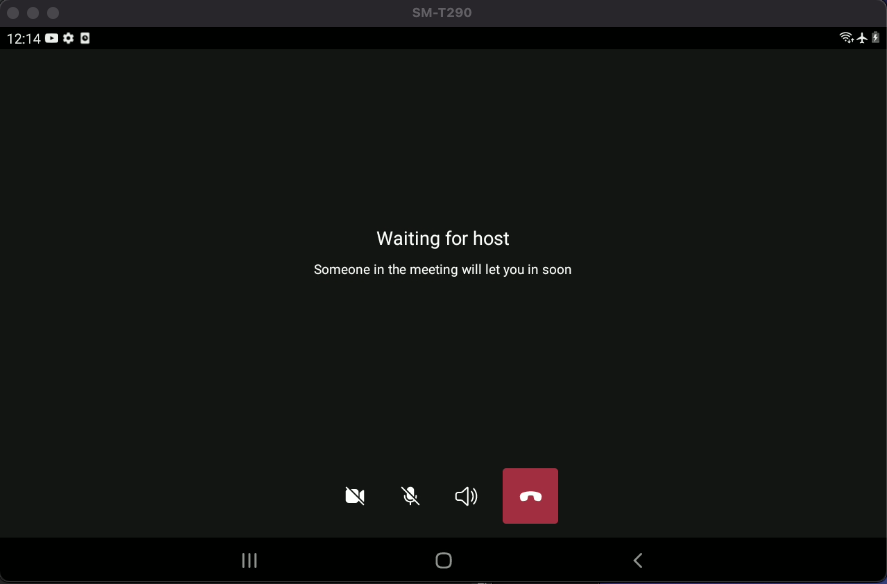
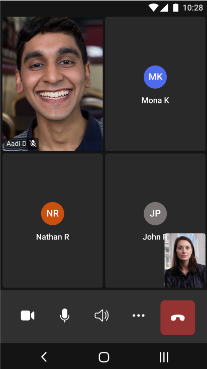

# UI Mobile Library

[!INCLUDE [Public Preview Notice](../../includes/private-preview-include.md)]

UI Mobile Library is an Azure Communication Services capability focused on common business-to-consumer and business-to-business calling interactions. The core of the Mobile UI Library is [video and voice calling](../voice-video-calling/calling-sdk-features.md), and it builds on Azure's calling primitives to deliver a complete user experience based on calling and meetings primitives.

The UI Mobile Library objective is to provide these capabilities available to you in a turnkey, composite format. You drop the UI SDK into your favorite mobile development app's canvas, and the SDK generates a complete user experience. Because this user experience is lightly, you can take advantage of reduce the development time and engineering complexity.

## Composites

Composites are higher-level components composed of UI components that deliver turn-key solutions for common communication scenarios using Azure Communication Services.
Developers can easily instantiate the Composite using an Azure Communication Services access token and the required configuration attributed for call or chat.

| Composite                                                                   | Use Cases                                                                                                                                                                                                                                                                                                  |
| --------------------------------------------------------------------------- | ------------------------------------------------------------------------------------------------------------------------------------------------------------------------------------------------------------------------------------------------------------------------------------------------------------ |
| [CallComposite](../../quickstarts/voice-video-calling/getting-started-with-calling.md)  TBD final link| Calling experience that allows users to start or join a call. Inside the experience users can configure their devices, participate in the call with video, and see other participants, including those ones with video turn on. For Teams Interop is included lobby functionality for user to wait to be admitted. |

## Scenarios

### Joining a video/audio call

The users can join easily over the call using the *Teams meeting URL* or set up an Azure Communication Services Call to a simpler and great experience, just like the Teams application. Adding the capability to the user to be part of extensive live video calling or audio calling without losing the experience of the simplicity and focusing in what really matters.

### Pre-call experience

As a participant of the calls, you can provide a name and set up a default configuration for audio and video devices, and you're ready to jump into the call.

### Call experience

The calling composite provide an end two end experience, optimizing development time, and focusing into a clean layout.  

**The calling experience provides all those capabilities in one single composite: *calling composite*, providing a clear path without complex code, and quickly implementing and faster development.**

### Quality and security

Mobile Composites are initialized using Azure Communication Services access tokens. For more information on [how to generate and manage access tokens.](../../quickstarts/access-tokens.md)

### More details

If you need more details about mobile composites, please visit [use cases site](mobile-ui-usesscenarios.md) to discover more.

***We expect to add more scenarios ahead of the UI Library being in General Availability.***

## What UI Artifact is Best for my Project?

Understanding these requirements will help you choose the right client library:

- **How much customization do you desire?** Azure Communication core client libraries don't have a UX and are designed so you can build whatever UX you want. UI Library components provide UI assets at the cost of reduced customization.

- **What platforms are you targeting?** Different platforms have different capabilities.

Details about feature availability in the [UI Library is available here](mobile-ui-use-cases.md), but key trade-offs are summarized below.

| Client library / SDK  | Implementation Complexity | Customization Ability | Calling |  [Teams Interop](../../concepts/teams-interop.md) |
| --------------------- | ------------------------- | --------------------- |  ---- | ----------------------------------------------------------------------------------------------- |
| Composite Components  | Low                       | Low                   |         ✔    | ✔                                                                                               |
| Core client libraries | High                      | High                  |         ✔    | ✔                                                                                               |

> [!div class="nextstepaction"]

For more information about how to start with the UI Mobile library composites, please follow [our Quickstart guide](../../quickstarts/ui-library/get-started-call.md).