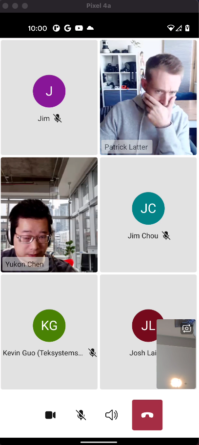

# UI Mobile Library

UI Mobile Library is an Azure Communication Services capability focused on common business-to-consumer and business-to-business calling interactions. The core of the Mobile UI Library is [video and voice calling](../voice-video-calling/calling-sdk-features), and it builds on Azure's calling primitives to deliver a complete user experience based on calling and meetings primitives.

The UI Mobile Library objective is provide these capabilities available to you in a turnkey, composite format. You drop the UI SDK into your favorite mobile development app's canvas, and the SDK generates a complete user experience. Because this user experience is very lightly, you can take advantage of reduce the development time and engineering complexity.

## Platform support

|Platform | Versions|
|---------|---------|
| iOS     | iOS 13+ |
| Android | v23+    |

## Scenarios

### Joining a meeting

The users can join easily over the meeting using the Teams meeting URL to a simpler and great experience, just like the Teams application. Adding the capability to the user to be part of extensive live meetings without losing the experience of the simplicity of the Teams application.

### Pre-meeting experience

As a participant of any of the meetings, you can set up a default configuration for audio and video devices. Add your name and bring your own image avatar.

### Meeting experience

Customize the user experience, adjust the capabilities accordingly to your needs. You will control the overall experience during the meetings.

### Quality and security

You can secure using an Azure Communication Service access token, more information [how generate and manage access tokens.](../../quickstarts/access-tokens)

More scenarios please visit [use cases site](mobile-ui-usesscenarios.md) to discover more about UI Mobile Library.

### More details

- **Device selector**: The user can select their audio and video devices.

- **Theming**: Bring the capabilities customize the primary color of the meeting experience.

- **Turn Video On/Off**: Bring the possibility to the users to manage their video during the meeting.

- **Multilingual support**: Support 56 languages during the whole teams experience.

***We expect to add more scenarios ahead of the UI Library being in General Availability.***

## Learn and go

For more information about how to start with the UI Mobile library, please follow [our Quickstarts guides TBD](../../quickstarts/voice-video-calling/getting-started-with-calling).