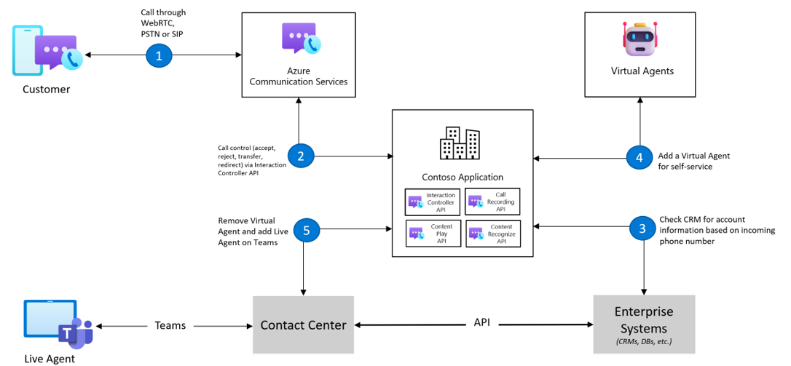

# Call Automation Overview

> [!IMPORTANT]
> Functionality described on this document is currently in private preview. Private preview includes access to SDKs and documentation for testing purposes that are not yet available publicly.
> Apply to become an early adopter by filling out the form for [preview access to Azure Communication Services](https://aka.ms/ACS-EarlyAdopter).

Azure Communication Services Call Automation provides developers the ability to build  server-based, intelligent call workflows for voice and PSTN channels. The SDKs, available for .NET and Java, uses an action-event model to help you build personalised customer interactions. Your communication applications can listen to real-time call events and perform control plane actions (like answer, transfer, play audio, etc) to steer and control calls based on your business logic.

## Common Use Cases

Some of the common use cases that can be build using Call Automation include:

- Program calls for transactional workflows such as click2call and appointment reminders to improve customer service.
- Build IVR workflows to self-serve customers for use cases like order bookings and updates, using Play (Audio URL) and Recognize (DTMF) actions.
- Integrate your communication applications with Contact Centers and your private telephony networks using Direct Routing.
- Protect your customer's identity by building number masking services to connect buyers to sellers or users to partner vendors on your platform.
- Increase engagement by building automated customer outreach programs for marketing and customer service.

The below flow diagram shows how your application can use Call Automation SDKs to manage an inbound call, steer to virtual agent or IVRs for simple self-serve scenarios and connect customers to live agents for complex scenarios.

ToDo: Picture to be updated to standard ACS design

## Capabilities

The following list presents the set of features which are currently available in the Azure Communication Services Call Automation SDKs.

| Feature Area          | Capability                                        | .NET   | Java  |
| ----------------------| -----------------------------------------------   | ------ | ----- |
| Pre-call scenarios    | Answer a one-to-one call                          | ✔️    | ✔️    |
|                       | Answer a group call                               | ✔️    | ✔️    |
|                       | Place new outbound call to one or more endpoints  | ✔️    | ✔️    |
|                       | Redirect* (forward) a call to one or more endpoints  | ✔️    | ✔️    |
|                       | Reject an incoming call                           | ✔️    | ✔️    |
| Mid-call scenarios    | Add one or more endpoints to an existing call     | ✔️    | ✔️    |
|                       | Remove one or more endpoints from an existing call| ✔️    | ✔️    |
|                       | Blind Transfer** a call to another endpoint         | ✔️    | ✔️    |
|                       | Hang up a call (remove the call leg)              | ✔️    | ✔️    |
|                       | Terminate a call (remove all participants and end call)| ✔️ | ✔️  |
| Query scenarios       | Get the call state                                | ✔️    | ✔️    |
|                       | Get a participant in a call                       | ✔️    | ✔️    |
|                       | List all participants in a call                   | ✔️    | ✔️    |

*Redirecting a call to a phone number is not supported.

** Transfer of VoIP call to a phone number is not supported.

## Architecture

Calling Automation uses a REST API interface to receive requests and provide responses to all actions performed within the service. Due to the asynchronous nature of calling, most actions will have corresponding events which are triggered when the action completes successfully or fails.

Event Grid – Azure Communication Services uses Event Grid to deliver the IncomingCall event which can be triggered by an inbound PSTN call to a number you have acquired in the portal or by connecting your telephony infrastructure using an SBC. The IncomingCall event is also sent for any call between Azure Communication Services users (one-to-one), when a user is added to an existing call (group call) or an existing 1:1 call is transferred to a communication user.

Web hooks – Calling Automation SDKs use standard web hook HTTP/S callbacks for call state change events and responses to mid-call actions.

ToDo: Picture to be updated to standard ACS design

## Call Actions

### Pre-call actions

These actions are performed before the destination endpoint listed in the IncomingCall event notification is connected. Web hook callback events only communicate the “answer” pre-call action, not for reject or redirect actions.  

**Answer** – Using the IncomingCall event from Event Grid and Call Automation SDK, a call can be answered by your application. This allows for IVR scenarios where an inbound PSTN call can be answered programmatically by your application. Additional scenarios include answering a call on behalf of a user or answering an outbound call sent to a PSTN number in the same Azure Communication Services resource.

**Reject** – To reject a call means your application can receive the IncomingCall event and prevent the call from being connected to the destination endpoint.

**Redirect** – Using the IncomingCall event from Event Grid, a call can be redirected to one or more endpoints creating a single or simultaneous ringing (sim-ring) scenario. This means the call is not answered by your application, it is simply ‘redirected’ to another destination endpoint to be answered.

**Make Call** - Make Call action can be used to place outbound calls to phone numbers and to other communication users. Use cases include your application placing outbound calls to proactively inform users about an outage or notify about an order update.

### Mid-call actions

These actions can be performed if Calling Automation SDKs were used to answer an inbound call or place an outbound call. Each mid-call action has a corresponding success or failure web hook callback event.

**Add/Remove participant(s)** – One or more participants can be added in a single request with each participant being a variation of supported destination endpoints. A web hook callback is sent for every participant successfully added to the call.

**Transfer** – When your application answers a call or places an outbound call to an endpoint, that endpoint can be transferred to another destination endpoint. Tranfering a 1:1 call will remove your application's ability to control the call using the Call Automation SDKs.

**Hang-up** – When your application has answered a one-to-one call, the hang-up action will remove the call leg and terminate the call with the other endpoint. If there are more than two participants in the call (group call), performing a ‘hang-up’ action will remove your application’s endpoint from the group call.

**Terminate** – Whether your application has answered a one-to-one or group call, or placed an outbound call with one or more participants, this action will remove all participants and end the call. This operation is trigerred by setting `forEveryOne` property to true in Hang-Up call action.

## Events

The following table outlines the current events emitted by Azure Communication Services. The two tables below show events emitted by Event Grid and from the Call Automation as webhook events.

### Event Grid events

Most of the events sent by Event Grid are platform agnostic meaning they are emitted regardless of the SDK (Calling or Call Automation). While you can create a subscription for any event, we recommend you use the IncomingCall event for all Call Automation use-cases where you want to control the call programmatically. Use the other events for reporting/telemetry purposes.

| Event             | Description |
| ----------------- | ------------ |
| IncomingCall      | Notification of a call to a communication user or phone number |
| CallStarted       | A call is established (inbound or outbound) |
| CallEnded         | A call is terminated and all participants are removed |
| ParticipantAdded  | A participant has been added to a call |
| ParticipantRemoved| A participant has been removed from a call |

### Call Automation webhook events

The Call Automation events are sent to the web hook callback URI specified when you answer or place a new outbound call.
| Event             | Description |
| ----------------- | ------------ |
| CallConnected      | Your application’s call leg is connected (inbound or outbound)  |
| CallDisconnected       | Your application’s call leg is disconnected  |
| CallTransferAccepted         | Your application’s call leg has been transferred to another endpoint  |
| CallTransferFailed  | The transfer of your application’s call leg failed  |
| AddParticipantSucceeded| Your application added a participant  |
|AddParticipantFailed   | Your application was unable to add a participant  |
| RemoveParticipantSucceeded|Your application removed a participant |
| RemoveParticipantFailed |Your application was unable to remove a participant |
| ParticipantUpdated    | The status of a participant changed while your application’s call leg was connected to a call  |

## Known Issues

1. If a call is transferred to an invalid CommunicationUserIdentifier that doesnt exist, the call action returns a 500 error instead of a 400 error code.
2. Taking a pre-call action like Answer/Reject on the original call after redirected it gives a 200 success instead of failing on 'call not found'.

## Next Steps

> [!div class="nextstepaction"]
> [Get started with Call Automation](./../../quickstarts/voice-video-calling/Callflows-for-customer-interactions.md)
