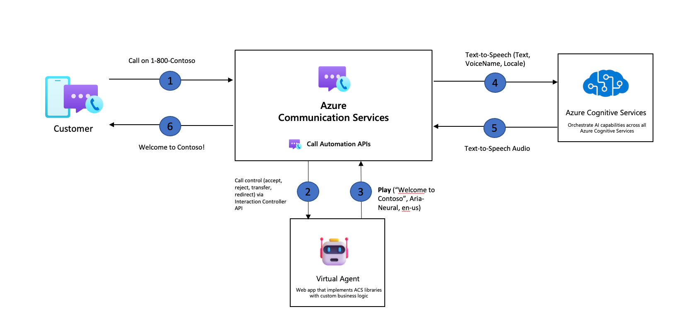

> [!IMPORTANT]
> Functionality described on this document is currently in private preview. Private preview includes access to SDKs and documentation for testing purposes that are not yet available publicly.
> Apply to become an early adopter by filling out the form for [preview access to Azure Communication Services](https://aka.ms/ACS-EarlyAdopter).

# Play Action Overview

The play action provided through the call automation SDK allows you to play audio prompts to participants in the call. This action can be accessed through the server-side implementation of your application. The play action allows you to provide ACS access to your pre-recorded audio files with support for authentication. 

**Note:** ACS currently only supports files of WAV, mono, 16KHz format.

The Play action allows you to provide access to a pre-recorded audio file of WAV format that ACS can access with support for authentication.

## Common use cases 

The play action can be used in many ways, below are some examples of how developers may wish to use the play action in their applications. 

### Announcements
Your application might want to play some sort of announcement when a participant joins or leaves the call, to notify other users:
- Someone has entered the meeting, so that they're aware of a new participant.
- Someone has left the meeting, so that they're aware that a participant may have been disconnected. 

### Self-serve customers

In scenarios with IVRs and virtual assistants, you can use your application or bots to play audio prompts to callers, this prompt can be in the form of a menu to guide the caller through their interaction. 

### Hold music

The play action can also be used to play hold music for callers. This can also be setup in a loop so that the music keeps playing till an agent is available to assist the caller. 

### Playing compliance messages

As part of compliance requirements in various industries, vendors are expected to play legal or compliance messages to callers, e.g. “This call will be recorded for quality purposes”. 

## How the play action workflow looks

## What's coming up next for Play action

### Text-to-Speech

Microsoft uses deep neural networks to overcome the limits of traditional speech synthesis with regards to stress and intonation in spoken language. Prosody prediction and voice synthesis occur simultaneously, resulting in a more fluid and natural sounding output. You can use these neural voices to make interactions with your chatbots and voice assistants more natural and engaging. There are over 100 pre-built voices to choose from. [Learn more about Azure Text-to-Speech voices](https://docs.microsoft.com/en-us/azure/cognitive-services/speech-service/language-support?tabs=speechtotext#prebuilt-neural-voices).

### Fine tuning Text-to-Speech output with SSML
Speech Synthesis Markup Language (SSML) is an XML-based markup language that lets developers specify how input text is converted into synthesized speech by using text-to-speech. With SSML developers can fine-tune the pitch, pause, improve pronunciation, change speaking rate, adjust volume, and attribute multiple voices to a single document. With SSML you can also define your own lexicons or switch to different speaking styles. For scenarios where you wish to provide [multilingual voice](https://techcommunity.microsoft.com/t5/ai-cognitive-services-blog/azure-text-to-speech-updates-at-build-2021/ba-p/2382981) outputs, you can adjust the spoken languages via SSML. To fine-tune the voice output for your scenario see our documentation [Improve synthesis with Speech Synthesis Markup Language](https://docs.microsoft.com/en-us/azure/cognitive-services/speech-service/speech-synthesis-markup?tabs=csharp).

## Benefits of Text-to-Speech and Text-to-Speech SSML

## Improve customer interaction

You can enhance your play action to play more fluid and natural sounding speech that provides a more approachable experience to your customers. This can be enabled by integrating your Azure Cognitive Services with Azure Communication Services. 

## Personalization

With the integration of Azure Cognitive Services and Azure Communication Services you can support a wide variety of languages and voices, based on the configuration you have enabled on your Azure Cognitive Services resource. You can enable your participants to select the language and voice of the audio they hear, providing a more personalized and inclusive experience.

## Known Issues/Limitations
1. Play action is not enabled to work with Teams Interoperability.
2. Play will not support loop for targeted playing. 

## Next Steps
Check out the [Play action quickstart]() to learn more.
