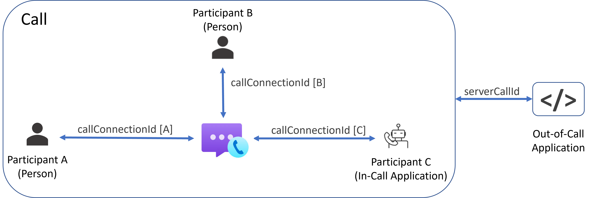

# Call Automation overview

[!INCLUDE [Public Preview](../../includes/public-preview-include-document.md)]

Call Automation APIs enable you to access voice and video calling capabilities from **services**. You can use these APIs to create service applications that drive automated outbound reminder calls for appointments or provide proactive notifications for events like power outages or wildfires. Service applications that join a call can monitor updates such as participants joining or leaving, allowing you to implement rich reporting and logging capabilities.

Call Automation APIs are provided for both in-call (application-participant or app-participant) actions, and out-of-call actions. Two key differences between these sets of APIs are:
- In-call APIs require your application to join the call as a participant. App-participants are billed at [standard PSTN and VoIP rates](https://azure.microsoft.com/pricing/details/communication-services/).
- In-call APIs use the `callConnectionId` associated with app-participant, while Out-of-Call APIs use the `serverCallId` associated with the call instance. 

## Use cases
| Use Case                                                       | In-Call (App-participant) | Out-of-Call   |
| ---------------------------------------------------------------| ------------------------- | ------------- |
| Place or receive 1:1 calls between bot and human participants  | X                         |               |
| Play audio prompts and listen for responses                    | X                         |               |
| Monitor in-call events                                         | X                         |               |
| Create calls with multiple participants                        | X                         |               |
| Get call participants and participant details                  | X                         |               |
| Add or remove call participants                                | X                         | X             |
| Server-side actions in peer-to-peer calls (e.g. recording)     |                           | X             |
| Play audio announcements to all participants                   |                           | X             |
| Start and manage call recording                                |                           | X             |

## In-Call (App-Participant) APIs

In-call APIs enable an application to take actions in a call as an app-participant. When an application answers or joins a call, a `callConnectionId` is assigned, which is used for in-call actions such as:
- Add or remove call participants
- Play audio prompts and listen for DTMF responses
- Listen to call roster updates and events
- Hang-up a call

### In-Call Events
Event notifications are sent as JSON payloads to the calling application via the `callbackUri` set when joining the call. Events sent to in-call app-participants are:
- CallState events (Establishing, Established, Terminating, Terminated)
- DTMF received
- Play audio result
- Cancel media processing
- Invite participant result
- Participants updated

## Out-of-Call APIs
Out-of-Call APIs enable you to perform actions on a call or meeting without having an app-participant present. Out-of-Call APIs use the `serverCallId`, provided by either the Calling Client SDK or generated when a call is created via the Call Automation APIs. Because out-of-call APIs do not require an app-participant, they are useful for implementing server-side business logic into peer-to-peer calls. For example, consider a support call scenario that started as a peer-to-peer call, and the agent (participant B) wants to bring in a subject matter expert to assist. Participant B triggers an event in the client interface for a server application to identify an available subject matter expert and invite them to the call. The end-state of the flow shown below is a group call with three human participants.

Out-of-call APIs are available for actions such as:
- Add or remove call participants
- Start/stop/pause/resume call recording
                                                       
### Out-of-Call Events
Event notifications are sent as JSON payloads to the calling application via the `callbackUri` providing in the originating API call. Actions with corresponding out-of-call events are:
- Call Recording (Start, Stop, Pause, Resume)
- Invite participant result

## Next steps
Check out the [Call Automation Quickstart](../../quickstarts/voice-video-calling/call-automation-api-sample.md) to learn more.
