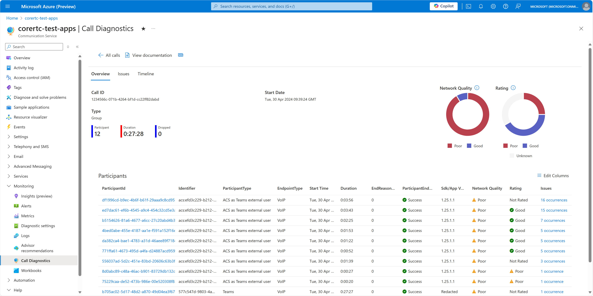
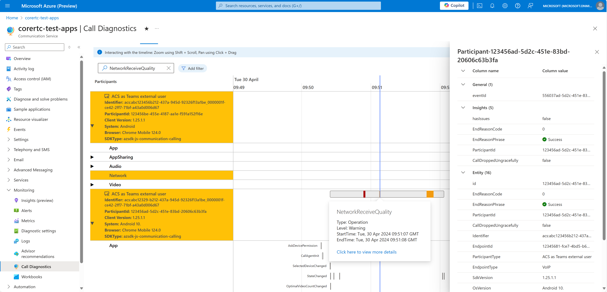

# Call Diagnostics

[!INCLUDE [Public Preview Disclaimer](../../includes/public-preview-include-document.md)]

Understanding your call quality and reliability is foundational to
delivering a great customer calling experience. There are various
issues that can affect the quality of your calls, such as poor internet
connectivity, software compatibility issues, and technical difficulties
with devices. These issues can be frustrating for all call participants,
whether they're a patient checking in for a doctor’s call, or a student
taking a lesson with their teacher. As a developer, diagnosing and
fixing these issues can be time-consuming and frustrating.

Call Diagnostics acts as a detective for your calls. It helps developers
using Azure Communication Services investigate events that happened in a call to
identify likely causes of poor call quality and reliability. Just like a
real conversation, many things happen simultaneously in a call that may
or may not affect your communication. Call Diagnostics’ timeline makes
it easier to visualize what happened in a call by showing you rich data
visualizations of call events and providing insights into issues that
commonly affect calls.

## How to enable Call Diagnostics

Azure Communication Services collects call data in the form of metrics
and events. You must enable a Diagnostic Setting in Azure Monitor to
send these data to a Log Analytics workspace for Call Diagnostics to
analyze new call data.

> [!IMPORTANT]
> Call Diagnostics can’t query data from data that wasn’t sent to a Log Analytics workspace. Diagnostic Settings will only begin collect data by single Azure Communications Services Resource ID once enabled. See our Frequently Asked Question on enabling Call Diagnostics [here](#frequently-asked-questions) 

Since Call Diagnostics is an application layer on top of data for your
Azure Communications Service Resource, you can query these call data and
[build workbook reports on top of your data.](../../../azure-monitor/logs/data-platform-logs.md#what-can-you-do-with-azure-monitor-logs)

You can access Call Diagnostics from any Azure Communication Services
Resource in your Azure portal. When you open your Azure Communications
Services Resource, just look for the “Monitoring” section on the left
side of the screen and select "Call Diagnostics."

Once you have setup Call Diagnostics for your Azure Communication Services Resource, you can search for calls using valid callIDs that took place in that resource. Data can take several hours after call completion to appear in your resource and populate in Call Diagnostics. 

**Call Diagnostics has four main sections:**

-  [Call Search](#call-search)

-  [Call Overview](#call-overview)

-  [Call Issues](#call-issues)

-  [Call Timeline](#call-timeline)

## Call Search

The search section lets you find individual calls, or filter calls to explore calls with issues. Clicking on a call takes you to a detail screen where you
see three sections, **Overview**, **Issues**, and **Timeline** for the
selected call.

The search field allows you to search by callID. See our documentation to [access your client call ID.](../troubleshooting-info.md#access-your-client-call-id)

> [!NOTE]
> You can explore information icons and links within Call Diagnostics to learn functionality, definitions, and helpful tips.

## Call Overview

Once you select a call from the Call Search page, your call details display in the Call Overview tab. You see a call summary highlighting
the participants in the call and key metrics for their call quality. You
can select a participant to drill into their call timeline details
directly or navigate to the Call Issues tab for further analysis.

> [!NOTE]
> You can explore information icons and links within Call Diagnostics to learn functionality, definitions, and helpful tips.

## Call Issues

The Call Issues tab gives you a high-level analysis of any media quality
and reliability issues that were detected during the call. 

Call Issues highlights detected issues commonly known to affect user’s call
quality such as poor network conditions, speaking while muted, or device
failures during a call. If you want to explore a detected issue, select
the highlighted item and you see a prepopulated view of the
related events in the Timeline tab.

> [!NOTE]
> You can explore information icons and links within Call Diagnostics to learn functionality, definitions, and helpful tips.

## Call Timeline

When call issues are difficult to troubleshoot, you can explore the
timeline tab to see a detailed sequence of events that occurred during
the call.

The timeline view is complex and designed for developers who need to explore details of a call and interpret detailed debugging data. In
large calls the timeline view can present an overwhelming amount of
information, we recommend relying on filtering to narrow your search
results and reduce complexity.

You can view detailed call logs for each participant within a call. Call information may not be present due to various reasons such as privacy constraints between different calling resources. See frequently asked questions to learn more.

<!-- > [!NOTE]
> You can explore information icons and links within Call Diagnostics to learn functionality, definitions, and helpful tips. -->

<!-- # Common issues

Issue categories can include:

- Azure Communication Services issue

- Calling deployment issue

- Network issue

- User actions or inactions (e.g. not allowing device permissions),
  driving through a tunnel.

To help you get started, you will find below the steps to triage common
issues using Call Diagnostics.

***“Other participants couldn’t hear me on the call”***

Dive into the audio section for the participant to see if there are any
issues detected. In the case below, we see that the microphone was muted
unexpectedly. In other cases, we might see errors with the device’s set
up and permissions.

(**<u>TODO insert image)</u>**

***“My video was choppy and pixelated”***  
Explore the video section for the participant to see if a poor network
connection in a call may have caused the issue.

(**<u>TODO insert image)</u>**

***“My call unexpectedly dropped”***  
**<u>TODO -</u>** Show how you might drill down to show the end-user
lost connection.

(**<u>TODO insert image)</u>**

***“Other participants couldn’t see me on the call”***  
Show how you might drill down to show the status of the camera in the
call and any detected failures.

(**<u>TODO insert image)</u>**

## Call quality resources

Ensuring good call quality starts with your calling setup, please
explore our documentation to learn how you can use the UI Library to
benefit from our quality and reliability tools \<[link to manage call
quality](https://learn.microsoft.com/azure/communication-services/concepts/voice-video-calling/manage-call-quality)\>. -->

## Frequently asked questions:

- How do I set up Call Diagnostics?

  - Follow instructions to add diagnostic settings for your resource here [Enable logs via Diagnostic Settings in Azure Monitor.](../analytics/enable-logging.md) We recommend you initially collect all logs and then determine which logs you want to retain and for how long after you have an understanding of the capabilities in Azure Monitor. When adding your diagnostic setting you are prompted to [select logs](../analytics/enable-logging.md#adding-a-diagnostic-setting), select "**allLogs**" to collect all logs. 

  - Your data volume, retention, and Call Diagnostics query usage in Log Analytics within Azure Monitor is billed through existing Azure data meters. We recommend you monitor your data usage and retention policies for cost considerations as needed. See: [Controlling costs.](../../../azure-monitor/essentials/diagnostic-settings.md#controlling-costs)

  - If you have multiple Azure Communications Services Resource IDs you must enable these settings for each resource ID and query call details for participants within their respective Azure Communications Services Resource ID. 
 
  - If Azure Communication Services participants join from different Azure Communication Services Resources, how do they display in Call Diagnostics
 
  - Participants from other Azure Communication Services resources will have limited information in Call Diagnostics. The participants that belong to the resource you open Call Diagnostics will have all available insights shown. 

- What are the common call issues I might see and how can I fix them?

  - Here are resources for common call issues. For an overview of troubleshooting strategies for more information on isolating call issues. Please see: [Overview of general troubleshooting strategies](../../resources/troubleshooting/voice-video-calling/general-troubleshooting-strategies/overview.md)

  - If you see common error messages or descriptions. See: 
[Understanding error messages and codes](../../resources/troubleshooting/voice-video-calling/general-troubleshooting-strategies/understanding-error-codes.md)

  - If users are unable to join calls. See:
[Overview of call setup issues](../../resources/troubleshooting/voice-video-calling/call-setup-issues/overview.md)

  - If users have camera or microphone issues. For example, they can’t hear someone. See: [Overview of device and permission issues](../../resources/troubleshooting/voice-video-calling/device-issues/overview.md)

  - If call participants have audio issues. For example, they sound like a robot or hear an echo. See: [Overview of audio issues](../../resources/troubleshooting/voice-video-calling/audio-issues/overview.md)

  - If call participants have video issues. For example, their video looks fuzzy, or cuts in and out. See: [Overview of video issues](../../resources/troubleshooting/voice-video-calling/video-issues/overview.md)

    <!-- 2.  If that ACS resource isn't part of **<u>your Azure subscription
        and / or hasn't enabled Diagnostics Settings to store call logs,
        there will not be any data available</u>** for Call Diagnostics. -->

<!-- 1. If Teams participants join a call, how will they display in Call
    Diagnostics?

    1.  If a Teams participant organized the call through Microsoft
        Teams, that participant will appear as a participant in Call
        Diagnostics, however they'll have fewer call details populated.

    2.  If there were other Teams participants besides the Teams meeting
        organizer, those participants won't appear in Call
        Diagnostics. -->

<!-- 1.  How do I find a Call ID?

    a.  Link -->

<!-- 1.  My call ID should be here?

    a.  It could no longer be stored by your Log Analytics workspace, you may need to ensure you retain your call data in diagnostics settings. It's possible your callID is incorrect. (**ENG add details on which call ID to specifically pull in the event of multiple callIDs.**)

    a.  Maybe it’s not the ACS call ID, check “how do I find a callID?” to learn more. -->

<!-- 1.  My call had issues, but Call Diagnostics doesn’t show any issues.

    a.  Call Diagnostics relies on several common call issues to help diagnose calls. Issues can still occur outside of the existing telemetry or can be caused by unlisted call participants you aren’t allowed to view due to privacy restrictions. -->

<!-- 1.  What types of calls are visible in Call Diagnostics?

    a.  Call types included.
    1. Includes call data for Web JS SDK, Native SKD, PSTN, Call Automation.

    1. Includes some Call Automation Bot data edges

    a.  Partial data.

      a.  Different SDKs, privacy considerations may prevent you from receiving those data. -->

<!-- 1. What are limits of what our data reaches.
    1. Privacy restrictions may prevent you from seeing the full call roster.

1.  What are bots?

1.  What capabilities does Search have?

1.  What capabilities does Overview have?

1.  What capabilities does Issues have?

1. What capabilities does Timeline have?

    1. You can zoom within the timeline by using SHIFT+mouse-scroll wheel and pan left and right by clicking and dragging within the timeline itself. -->

<!-- 1. What types of issues might I find?

    a.  Participant’s call issues generally fall into these categories: 
    1. They can’t join a call. 

    1. They can’t do something in a call (mute, start video, etc.). 

    1. They get dropped from a call. 

    1. They have a poor call experience (audio/video quality).  -->

## Next steps

- Learn how to manage call quality, see: [Improve and manage call quality](manage-call-quality.md)

- Explore troubleshooting guidance, see: [Overview of general troubleshooting strategies](../../resources/troubleshooting/voice-video-calling/audio-issues/overview.md) 

- Continue to learn other quality best practices, see: [Best practices: Azure Communication Services calling SDKs](../best-practices.md)

-	Learn how to use the Log Analytics workspace, see: [Log Analytics Tutorial](../../../../articles/azure-monitor/logs/log-analytics-tutorial.md)

-	Create your own queries in Log Analytics, see: [Get Started Queries](../../../../articles/azure-monitor/logs/get-started-queries.md)

- Explore known call issues, see: [Known issues in the SDKs and APIs](../known-issues.md)

<!-- added to the toc.yml file at row 583.

    - name: Monitor and manage call quality
      items:
      - name: Manage call quality
        href: concepts/voice-video-calling/manage-call-quality.md
        displayName: diagnostics, Survey, feedback, quality, reliability, users, end, call, quick
      - name: End of Call Survey
        href: concepts/voice-video-calling/end-of-call-survey-concept.md
        displayName: diagnostics, Survey, feedback, quality, reliability, users, end, call, quick
 -->