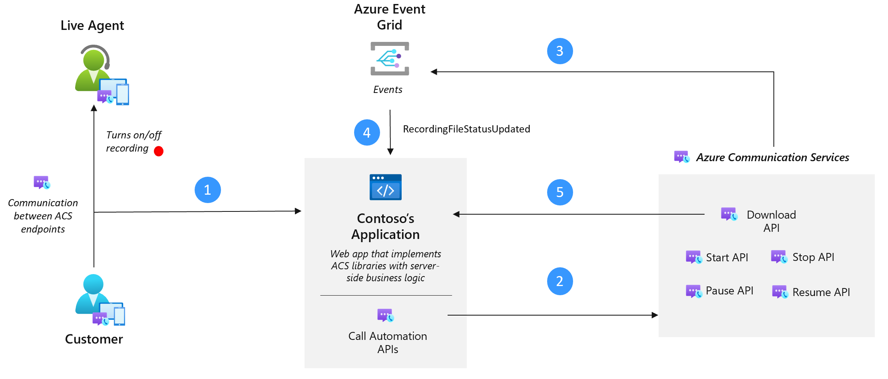

# Call Recording overview

[!INCLUDE [Public Preview](../../includes/public-preview-include-document.md)]

> [!NOTE]
>  Call Recording is not enabled for [Teams interoperability](../teams-interop.md).

Call Recording enables you to record multiple calling scenarios available in Azure Communication Services by providing you with a set of APIs to start, stop, pause and resume recording. Whether it's a PSTN, WebRTC, or SIP call, these APIs can be accessed from server-side business logic or via events triggered by user actions. 

Depending on your business needs, you can use Call Recording for different Azure Communication Services calling implementations.
For example, you can record 1:1 or 1:N scenarios for audio and video calls enabled by [Calling Client SDK](https://learn.microsoft.com/azure/communication-services/concepts/voice-video-calling/calling-sdk-features). 





But also, you can use Call Recording to record complex PSTN or VoIP inbound and outbound calling workflows managed by [Call Automation](https://learn.microsoft.com/azure/communication-services/concepts/voice-video-calling/call-automation).
Regardless of how you established the call, Call Recording allows you to produce mixed or unmixed media files that are stored for 48 hours on a built-in temporary storage. You can retrieve the files and take them to the long-term storage solution of your choice. Call Recording supports all Azure Communication Services data regions.

## Media output and Channel types supported
Call Recording supports multiple media outputs and content types to address your business needs and use cases. You might use mixed formats for scenarios such as keeping records, meeting notes, coaching and training, or even compliance and adherence. Or, you can use unmixed formats to address quality assurance use cases or even more complex scenarios like advanced analytics or AI-based (Artificial Intelligence) sophisticated post-call processes.

### Video

| Channel Type | Content Format | Resolution | Sampling Rate | Output | Description |
| :----------- | :------------- | :----------- | :---- | :--------------------------- | :------------ |
| mixed | mp4 | 1920x1080, eight (8) FPS (frames per second) | 16 kHz | single file, single channel | mixed audio+video of all participants in a default tile arrangement |

### Audio

> [!NOTE]
> **Unmixed audio** is in **Private Preview**.

| Channel Type | Content Format | Sampling Rate | Output | Description |
| :----------- | :------------- | :----------- | :---- | :---------------- | 
| mixed | mp3 & wav | 16 kHz | single file, single channel | mixed audio of all participants |
| unmixed | wav | 16 kHz | single file, up to 5 wav channels | unmixed audio, one participant per channel, up to five channels |


## Call Recording APIs
Call Recording APIs can be used to manage recording via internal business logic triggers, such as an application creating a group call and recording the conversation. Also, recordings can be triggered by a user action that tells the server application to start recording. Call Recording APIs use exclusively the `serverCallId` to initiate recording. To learn how to get the `serverCallId`, check our [Call Recording Quickstart](../../quickstarts/voice-video-calling/get-started-call-recording.md).
A `recordingId` is returned when recording is started, which is then used for follow-on operations like pause and resume.  


| Operation                            | Operates On            | Comments                       |
| :-------------------- | :--------------------- | :----------------------------- |
| Start Recording       | `serverCallId`         | Returns `recordingId` | 
| Get Recording State   | `recordingId` | Returns `RecordingStateResult`       | 
| Pause Recording       | `recordingId` | Pausing and resuming call recording enables you to skip recording a portion of a call or meeting, and resume recording to a single file. | 
| Resume Recording      | `recordingId` | Resumes a Paused recording operation. Content is included in the same file as content from prior to pausing. | 
| Stop Recording        | `recordingId` | Stops recording, and initiates final media processing for file download. | 


## Event Grid notifications
Notifications related to media and metadata are emitted via Event Grid.

> [!NOTE]
> Azure Communication Services provides short term media storage for recordings. **Recordings will be available to download for 48 hours.** After 48 hours, recordings will no longer be available.

An Event Grid notification `Microsoft.Communication.RecordingFileStatusUpdated` is published when a recording is ready for retrieval, typically a few minutes after the recording process has completed (for example, meeting ended, recording stopped). Recording event notifications include `contentLocation` and `metadataLocation`, which are used to retrieve both recorded media and a recording metadata file.

### Notification Schema Reference
```typescript
{
    "id": string, // Unique guid for event
    "topic": string, // /subscriptions/{subscription-id}/resourceGroups/{group-name}/providers/Microsoft.Communication/communicationServices/{communication-services-resource-name}
    "subject": string, // /recording/call/{call-id}/serverCallId/{serverCallId}
    "data": {
        "recordingStorageInfo": {
            "recordingChunks": [
                {
                    "documentId": string, // Document id for retrieving from storage
                    "index": int, // Index providing ordering for this chunk in the entire recording
                    "endReason": string, // Reason for chunk ending: "SessionEnded", "ChunkMaximumSizeExceeded”, etc.
                    "metadataLocation": <string>, // url of the metadata for this chunk
                    "contentLocation": <string>   // url of the mp4, mp3, or wav for this chunk
                }
            ]
        },
        "recordingStartTime": string, // ISO 8601 date time for the start of the recording
        "recordingDurationMs": int, // Duration of recording in milliseconds
        "sessionEndReason": string // Reason for call ending: "CallEnded", "InitiatorLeft", etc.
    },
    "eventType": string, // "Microsoft.Communication.RecordingFileStatusUpdated"
    "dataVersion": string, // "1.0"
    "metadataVersion": string, // "1"
    "eventTime": string // ISO 8601 date time for when the event was created
}
```
## Metadata Schema 
```typescript
{
  "resourceId": <string>,           // stable resource id of the ACS resource recording
  "callId": <string>,               // id of the call
  "chunkDocumentId": <string>,      // object identifier for the chunk this metadata corresponds to
  "chunkIndex": <number>,           // index of this chunk with respect to all chunks in the recording
  "chunkStartTime": <string>,       // ISO 8601 datetime for the start time of the chunk this metadata corresponds to
  "chunkDuration": <number>,        // [Chunk duration has a maximum of 4 hours] duration of the chunk this metadata corresponds to in milliseconds
  "pauseResumeIntervals": [
              "startTime": <string>,          // ISO 8601 datetime for the time at which the recording was paused
              "duration": <number>            // duration of the pause in the recording in milliseconds
                          ],
  "recordingInfo": {
               "contentType": <string>,        // content type of recording, e.g. audio/audioVideo
               "channelType": <string>,        // channel type of recording, e.g. mixed/unmixed
               "format": <string>,             // format of the recording, e.g. mp4/mp3/wav
               "audioConfiguration": {
                   "sampleRate": <number>,       // sample rate for audio recording
                   "bitRate": <number>,          // bitrate for audio recording
                   "channels": <number>          // number of audio channels in output recording
                                     }
                    },
  "participants": [
    {
      "participantId": <string>,    // participant identifier of a participant captured in the recording
      "channel": <number>           // channel the participant was assigned to if the recording is unmixed
    }
  ]
}

```

## Regulatory and privacy concerns

Many countries and states have laws and regulations that apply to call recording. PSTN, voice, and video calls, often require that users consent to the recording of their communications. It is your responsibility to use the call recording capabilities in compliance with the law. You must obtain consent from the parties of recorded communications in a manner that complies with the laws applicable to each participant.

Regulations around the maintenance of personal data require the ability to export user data. In order to support these requirements, recording metadata files include the participantId for each call participant in the `participants` array. You can cross-reference the MRIs in the `participants` array with your internal user identities to identify participants in a call. An example of a recording metadata file is provided below for reference.

## Known Issues

It's possible that when a call is created using Call Automation, you won't get a value in the `serverCallId`. If that's the case, get the `serverCallId` from the `CallConnected` event method described in [Get serverCallId](https://learn.microsoft.com/azure/communication-services/quickstarts/voice-video-calling/callflows-for-customer-interactions?pivots=programming-language-csharp#configure-programcs-to-answer-the-call).

## Next steps
For more information, see the following articles:

- Learn more about Call recording, check out the [Call Recording Quickstart](../../quickstarts/voice-video-calling/get-started-call-recording.md).
- Learn more about [Call Automation](https://learn.microsoft.com/azure/communication-services/quickstarts/voice-video-calling/callflows-for-customer-interactions?pivots=programming-language-csharp).
- Learn more about [Video Calling](https://learn.microsoft.com/azure/communication-services/quickstarts/voice-video-calling/get-started-with-video-calling?pivots=platform-web).
