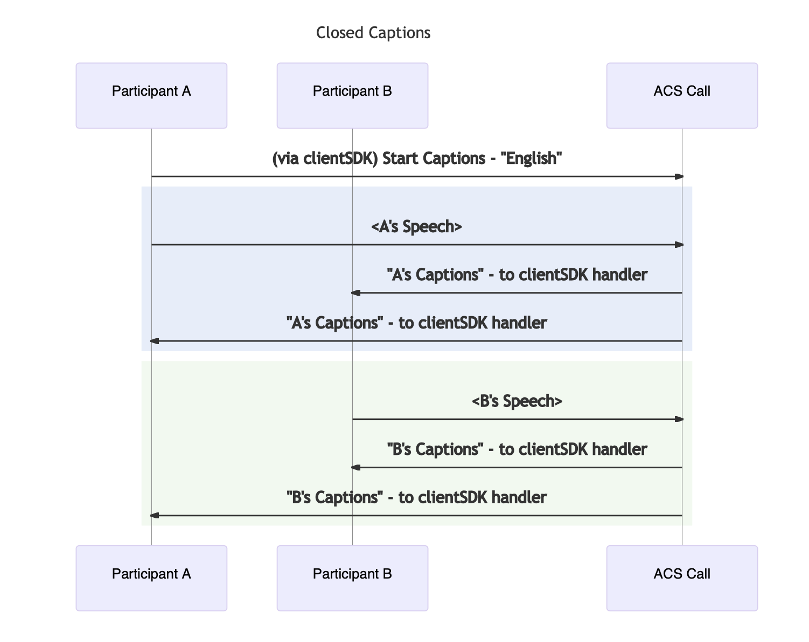

# Closed Captions overview

[!INCLUDE [Private Preview Disclaimer](../../includes/private-preview-include-section.md)]

Azure Communication Services allows one to enable Closed Captions for the VoIP calls in private preview.
Closed Captions is the conversion of a voice or video call audio track into written words that appear in real time. Closed Captions are never saved and are only visible to the user that has enabled it.
Here are main scenarios where Closed Captions are useful:

- **Accessibility**. In the workplace or consumer apps, Closed Captioning for meetings, conference calls, and training videos can make a huge difference. Scenarios when audio can't be heard, either because of a noisy environment, such as an airport, or because of an environment that must be kept quiet, such as a hospital. 
- **Inclusivity**. Closed Captioning was developed to aid hearing-impaired people, but it could be useful for a language proficiency as well. 

## When to use Closed Captions

- Closed Captions help maintain concentration and engagement, which can provide a better experience for viewers with learning disabilities, a language barrier, attention deficit disorder, or hearing impairment. 
- Closed Captions allow participants to be on the call in loud or sound-sensitive environments.

## Feature highlights

- Support for multiple platforms with cross-platform support.
- Async processing with client subscription to events and callbacks.
- Multiple languages to choose from for recognition.

## Availability
Closed Captions are supported in Private Preview only in Azure Communication Services to Azure Communication Services calls on all platforms. 
- Android
- iOS
- Web

## Next steps

- Get started with a [Closed Captions Quickstart](../../quickstarts/voice-video-calling/get-started-with-closed-captions.md?pivots=platform-iosBD)
- Learn more about using closed captions in [Teams interop](../interop/enable-closed-captions.md) scenarios.
