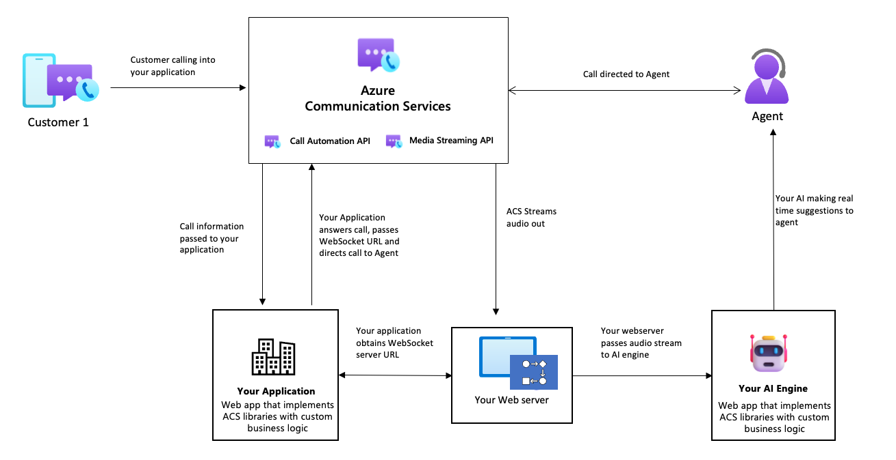

# Media streaming overview - audio subscription

> [!IMPORTANT]
> Functionality described on this document is currently in private preview. Private preview includes access to SDKs and documentation for testing purposes that are not yet available publicly.
> Apply to become an early adopter by filling out the form for [preview access to Azure Communication Services](https://aka.ms/ACS-EarlyAdopter).

Azure Communication Services provides developers with Media Streaming capabilities to get real-time access to media streams to capture, analyze and process audio content during active calls. In today's world consumption of live audio and video is prevalent, this content could be in the forms of online meetings, online conferences, online schooling, customer support, etc. This consumption has only been exacerbated by the recent events of Covid-19, with many of the worlds work force working remotely from home. With media streaming access, developers can now build server applications to capture and analyze audio streams for each of the participants on the call in real-time. Developers can also combine media streaming with other call automation actions or use their own AI models to analyze audio streams for use cases such as NLP for conversation analysis or provide real-time insights and suggestions to their agents while they are in an active interaction with their end users.

This private preview supports the ability for developers to get access to real-time audio streams over a websocket to analyze each participants audio in mixed and unmixed formats

## Common use cases
Audio streams can be used in many ways, below are some examples of how developers may wish to use the audio streams in their applications.

### Real-time call assistance

**Improved AI powered suggestions** - Use real-time audio streams of active interactions between agents and customers to gauge the intent of the call and how your agents can provide a better experience to their customer through active suggestions using your own AI model to analyze the call.

### Authentication
**Biometric authentication** – Use the audio streams to carry out authentication using caller biometrics such as voice recognition.

### Interpretations
**Real-time translation** – Use audio streams to send to human or AI translators who can consume this audio content and provide translations.

## Sample architecture for subscribing to audio streams from an ongoing call

## Supported formats

### Mixed format
Contains mixed audio of all participants on the call. As this is mixed audio, the participantRawID will be null.
	
### Unmixed
Contains audio per participant per channel, with support for up to four channels for four dominant speakers. You will also get a participantRawID that you can use to determine the speaker. 

## Additional information
The table below describes information that will help developers convert the media packets into audible content that can be used by their applications.
- Framerate: 50 frames per second
- Packet stream rate: 20 ms rate
- Data packet: 64 Kbytes
- Audio metric: 16-bit PCM mono at 16000 hz
- Public string data is a base64 string that should be converted into a byte array to create raw PCM file. You can then use the following configuration in Audacity to run the file.

## Next Steps
Check out the [Media Streaming quickstart](../../quickstarts/voice-video-calling/media-streaming.md) to learn more.
