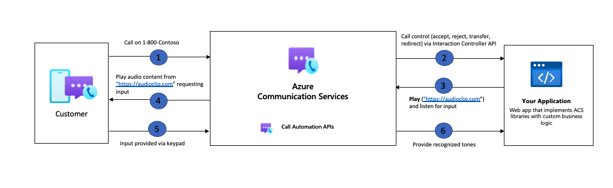

# Recognize action overview

> [!IMPORTANT]
> Functionality described on this document is currently in private preview. Private preview includes access to SDKs and documentation for testing purposes that are not yet available publicly. 
> Apply to become an early adopter by filling out the form for [preview access to Azure Communication Services](https://aka.ms/ACS-EarlyAdopter).

With the Recognize action developers will be able to enhance their IVR or contact center applications to recognize user input. One of the most common scenarios of recognition is to play a message and request user input. This input is received in the form of DTMF (input via the digits on their calling device) which then allows the application to navigate the user to the next action. 

**DTMF**
Dual-tone multifrequency (DTMF) recognition is the process of understanding tones/sounds generated by a telephone when a number is pressed. Equipment at the receiving end listening for the specific tone then converts them into commands. These commands generally signal user intent when navigating a menu in an IVR scenario or in some cases can be used to capture important information that the user needs to provide via their phones keypad.

**DTMF events and their associated tones**

|Event|Tone|
| --- |--|
|0|Zero|
|1|One|
|2|Two|
|3|Three|
|4|Four|
|5|Five|
|6|Six|
|7|Seven|
|8|Eight|
|9|Nine|
|A|A|
|B|B|
|C|C|
|D|D|
|*|Asterisk|
|#|Pound|

## Common use cases

The recognize action can be used for many reasons, below are a few examples of how developers can use the recognize action in their application.

### Improve user journey with self-service prompts

- **Users can control the call** - By enabling input recognition you allow the caller to navigate your IVR menu and provide information that can be used to resolve their query. 
- **Gather user information** - By enabling input recognition your application can gather input from the callers. This can be information such as account numbers, credit card information, etc.

### Interrupt audio prompts

**User can exit from an IVR menu and speak to a human agent** - With DTMF interruption your application can allow users to exit interrupt the flow of the IVR menu and be able to chat to a human agent. 

## How the Recognize action workflow looks

## What's coming up next for Recognize action

As we invest more into this functionality, we recommend developers sign up to our TAP program that allows you to get early access to the newest feature releases. Over the coming months the recognize action will add in new capabilities that use our integration with Azure Cognitive Services to provide AI capabilities such as Speech-To-Text. With these, you can improve customer interactions and recognize voice inputs from participants on the call. 

## Next steps

- Check out the [Recognize action quickstart](../../quickstarts/voice-video-calling/recognize-action.md) to learn more.
