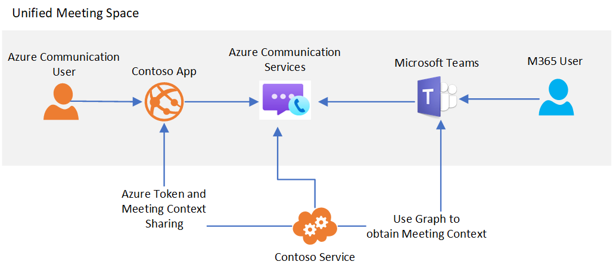

# Teams interoperability

[!INCLUDE [Public Preview Notice](../../includes/private-preview-include.md)]

Azure Communication Services can be used to build custom meeting experiences that interact with Microsoft Teams. Users of your Communication Services solution(s) can interact with Teams participants over voice, video, and screen sharing.

This interoperability allows you to create custom Azure applications that connect users to Teams meetings. Users of your custom applications don't need to have Azure Active Directory identities or Teams licenses to experience this capability. This is ideal for bringing employees (familiar using Teams) and external users (using a custom application experience) together into a seamless meeting experience. This allows you to build an experience like this:

1. Employees use Teams to schedule a meeting
2. Your service application using the Microsoft Graph APIs to access meeting details
3. Meeting details are shared with external users through your custom application
4. External users leverage the custom application and Azure Communication Services Calling SDK to join the Teams meeting

The high-level architecture for this use-case:

While certain Teams meeting features such as raised hand, together mode, and breakout rooms will only be available for Teams users, your custom application will have access to the meeting's core audio, video, and screen sharing capabilities.

When the Communication Services user joins the Teams meeting, the display name provided through the Calling client library will be shown to Teams users. The Communication Services user will otherwise be treated like an anonymous user in Teams. Your custom application should consider user authentication and other security measures to protect Teams meetings. Be mindful of the security implications of enabling anonymous users to join meetings, and use the [Teams security guide](https://docs.microsoft.com/microsoftteams/teams-security-guide#addressing-threats-to-teams-meetings) to configure capabilities available to anonymous users.

## Next steps

> [!div class="nextstepaction"]
> [Join your calling app to a Teams meeting](../../quickstarts/voice-video-calling/get-started-teams-interop.md)
