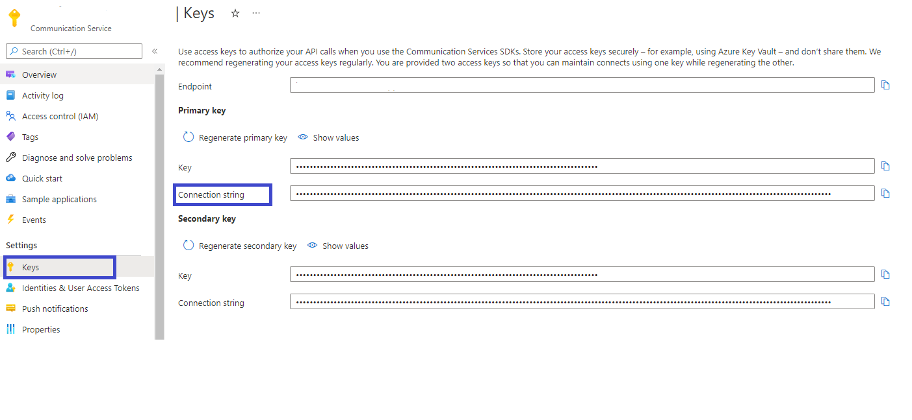

## Prerequisites
- Azure account with an active subscription, for details see [Create an account for free.](https://azure.microsoft.com/free/)
- Azure Communication Services resource. See [Create an Azure Communication Services resource](../../../quickstarts/create-communication-resource.md?tabs=windows&pivots=platform-azp)
- Create a new web service application using the [Call Automation SDK](../../../quickstarts/voice-video-calling/callflows-for-customer-interactions.md).
- The latest [.NET library](https://dotnet.microsoft.com/download/dotnet-core) for your operating system.
- [Apache Maven](https://maven.apache.org/download.cgi).
- Obtain the NuGet package from the [Azure SDK Dev Feed](https://github.com/Azure/azure-sdk-for-net/blob/main/CONTRIBUTING.md#nuget-package-dev-feed)

## Technical specifications

The following parameters are available to customize the Recognize function:

| Parameter | Type|Default (if not specified) | Description | Required or Optional |
| ------- |--| ------------------------ | --------- | ------------------ |
| Prompt <br/><br/> *(for details on Play action, refer to [this how-to guide](../play-action.md))* | FileSource | Not set |This will be the message you wish to play before recognizing input. | Optional |
| InterToneTimeout | TimeSpan | 2 seconds <br/><br/>**Min:** 1 second <br/>**Max:** 60 seconds | Limit in seconds that ACS will wait for the caller to press another digit (inter-digit timeout). | Optional |
| InitialSilenceTimeout | TimeSpan | 5seconds<br/><br/>**Min:** 0 seconds <br/>**Max:** 300 seconds | How long recognize action will wait for input before considering it a timeout. | Optional |
| MaxTonesToCollect | Integer | No default<br/><br/>**Min:** 1|Number of digits a developer expects as input from the participant.| Required |
| StopTones |IEnumeration\<DtmfTone\> | Not set | The digit participants can press to escape out of a batch DTMF event. | Optional |
| InterruptPrompt | Bool | True | If the participant has the ability to interrupt the playMessage by pressing a digit. | Optional |
| InterruptCallMediaOperation | Bool | True | If this flag is set it will interrupt the current call media operation if any (for example if play is going on) and initiate recognize. | Optional |
| OperationContext | String | Not set | String that developers can pass mid action, useful for allowing developers to store context about the events they receive. | Optional |

## Create a new C# application

In the console window of your operating system, use the `dotnet` command to create a new web application.

```console
dotnet new web -n MyApplication
```

## Install the NuGet package

During the preview phase, the NuGet package can be obtained by configuring your package manager to use the Azure SDK Dev Feed from [here](https://github.com/Azure/azure-sdk-for-net/blob/main/CONTRIBUTING.md#nuget-package-dev-feed)

## Obtain your connection string

From the Azure portal, locate your Communication Service resource and click on the Keys section to obtain your connection string.

 

## Establish a call

By this point you should be familiar with starting calls, if you need to learn more about how to start a call view our [quickstart](../../../quickstarts/voice-video-calling/callflows-for-customer-interactions.md). In this instance, we'll answer an incoming call.

## Call the recognize action

When your application answers the call, you can provide information about recognizing participant input and playing a prompt.

``` csharp
var targetParticipant = new PhoneNumberIdentifier("+1XXXXXXXXXXX");
                var recognizeOptions = new CallMediaRecognizeDtmfOptions(targetParticipant, maxTonesToCollect)
                {
                    InterruptCallMediaOperation = true,
                    InitialSilenceTimeout = TimeSpan.FromSeconds(30),
                    Prompt = new FileSource(new System.Uri("file://path/to/file")),
                    InterToneTimeout = TimeSpan.FromSeconds(5),
                    InterruptPrompt = true,
                    StopTones = new DtmfTone[] { DtmfTone.Pound },
                };
                await _callConnection.GetCallMedia().StartRecognizingAsync(recognizeOptions).ConfigureAwait(false);

```

**Note:** If parameters aren't set, the defaults will be applied where possible.

## Receiving recognize event updates

Developers can subscribe to the *RecognizeCompleted* and *RecognizeFailed* events on the webhook callback they registered for the call to create business logic in their application for determining next steps when one of the aforementioned events occurs. 

Example of *RecognizeCompleted* event:
``` json
[
    {
        "id": "e9cf1c71-f119-48db-86ca-4f2530a2004d",
        "source": "calling/callConnections/411f0b00-d97f-49ad-a6ff-3f8c05dc64d7/RecognizeCompleted",
        "type": "Microsoft.Communication.RecognizeCompleted",
        "data": {
            "eventSource": "calling/callConnections/411f0b00-d97f-49ad-a6ff-3f8c05dc64d7/RecognizeCompleted",
            "operationContext": "267e33a9-c28e-4ecf-a33e-b3abd9526e32",
            "resultInformation": {
                "code": 200,
                "subCode": 8531,
                "message": "Action completed, max digits received."
            },
            "recognitionType": "dtmf",
            "collectTonesResult": {
                "tones": [
                    "nine",
                    "eight",
                    "zero",
                    "five",
                    "two"
                ]
            },
            "callConnectionId": "411f0b00-d97f-49ad-a6ff-3f8c05dc64d7",
            "serverCallId": "aHR0cHM6Ly9hcGkuZmxpZ2h0cHJveHkuc2t5cGUuY29tL2FwaS92Mi9jcC9jb252LXVzZWEyLTAxLmNvbnYuc2t5cGUuY29tL2NvbnYvQzNuT3lkY3E0VTZCV0gtcG1GNmc1Zz9pPTQmZT02Mzc5ODYwMDMzNDQ2MTA5MzM=",
            "correlationId": "53be6977-d832-4c42-8527-fb2aa4a78b74"
        },
        "time": "2022-09-13T00:55:08.2240104+00:00",
        "specversion": "1.0",
        "datacontenttype": "application/json",
        "subject": "calling/callConnections/411f0b00-d97f-49ad-a6ff-3f8c05dc64d7/RecognizeCompleted"
    }
]
```

Example of how you can deserialize the *RecognizeCompleted* event:
``` csharp
app.MapPost("<WEB_HOOK_ENDPOINT>", async (
    [FromBody] CloudEvent[] cloudEvents,
    [FromRoute] string contextId) =>{
    foreach (var cloudEvent in cloudEvents)
    {
        CallAutomationEventBase @event = CallAutomationEventParser.Parse(cloudEvent);
        If (@event is RecognizeCompleted recognizeCompleted)
        {
            // Access to the Collected Tones
            foreach(DtmfTone tone in recognizeCompleted.CollectTonesResult.Tones) {
                   // work on each of the Dtmf tones.
        }
    }
```

Example of *RecognizeFailed* event:

``` json
[
    {
        "id": "47d9cb04-7039-427b-af50-aebdd94db054",
        "source": "calling/callConnections/411f0b00-bb72-4d5b-9524-ae1c29713335/RecognizeFailed",
        "type": "Microsoft.Communication.RecognizeFailed",
        "data": {
            "eventSource": "calling/callConnections/411f0b00-bb72-4d5b-9524-ae1c29713335/RecognizeFailed",
            "operationContext": "267e33a9-c28e-4ecf-a33e-b3abd9526e32",
            "resultInformation": {
                "code": 500,
                "subCode": 8511,
                "message": "Action failed, encountered failure while trying to play the prompt."
            },
            "callConnectionId": "411f0b00-bb72-4d5b-9524-ae1c29713335",
            "serverCallId": "aHR0cHM6Ly9hcGkuZmxpZ2h0cHJveHkuc2t5cGUuY29tL2FwaS92Mi9jcC9jb252LXVzZWEyLTAxLmNvbnYuc2t5cGUuY29tL2NvbnYvQzNuT3lkY3E0VTZCV0gtcG1GNmc1Zz9pPTQmZT02Mzc5ODYwMDMzNDQ2MTA5MzM=",
            "correlationId": "53be6977-d832-4c42-8527-fb2aa4a78b74"
        },
        "time": "2022-09-13T00:55:37.0660233+00:00",
        "specversion": "1.0",
        "datacontenttype": "application/json",
        "subject": "calling/callConnections/411f0b00-bb72-4d5b-9524-ae1c29713335/RecognizeFailed"
    }
]

```

Example of how you can deserialize the *RecognizeFailed* event:

``` csharp
app.MapPost("<WEB_HOOK_ENDPOINT>", async (
    [FromBody] CloudEvent[] cloudEvents,
    [FromRoute] string contextId) =>{
    foreach (var cloudEvent in cloudEvents)
    {
        CallAutomationEventBase @event = CallAutomationEventParser.Parse(cloudEvent);
        If (@event is RecognizeFailed recognizeFailed)
        {
            Log.error($”Recognize failed due to: {recognizeFailed.ResultInformation.Message}”);

        }
    }
```
