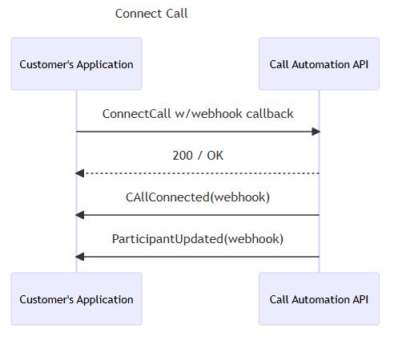

# Control and steer calls with Call Automation

Call Automation uses a REST API interface to receive requests for actions and provide responses to notify whether the request was successfully submitted or not. Because of the asynchronous nature of calling, most actions have corresponding events that are triggered when the action finishes successfully or fails. This article covers the actions that are available for steering calls, like `CreateCall`, `Transfer`, and `Redirect`, and managing participants. Sample code shows how to invoke the particular action. Sequence diagrams describe the events that are expected after you invoke an action. The diagrams help you visualize how to program your service application with Call Automation.

Call Automation supports other actions to manage call media and recording that have separate articles.

## Prerequisites

- Read the Call Automation [concepts article](../../concepts/call-automation/call-automation.md#call-actions) that describes the action-event programming model and event callbacks.
- Learn about the [user identifiers](../../concepts/identifiers.md#the-communicationidentifier-type) like `CommunicationUserIdentifier` and `PhoneNumberIdentifier` that are used in this article.

For all the code samples, `client` is the `CallAutomationClient` object that you can create, as shown. Also, `callConnection` is the `CallConnection` object that you obtain from the `Answer` or `CreateCall` response. You can also obtain it from callback events that your application receives.

## [C#](#tab/csharp)

```csharp
var client = new CallAutomationClient("<resource_connection_string>"); 
```

## [Java](#tab/java)

```java
 CallAutomationClient client = new CallAutomationClientBuilder().connectionString("<resource_connection_string>").buildClient();
```

## [JavaScript](#tab/javascript)

```javascript
const client = new CallAutomationClient("<resource_connection_string>");
```

## [Python](#tab/python)

```python
call_automation_client = CallAutomationClient.from_connection_string("<resource_connection_string>")
```

-----

## Make an outbound call

You can place a 1:1 or group call to a communication user or phone number (a public number or one that Azure Communication Services owns).
When you call a public-switched telephone network (PSTN) endpoint, you also need to provide a phone number to use as the source caller ID and that shows as the call notification to the target PSTN endpoint.

To place a call to an Azure Communication Services user, you need to provide a `CommunicationUserIdentifier` object instead of `PhoneNumberIdentifier`.  

### [C#](#tab/csharp)

```csharp
Uri callbackUri = new Uri("https://<myendpoint>/Events"); //the callback endpoint where you want to receive subsequent events 
var callerIdNumber = new PhoneNumberIdentifier("+16044561234"); // This is the Azure Communication Services provisioned phone number for the caller  
var callThisPerson = new CallInvite(new PhoneNumberIdentifier("+16041234567"), callerIdNumber); // person to call
CreateCallResult response = await client.CreateCallAsync(callThisPerson, callbackUri);
```

### [Java](#tab/java)

```java
String callbackUri = "https://<myendpoint>/Events"; //the callback endpoint where you want to receive subsequent events
PhoneNumberIdentifier callerIdNumber = new PhoneNumberIdentifier("+18001234567"); // This is the Azure Communication Services provisioned phone number for the caller  
CallInvite callInvite = new CallInvite(new PhoneNumberIdentifier("+16471234567"), callerIdNumber); // person to call
CreateCallResult response = client.createCall(callInvite, callbackUri).block();
```

### [JavaScript](#tab/javascript)

```javascript
const callInvite = {
    targetParticipant: { phoneNumber: "+18008008800" }, // person to call
    sourceCallIdNumber: { phoneNumber: "+18888888888" } // This is the Azure Communication Services provisioned phone number for the caller
};
const callbackUri = "https://<myendpoint>/Events"; // the callback endpoint where you want to receive subsequent events 
const response = await client.createCall(callInvite, callbackUri);
```

### [Python](#tab/python)

```python
callback_uri = "https://<myendpoint>/Events"  # the callback endpoint where you want to receive subsequent events
caller_id_number = PhoneNumberIdentifier(
    "+18001234567"
)  # This is the Azure Communication Services provisioned phone number for the caller
call_invite = CallInvite(
    target=PhoneNumberIdentifier("+16471234567"),
    source_caller_id_number=caller_id_number,
)
call_connection_properties = client.create_call(call_invite, callback_uri)
```

-----
When you make a group call that includes a phone number, you must provide a phone number to use as a caller ID number for the PSTN endpoint.

### [C#](#tab/csharp)

```csharp
Uri callbackUri = new Uri("https://<myendpoint>/Events"); //the callback endpoint where you want to receive subsequent events 
var pstnEndpoint = new PhoneNumberIdentifier("+16041234567");
var voipEndpoint = new CommunicationUserIdentifier("<user_id_of_target>"); //user id looks like 8:a1b1c1-...
var groupCallOptions = new CreateGroupCallOptions(new List<CommunicationIdentifier>{ pstnEndpoint, voipEndpoint }, callbackUri)
{
    SourceCallerIdNumber = new PhoneNumberIdentifier("+16044561234"), // This is the Azure Communication Services provisioned phone number for the caller
};
CreateCallResult response = await client.CreateGroupCallAsync(groupCallOptions);
```

### [Java](#tab/java)

```java
String callbackUri = "https://<myendpoint>/Events"; //the callback endpoint where you want to receive subsequent events
PhoneNumberIdentifier callerIdNumber = new PhoneNumberIdentifier("+18001234567"); // This is the Azure Communication Services provisioned phone number for the caller
List<CommunicationIdentifier> targets = new ArrayList<>(Arrays.asList(new PhoneNumberIdentifier("+16471234567"), new CommunicationUserIdentifier("<user_id_of_target>")));
CreateGroupCallOptions groupCallOptions = new CreateGroupCallOptions(targets, callbackUri);
groupCallOptions.setSourceCallIdNumber(callerIdNumber);
Response<CreateCallResult> response = client.createGroupCallWithResponse(createGroupCallOptions).block();
```

### [JavaScript](#tab/javascript)

```javascript
const callbackUri = "https://<myendpoint>/Events"; // the callback endpoint where you want to receive subsequent events 
const participants = [
    { phoneNumber: "+18008008800" },
    { communicationUserId: "<user_id_of_target>" }, //user id looks like 8:a1b1c1-...
];
const createCallOptions = {
    sourceCallIdNumber: { phoneNumber: "+18888888888" }, // This is the Azure Communication Services provisioned phone number for the caller
};
const response = await client.createGroupCall(participants, callbackUri, createCallOptions);
```

### [Python](#tab/python)

```python
callback_uri = "https://<myendpoint>/Events"  # the callback endpoint where you want to receive subsequent events
caller_id_number = PhoneNumberIdentifier(
    "+18888888888"
)  # This is the Azure Communication Services provisioned phone number for the caller
pstn_endpoint = PhoneNumberIdentifier("+18008008800")
voip_endpoint = CommunicationUserIdentifier(
    "<user_id_of_target>"
)  # user id looks like 8:a1b1c1-...
call_connection_properties = client.create_group_call(
    target_participants=[voip_endpoint, pstn_endpoint],
    callback_url=callback_uri,
    source_caller_id_number=caller_id_number,
)
```

-----
The response provides you with the `CallConnection` object that you can use to take further actions on this call after it connects. After the call is answered, two events are published to the callback endpoint that you provided earlier:

- `CallConnected`: Notifies that the call was established with the caller.
- `ParticipantsUpdated`: Contains the latest list of participants on the call.

   

If the call fails, you receive a `CallDisconnected` event and a `CreateCallFailed` event with error codes for further troubleshooting. For more information on error codes, see [Troubleshooting call end response codes](./../../resources/troubleshooting/voice-video-calling/troubleshooting-codes.md).

## Connect to a call

The connect action enables your service to establish a connection with an ongoing call and take actions on it. This capability is useful to manage a Rooms call or when client applications start a 1:1 or group call in which Call Automation isn't a part. Use the `CallLocator` property to establish the connection. The type options are `ServerCallLocator`, `GroupCallLocator`, and `RoomCallLocator`. You can find these IDs when the call is originally established or a Room is created, and can also be published as part of [CallStarted](./../../../event-grid/communication-services-voice-video-events.md#microsoftcommunicationcallstarted) event.

To connect to any 1:1 or group call, use `ServerCallLocator`. If you used `GroupCallId` to start a call, you can also use `GroupCallLocator`.
### [C#](#tab/csharp)

```csharp
Uri callbackUri = new Uri("https://<myendpoint>/Events"); //the callback endpoint where you want to receive subsequent events
CallLocator serverCallLocator = new ServerCallLocator("<ServerCallId>");
ConnectCallResult response = await client.ConnectCallAsync(serverCallLocator, callbackUri);
```

### [Java](#tab/java)

```java
String callbackUri = "https://<myendpoint>/Events"; //the callback endpoint where you want to receive subsequent events
CallLocator serverCallLocator =  new ServerCallLocator("<ServerCallId>");
ConnectCallResult response = client.connectCall(serverCallLocator, callbackUri).block();
```

### [JavaScript](#tab/javascript)

```javascript
const callbackUri = "https://<myendpoint>/Events"; // the callback endpoint where you want to receive subsequent events 
const serverCallLocator = { kind: "serverCallLocator", id: "<serverCallId>" };
const response = await client.connectCall(serverCallLocator, callbackUri);
```

### [Python](#tab/python)

```python
callback_uri = "https://<myendpoint>/Events"  # the callback endpoint where you want to receive subsequent events
server_call_locator = ServerCallLocator("<server_call_id>")
call_connection_properties = client.connect_call(call_locator=server_call_locator, callback_url=callback_uri)
```

-----

To connect to a Rooms call, use `RoomCallLocator`, which takes `RoomId`. Learn more about [Rooms](./../../concepts/rooms/room-concept.md) and how you can use the Call Automation API to [manage an ongoing Rooms call](./../../quickstarts/rooms/manage-rooms-call.md).

### [C#](#tab/csharp)

```csharp
Uri callbackUri = new Uri("https://<myendpoint>/Events"); //the callback endpoint where you want to receive subsequent events
CallLocator roomCallLocator = new RoomCallLocator("<RoomId>");
ConnectCallResult response = await client.ConnectCallAsync(roomCallLocator, callbackUri);
```

### [Java](#tab/java)

```java
String callbackUri = "https://<myendpoint>/Events"; //the callback endpoint where you want to receive subsequent events
CallLocator roomCallLocator =  new RoomCallLocator("<RoomId>");
ConnectCallResult response = client.connectCall(roomCallLocator, callbackUri).block();
```

### [JavaScript](#tab/javascript)

```javascript
const roomCallLocator = { kind: "roomCallLocator", id: "<RoomId>" };
const callbackUri = "https://<myendpoint>/Events"; // the callback endpoint where you want to receive subsequent events 
const response = await client.connectCall(roomCallLocator, callbackUri);
```

### [Python](#tab/python)

```python
callback_uri = "https://<myendpoint>/Events"  # the callback endpoint where you want to receive subsequent events
room_call_locator = RoomCallLocator("<room_id>")
call_connection_properties = client.connect_call(call_locator=room_call_locator, callback_url=callback_uri)
```

-----

A successful response provides you with a `CallConnection` object that you can use to take further actions on this call. Two events are published to the callback endpoint that you provided earlier:

- `CallConnected`: Notifies that you successfully connected to the call.
- `ParticipantsUpdated`: Contains the latest list of participants on the call.

At any point after a successful connection, if your service disconnects from this call, a `CallDisconnected` event notifies you. Failure to connect to the call in the first place results in the `ConnectFailed` event.



## Answer an incoming call

After you subscribe to receive [incoming call notifications](../../concepts/call-automation/incoming-call-notification.md) to your resource, you can answer an incoming call. When you answer a call, you need to provide a callback URL. Azure Communication Services posts all subsequent events about this call to that URL.

### [C#](#tab/csharp)

```csharp
string incomingCallContext = "<IncomingCallContext_From_IncomingCall_Event>"; 
Uri callBackUri = new Uri("https://<myendpoint_where_I_want_to_receive_callback_events"); 

var answerCallOptions = new AnswerCallOptions(incomingCallContext, callBackUri);  
AnswerCallResult answerResponse = await client.AnswerCallAsync(answerCallOptions);
CallConnection callConnection = answerResponse.CallConnection; 
```

### [Java](#tab/java)

```java
String incomingCallContext = "<IncomingCallContext_From_IncomingCall_Event>";
String callbackUri = "https://<myendpoint>/Events"; 
 
AnswerCallOptions answerCallOptions = new AnswerCallOptions(incomingCallContext, callbackUri); 
Response<AnswerCallResult> response = client.answerCallWithResponse(answerCallOptions).block(); 
```

### [JavaScript](#tab/javascript)

```javascript
const incomingCallContext = "<IncomingCallContext_From_IncomingCall_Event>";
const callbackUri = "https://<myendpoint>/Events";

const { callConnection } = await client.answerCall(incomingCallContext, callbackUri);
```

### [Python](#tab/python)

```python
incoming_call_context = "<IncomingCallContext_From_IncomingCall_Event>"
callback_uri = "https://<myendpoint>/Events"  # the callback endpoint where you want to receive subsequent events
call_connection_properties = client.answer_call(
    incoming_call_context=incoming_call_context, callback_url=callback_uri
)
```

-----
The response provides you with a `CallConnection` object that you can use to take further actions on this call after it connects. After the call is answered, two events are published to the callback endpoint that you provided earlier:

- `CallConnected`: Notifies that the call was established with the caller.
- `ParticipantsUpdated`: Contains the latest list of participants on the call.


If the answer operation fails, you receive an `AnswerFailed` event with error codes for further troubleshooting. For more information on error codes, see [Troubleshooting call end response codes](./../../resources/troubleshooting/voice-video-calling/troubleshooting-codes.md).

## Reject a call

You can reject an incoming call. Reasons for the rejection are `None`, `Busy`, or `Forbidden`. If nothing is provided, the default is `None`.

# [C#](#tab/csharp)

```csharp
string incomingCallContext = "<IncomingCallContext_From_IncomingCall_Event>"; 
var rejectOption = new RejectCallOptions(incomingCallContext); 
rejectOption.CallRejectReason = CallRejectReason.Forbidden; 
_ = await client.RejectCallAsync(rejectOption); 
```

# [Java](#tab/java)

```java
String incomingCallContext = "<IncomingCallContext_From_IncomingCall_Event>";  
RejectCallOptions rejectCallOptions = new RejectCallOptions(incomingCallContext) 
        .setCallRejectReason(CallRejectReason.BUSY); 
Response<Void> response = client.rejectCallWithResponse(rejectCallOptions).block(); 
```

# [JavaScript](#tab/javascript)

```javascript
const incomingCallContext = "<IncomingCallContext_From_IncomingCall_Event>";
const rejectOptions = {
    callRejectReason: KnownCallRejectReason.Forbidden,
};
await client.rejectCall(incomingCallContext, rejectOptions);
```

# [Python](#tab/python)

```python
incoming_call_context = "<IncomingCallContext_From_IncomingCall_Event>"
client.reject_call(
    incoming_call_context=incoming_call_context,
    call_reject_reason=CallRejectReason.FORBIDDEN,
)
```

-----
No events are published for the reject action.

## Redirect a call

You can redirect an incoming call to another endpoint without answering it. Redirecting a call removes your application's ability to control the call by using Call Automation.

# [C#](#tab/csharp)

```csharp
string incomingCallContext = "<IncomingCallContext_From_IncomingCall_Event>"; 
var target = new CallInvite(new CommunicationUserIdentifier("<user_id_of_target>")); //user id looks like 8:a1b1c1-... 
_ = await client.RedirectCallAsync(incomingCallContext, target); 
```

# [Java](#tab/java)

```java
String incomingCallContext = "<IncomingCallContext_From_IncomingCall_Event>"; 
CallInvite target = new CallInvite(new CommunicationUserIdentifier("<user_id_of_target>")); //user id looks like 8:a1b1c1-... 
RedirectCallOptions redirectCallOptions = new RedirectCallOptions(incomingCallContext, target); 
Response<Void> response = client.redirectCallWithResponse(redirectCallOptions).block();
```

# [JavaScript](#tab/javascript)

```javascript
const incomingCallContext = "<IncomingCallContext_From_IncomingCall_Event>";
const target = { targetParticipant: { communicationUserId: "<user_id_of_target>" } }; //user id looks like 8:a1b1c1-...
await client.redirectCall(incomingCallContext, target);
```

# [Python](#tab/python)

```python
incoming_call_context = "<IncomingCallContext_From_IncomingCall_Event>"
call_invite = CallInvite(
    CommunicationUserIdentifier("<user_id_of_target>")
  )  # user id looks like 8:a1b1c1-...
client.redirect_call(
    incoming_call_context=incoming_call_context, target_participant=call_invite
)
```

-----
To redirect the call to a phone number, construct the target and caller ID with `PhoneNumberIdentifier`.

# [C#](#tab/csharp)

```csharp
var callerIdNumber = new PhoneNumberIdentifier("+16044561234"); // This is the Azure Communication Services provisioned phone number for the caller
var target = new CallInvite(new PhoneNumberIdentifier("+16041234567"), callerIdNumber);
```

# [Java](#tab/java)

```java
PhoneNumberIdentifier callerIdNumber = new PhoneNumberIdentifier("+16044561234"); // This is the Azure Communication Services provisioned phone number for the caller
CallInvite target = new CallInvite(new PhoneNumberIdentifier("+18001234567"), callerIdNumber);
```

# [JavaScript](#tab/javascript)

```javascript
const callerIdNumber = { phoneNumber: "+16044561234" };
const target = {
    targetParticipant: { phoneNumber: "+16041234567" }, 
    sourceCallIdNumber: callerIdNumber,
};
```

# [Python](#tab/python)

```python
caller_id_number = PhoneNumberIdentifier(
    "+18888888888"
)  # This is the Azure Communication Services provisioned phone number for the caller
call_invite = CallInvite(
    target=PhoneNumberIdentifier("+16471234567"),
    source_caller_id_number=caller_id_number,
)
```

-----
No events are published for redirect. If the target is an Azure Communication Services user or a phone number that your resource owns, it generates a new `IncomingCall` event with the `to` field set to the target that you specify.

## Transfer a participant in a call

When your application answers a call or places an outbound call to an endpoint, your app can transfer the endpoint to another destination endpoint. Transferring a 1:1 call removes your application from the call and removes its ability to control the call by using Call Automation. The call invite to the target shows the caller ID of the endpoint being transferred. Providing a custom caller ID isn't supported.

# [C#](#tab/csharp)

```csharp
var transferDestination = new CommunicationUserIdentifier("<user_id>"); 
var transferOption = new TransferToParticipantOptions(transferDestination) {
    OperationContext = "<Your_context>",
    OperationCallbackUri = new Uri("<uri_endpoint>") // Sending event to a non-default endpoint.
};
// adding customCallingContext
transferOption.CustomCallingContext.AddVoip("customVoipHeader1", "customVoipHeaderValue1");
transferOption.CustomCallingContext.AddVoip("customVoipHeader2", "customVoipHeaderValue2");

TransferCallToParticipantResult result = await callConnection.TransferCallToParticipantAsync(transferOption);
```

# [Java](#tab/java)

```java
CommunicationIdentifier transferDestination = new CommunicationUserIdentifier("<user_id>");
TransferCallToParticipantOptions options = new TransferCallToParticipantOptions(transferDestination)
                .setOperationContext("<operation_context>")
                .setOperationCallbackUrl("<url_endpoint>"); // Sending event to a non-default endpoint.
// set customCallingContext
options.getCustomCallingContext().addVoip("voipHeaderName", "voipHeaderValue");

Response<TransferCallResult> transferResponse = callConnectionAsync.transferToParticipantCallWithResponse(options).block();
```

# [JavaScript](#tab/javascript)

```javascript
const transferDestination = { communicationUserId: "<user_id>" };
const options = { operationContext: "<Your_context>", operationCallbackUrl: "<url_endpoint>" };
// adding customCallingContext
const customCallingContext: CustomCallingContext = [];
customCallingContext.push({ kind: "voip", key: "customVoipHeader1", value: "customVoipHeaderValue1" })
options.customCallingContext = customCallingContext;

const result = await callConnection.transferCallToParticipant(transferDestination, options);
```

# [Python](#tab/python)

```python
transfer_destination = CommunicationUserIdentifier("<user_id>")
call_connection_client = call_automation_client.get_call_connection("<call_connection_id_from_ongoing_call>")
# set custom context
voip_headers = {"customVoipHeader1", "customVoipHeaderValue1"}

result = call_connection_client.transfer_call_to_participant(
    target_participant=transfer_destination,
    voip_headers=voip_headers,
    operation_context="Your context",
    operationCallbackUrl="<url_endpoint>"
)
```
-----
When your application answers a group call, places an outbound group call to an endpoint, or adds a participant to a 1:1 call, the app can transfer the endpoint from the call to another destination endpoint, except for the Call Automation endpoint. Transferring a participant in a group call removes the endpoint being transferred from the call. The call invite to the target shows the caller ID of the endpoint being transferred. Providing a custom caller ID isn't supported.

# [C#](#tab/csharp)

```csharp
// Transfer User
var transferDestination = new CommunicationUserIdentifier("<user_id>");
var transferee = new CommunicationUserIdentifier("<transferee_user_id>"); 
var transferOption = new TransferToParticipantOptions(transferDestination);
transferOption.Transferee = transferee;

// adding customCallingContext
transferOption.CustomCallingContext.AddVoip("customVoipHeader1", "customVoipHeaderValue1");
transferOption.CustomCallingContext.AddVoip("customVoipHeader2", "customVoipHeaderValue2");

transferOption.OperationContext = "<Your_context>";
transferOption.OperationCallbackUri = new Uri("<uri_endpoint>");
TransferCallToParticipantResult result = await callConnection.TransferCallToParticipantAsync(transferOption);

// Transfer PSTN User
var transferDestination = new PhoneNumberIdentifier("<target_phoneNumber>");
var transferee = new PhoneNumberIdentifier("<transferee_phoneNumber>"); 
var transferOption = new TransferToParticipantOptions(transferDestination);
transferOption.Transferee = transferee;

// adding customCallingContext
transferOption.CustomCallingContext.AddSipUui("uuivalue");
transferOption.CustomCallingContext.AddSipX("header1", "headerValue");

transferOption.OperationContext = "<Your_context>";

// Sending event to a non-default endpoint.
transferOption.OperationCallbackUri = new Uri("<uri_endpoint>");

TransferCallToParticipantResult result = await callConnection.TransferCallToParticipantAsync(transferOption);
```

# [Java](#tab/java)

```java
// Transfer User
CommunicationIdentifier transferDestination = new CommunicationUserIdentifier("<user_id>");
CommunicationIdentifier transferee = new CommunicationUserIdentifier("<transferee_user_id>"); 
TransferCallToParticipantOptions options = new TransferCallToParticipantOptions(transferDestination);
options.setTransferee(transferee);
options.setOperationContext("<Your_context>");
options.setOperationCallbackUrl("<url_endpoint>");

// set customCallingContext
options.getCustomCallingContext().addVoip("voipHeaderName", "voipHeaderValue");

Response<TransferCallResult> transferResponse = callConnectionAsync.transferToParticipantCallWithResponse(options).block();

// Transfer Pstn User
CommunicationIdentifier transferDestination = new PhoneNumberIdentifier("<target_phoneNumber>");
CommunicationIdentifier transferee = new PhoneNumberIdentifier("<transferee_phoneNumber>"); 
TransferCallToParticipantOptions options = new TransferCallToParticipantOptions(transferDestination);
options.setTransferee(transferee);
options.setOperationContext("<Your_context>");
options.setOperationCallbackUrl("<url_endpoint>");

// set customCallingContext
options.getCustomCallingContext().addSipUui("UUIvalue");
options.getCustomCallingContext().addSipX("sipHeaderName", "value");

Response<TransferCallResult> transferResponse = callConnectionAsync.transferToParticipantCallWithResponse(options).block();
```

# [JavaScript](#tab/javascript)

```javascript
// Transfer User
const transferDestination = { communicationUserId: "<user_id>" };
const transferee = { communicationUserId: "<transferee_user_id>" };
const options = { transferee: transferee, operationContext: "<Your_context>", operationCallbackUrl: "<url_endpoint>" };

// adding customCallingContext
const customCallingContext: CustomCallingContext = [];
customContext.push({ kind: "voip", key: "customVoipHeader1", value: "customVoipHeaderValue1" })
options.customCallingContext = customCallingContext;

const result = await callConnection.transferCallToParticipant(transferDestination, options);

// Transfer pstn User
const transferDestination = { phoneNumber: "<target_phoneNumber>" };
const transferee = { phoneNumber: "<transferee_phoneNumber>" };
const options = { transferee: transferee, operationContext: "<Your_context>", operationCallbackUrl: "<url_endpoint>" };

// adding customCallingContext
const customCallingContext: CustomCallingContext = [];
customContext.push({ kind: "sipuui", key: "", value: "uuivalue" });
customContext.push({ kind: "sipx", key: "headerName", value: "headerValue" })
options.customCallingContext = customCallingContext;

const result = await callConnection.transferCallToParticipant(transferDestination, options);
```

# [Python](#tab/python)

```python
# Transfer to user
transfer_destination = CommunicationUserIdentifier("<user_id>")
transferee = CommunicationUserIdentifier("transferee_user_id")
call_connection_client = call_automation_client.get_call_connection("<call_connection_id_from_ongoing_call>")

# create custom context
voip_headers = {"customVoipHeader1", "customVoipHeaderValue1"}

result = call_connection_client.transfer_call_to_participant(
    target_participant=transfer_destination,
    transferee=transferee,
    voip_headers=voip_headers,
    operation_context="Your context",
    operationCallbackUrl="<url_endpoint>"
)

# Transfer to PSTN user
transfer_destination = PhoneNumberIdentifier("<target_phoneNumber>")
transferee = PhoneNumberIdentifier("transferee_phoneNumber")

# create custom context
sip_headers={}
sip_headers.add("X-MS-Custom-headerName", "headerValue")
sip_headers.add("User-To-User","uuivale")

call_connection_client = call_automation_client.get_call_connection("<call_connection_id_from_ongoing_call>")
result = call_connection_client.transfer_call_to_participant(
    target_participant=transfer_destination,
    transferee=transferee,
    sip_headers=sip_headers,
    operation_context="Your context",
    operationCallbackUrl="<url_endpoint>"
)
```
-----
The sequence diagram shows the expected flow when your application places an outbound call and then transfers it to another endpoint.


## Add a participant to a call

You can add a participant such as an Azure Communication Services user or a phone number to an existing call. When you add a phone number, it's mandatory to provide a caller ID. This caller ID is shown on call notification to the added participant.

# [C#](#tab/csharp)

```csharp
// Add user
var addThisPerson = new CallInvite(new CommunicationUserIdentifier("<user_id>"));
// add custom calling context
addThisPerson.CustomCallingContext.AddVoip("myHeader", "myValue");
AddParticipantsResult result = await callConnection.AddParticipantAsync(addThisPerson);

// Add PSTN user
var callerIdNumber = new PhoneNumberIdentifier("+16044561234"); // This is the Azure Communication Services provisioned phone number for the caller
var addThisPerson = new CallInvite(new PhoneNumberIdentifier("+16041234567"), callerIdNumber);
// add custom calling context
addThisPerson.CustomCallingContext.AddSipUui("value");
addThisPerson.CustomCallingContext.AddSipX("header1", "customSipHeaderValue1");

// Use option bag to set optional parameters
var addParticipantOptions = new AddParticipantOptions(new CallInvite(addThisPerson))
{
    InvitationTimeoutInSeconds = 60,
    OperationContext = "operationContext",
    OperationCallbackUri = new Uri("uri_endpoint"); // Sending event to a non-default endpoint.
};

AddParticipantsResult result = await callConnection.AddParticipantAsync(addParticipantOptions); 
```

# [Java](#tab/java)

```java
// Add user
CallInvite callInvite = new CallInvite(new CommunicationUserIdentifier("<user_id>"));
// add custom calling context
callInvite.getCustomCallingContext().addVoip("voipHeaderName", "voipHeaderValue");
AddParticipantOptions addParticipantOptions = new AddParticipantOptions(callInvite)
                .setOperationContext("<operation_context>")
                .setOperationCallbackUrl("<url_endpoint>");
Response<AddParticipantResult> addParticipantResultResponse = callConnectionAsync.addParticipantWithResponse(addParticipantOptions).block();

// Add PSTN user
PhoneNumberIdentifier callerIdNumber = new PhoneNumberIdentifier("+16044561234"); // This is the Azure Communication Services provisioned phone number for the caller
CallInvite callInvite = new CallInvite(new PhoneNumberIdentifier("+16041234567"), callerIdNumber);
// add custom calling context
callInvite.getCustomCallingContext().addSipUui("value");
callInvite.getCustomCallingContext().addSipX("header1", "customSipHeaderValue1");
AddParticipantOptions addParticipantOptions = new AddParticipantOptions(callInvite)
                .setOperationContext("<operation_context>")
                .setOperationCallbackUrl("<url_endpoint>");
Response<AddParticipantResult> addParticipantResultResponse = callConnectionAsync.addParticipantWithResponse(addParticipantOptions).block();
```

# [JavaScript](#tab/javascript)

```javascript
// Add user
// add custom calling context
const customCallingContext: CustomCallingContext = [];
customContext.push({ kind: "voip", key: "voipHeaderName", value: "voipHeaderValue" })

const addThisPerson = {
    targetParticipant: { communicationUserId: "<acs_user_id>" },
    customCallingContext: customCallingContext,
};
const addParticipantResult = await callConnection.addParticipant(addThisPerson, {
            operationCallbackUrl: "<url_endpoint>",
            operationContext: "<operation_context>"
});

// Add PSTN user
const callerIdNumber = { phoneNumber: "+16044561234" }; // This is the Azure Communication Services provisioned phone number for the caller
// add custom calling context
const customCallingContext: CustomCallingContext = [];
customContext.push({ kind: "sipuui", key: "", value: "value" });
customContext.push({ kind: "sipx", key: "headerName", value: "headerValue" })
const addThisPerson = {
    targetParticipant: { phoneNumber: "+16041234567" }, 
    sourceCallIdNumber: callerIdNumber,
    customCallingContext: customCallingContext,
};
const addParticipantResult = await callConnection.addParticipant(addThisPerson, {
            operationCallbackUrl: "<url_endpoint>",
            operationContext: "<operation_context>"
});
```

# [Python](#tab/python)

```python
# Add user
voip_headers = {"voipHeaderName", "voipHeaderValue"}
target = CommunicationUserIdentifier("<acs_user_id>")

call_connection_client = call_automation_client.get_call_connection(
    "<call_connection_id_from_ongoing_call>"
)
result = call_connection_client.add_participant(
    target,
    voip_headers=voip_headers,
    operation_context="Your context",
    operationCallbackUrl="<url_endpoint>"
)

# Add PSTN user
caller_id_number = PhoneNumberIdentifier(
    "+18888888888"
) # This is the Azure Communication Services provisioned phone number for the caller
sip_headers = {}
sip_headers["User-To-User"] = "value"
sip_headers["X-MS-Custom-headerName"] = "headerValue"
target = PhoneNumberIdentifier("+18008008800"),

call_connection_client = call_automation_client.get_call_connection(
    "<call_connection_id_from_ongoing_call>"
)
result = call_connection_client.add_participant(
    target,
    sip_headers=sip_headers,
    operation_context="Your context",
    operationCallbackUrl="<url_endpoint>",
    source_caller_id_number=caller_id_number
)
```

-----
To add an Azure Communication Services user, provide `CommunicationUserIdentifier` instead of `PhoneNumberIdentifier`. Caller ID isn't mandatory in this case.

Next, `AddParticipant` publishes an `AddParticipantSucceeded` or `AddParticipantFailed` event, along with `ParticipantUpdated` that provides the latest list of participants on the call.


## Cancel an add participant request

# [C#](#tab/csharp)

```csharp
// add a participant
var addThisPerson = new CallInvite(new CommunicationUserIdentifier("<user_id>"));
var addParticipantResponse = await callConnection.AddParticipantAsync(addThisPerson);

// cancel the request with optional parameters
var cancelAddParticipantOperationOptions = new CancelAddParticipantOperationOptions(addParticipantResponse.Value.InvitationId)
{
    OperationContext = "operationContext",
    OperationCallbackUri = new Uri("uri_endpoint"); // Sending event to a non-default endpoint.
}
await callConnection.CancelAddParticipantOperationAsync(cancelAddParticipantOperationOptions);
```

# [Java](#tab/java)

```java
// Add user
CallInvite callInvite = new CallInvite(new CommunicationUserIdentifier("<user_id>"));
AddParticipantOperationOptions addParticipantOperationOptions = new AddParticipantOptions(callInvite);
Response<AddParticipantResult> addParticipantOperationResultResponse = callConnectionAsync.addParticipantWithResponse(addParticipantOptions).block();

// cancel the request
CancelAddParticipantOperationOptions cancelAddParticipantOperationOptions = new CancelAddParticipantOperationOptions(addParticipantResultResponse.invitationId)
                .setOperationContext("<operation_context>")
                .setOperationCallbackUrl("<url_endpoint>");
callConnectionAsync.cancelAddParticipantOperationWithResponse(cancelAddParticipantOperationOptions).block();
```

# [JavaScript](#tab/javascript)

```javascript
// Add user
const addThisPerson = {
    targetParticipant: { communicationUserId: "<acs_user_id>" },
};
const { invitationId } = await callConnection.addParticipant(addThisPerson, {
            operationCallbackUrl: "<url_endpoint>",
            operationContext: "<operation_context>"
});

// cancel the request
await callConnection.cancelAddParticipantOperation(invitationId, {
            operationCallbackUrl: "<url_endpoint>",
            operationContext: "<operation_context>"
});
```

# [Python](#tab/python)

```python
# Add user
target = CommunicationUserIdentifier("<acs_user_id>")

call_connection_client = call_automation_client.get_call_connection(
    "<call_connection_id_from_ongoing_call>"
)
result = call_connection_client.add_participant(target)

# cancel the request
call_connection_client.cancel_add_participant_operation(result.invitation_id, operation_context="Your context", operationCallbackUrl="<url_endpoint>")
```
-----
## Move a participant to a call from another call

With Azure Communication Services Call Automation SDK, you can move a participant from one ongoing call into another using the MoveParticipants API. This enables dynamic routing and flexible call orchestration—common in scenarios such as moving a translator into a doctor–patient call or transferring a customer from a lobby call into an active support call.

Sample scenarios:

- Doctor + Translator Room Routing – Move individually dialed translators into a main call.

- Lobby Call Transfer – Hold participants in a separate call until approved to join the main call.

# [C#](#tab/csharp)

```csharp
var targetParticipant = new CommunicationUserIdentifier("<user_id>"); 

// CallConnectionId for the call that you want to move the participant from
var fromCallId = "<callConnectionId>";

// Move a participant from another call to current call with optional parameters
var moveParticipantsOptions = new MoveParticipantOptions(
    new List<CommunicationIdentifier> { targetParticipant }, 
    fromCallId)
{
    OperationContext = "operationContext",
    OperationCallbackUri = new Uri("uri_endpoint") // Sending event to a non-default endpoint.
};

MoveParticipantsResult result = await callConnection.MoveParticipantsAsync(moveParticipantsOptions);
````
# [Java](#tab/java)

```java
List<CommunicationIdentifier> targetParticipants = new ArrayList<>(
    Arrays.asList(new CommunicationUserIdentifier("<user_id>"))
);
String fromCallId = "<callConnectionId>";

MoveParticipantsOptions moveParticipantsOptions = new MoveParticipantsOptions(targetParticipants, fromCallId)
    .setOperationContext("<operation_context>")
    .setOperationCallbackUrl("<url_endpoint>");

Response<MoveParticipantsResult> moveParticipantResultResponse = 
    callConnectionAsync.moveParticipantWithResponse(moveParticipantsOptions).block();
````
# [JavaScript](#tab/javascript)

```javascript
const targetParticipants = [{ communicationUserId: "<user_id>" }];
const fromCallId = "<callConnectionId>";

const moveParticipantResult = await callConnection.moveParticipant(
    targetParticipants, 
    fromCallId,  
    {
        operationCallbackUrl: "<url_endpoint>",
        operationContext: "<operation_context>"
    }
);
```

# [Python](#tab/python)

```python
target = CommunicationUserIdentifier("<user_id>")
target_participants = [target]
from_call_id = "<call_connection_id>"

call_connection_client = call_automation_client.get_call_connection(
    "<call_connection_id_from_ongoing_call>"
)

result = call_connection_client.move_participant(
    target_participants, 
    from_call_id, 
    operation_context="Your context", 
    operationCallbackUrl="<url_endpoint>"
)
```
-----
MoveParticipants publishes a MoveParticipantSucceeded or MoveParticipantFailed event to the target call.

## Remove a participant from a call

# [C#](#tab/csharp)

```csharp
var removeThisUser = new CommunicationUserIdentifier("<user_id>"); 

// remove a participant from the call with optional parameters
var removeParticipantOptions = new RemoveParticipantOptions(removeThisUser)
{
    OperationContext = "operationContext",
    OperationCallbackUri = new Uri("uri_endpoint"); // Sending event to a non-default endpoint.
}

RemoveParticipantsResult result = await callConnection.RemoveParticipantAsync(removeParticipantOptions);
```

# [Java](#tab/java)

```java
CommunicationIdentifier removeThisUser = new CommunicationUserIdentifier("<user_id>");
RemoveParticipantOptions removeParticipantOptions = new RemoveParticipantOptions(removeThisUser)
                .setOperationContext("<operation_context>")
                .setOperationCallbackUrl("<url_endpoint>");
Response<RemoveParticipantResult> removeParticipantResultResponse = callConnectionAsync.removeParticipantWithResponse(removeParticipantOptions).block();
```

# [JavaScript](#tab/javascript)

```javascript
const removeThisUser = { communicationUserId: "<user_id>" };
const removeParticipantResult = await callConnection.removeParticipant(removeThisUser, {
            operationCallbackUrl: "<url_endpoint>",
            operationContext: "<operation_context>"
});
```

# [Python](#tab/python)

```python
remove_this_user = CommunicationUserIdentifier("<user_id>")
call_connection_client = call_automation_client.get_call_connection(
    "<call_connection_id_from_ongoing_call>"
)
result = call_connection_client.remove_participant(remove_this_user, operation_context="Your context", operationCallbackUrl="<url_endpoint>")
```

-----
`RemoveParticipant` publishes a `RemoveParticipantSucceeded` or `RemoveParticipantFailed` event, along with a `ParticipantUpdated` event that provides the latest list of participants on the call. The removed participant is omitted from the list.


## Hang up on a call

You can use the `hangUp` action to remove your application from the call or to terminate a group call by setting the `forEveryone` parameter to `true`. For a 1:1 call, `hangUp` terminates the call with the other participant by default.

# [C#](#tab/csharp)

```csharp
_ = await callConnection.HangUpAsync(forEveryone: true); 
```

# [Java](#tab/java)

```java
Response<Void> response = callConnectionAsync.hangUpWithResponse(true).block();
```

# [JavaScript](#tab/javascript)

```javascript
await callConnection.hangUp(true);
```

# [Python](#tab/python)

```python
call_connection_client.hang_up(is_for_everyone=True)
```

-----
The `CallDisconnected` event is published after the `hangUp` action successfully finishes.

## Get information about a call participant

# [C#](#tab/csharp)

```csharp
CallParticipant participantInfo = await callConnection.GetParticipantAsync(new CommunicationUserIdentifier("<user_id>"));
```

# [Java](#tab/java)

```java
CallParticipant participantInfo = callConnection.getParticipant(new CommunicationUserIdentifier("<user_id>")).block();
```

# [JavaScript](#tab/javascript)

```javascript
const participantInfo = await callConnection.getParticipant({ communicationUserId: "<user_id>" });
```

# [Python](#tab/python)

```python
participant_info = call_connection_client.get_participant(
    CommunicationUserIdentifier("<user_id>")
)
```

-----

## Get information about all call participants

# [C#](#tab/csharp)

```csharp
List<CallParticipant> participantList = (await callConnection.GetParticipantsAsync()).Value.ToList(); 
```

# [Java](#tab/java)

```java
List<CallParticipant> participantList = Objects.requireNonNull(callConnection.listParticipants().block()).getValues();
```

# [JavaScript](#tab/javascript)

```javascript
const participantList = await callConnection.listParticipants();
```

# [Python](#tab/python)

```python
participant_list = call_connection_client.list_participants()
```

-----

## Get the latest information about a call

# [C#](#tab/csharp)

```csharp
CallConnectionProperties callConnectionProperties = await callConnection.GetCallConnectionPropertiesAsync(); 
```

# [Java](#tab/java)

```java
CallConnectionProperties callConnectionProperties = callConnection.getCallProperties().block(); 
```

# [JavaScript](#tab/javascript)

```javascript
const callConnectionProperties = await callConnection.getCallConnectionProperties();
```

# [Python](#tab/python)

```python
call_connection_properties = call_connection_client.get_call_properties()
```

-----
