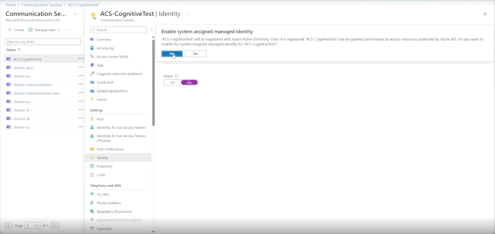
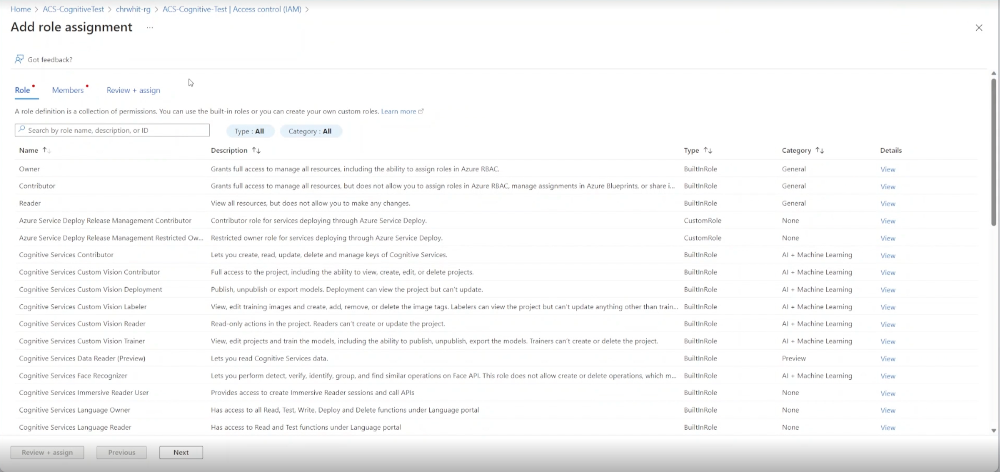
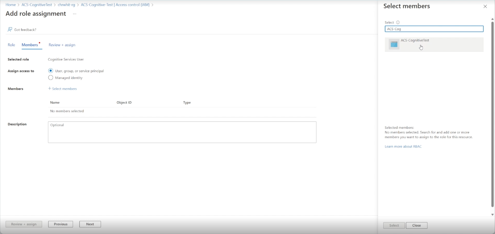

## Connect Azure Communication Services with Azure Cognitive Services

Azure Communication Services Call Automation APIs provide developers the ability to steer and control the ACS Telephony, VoIP or WebRTC calls using real-time event triggers to perform actions based on custom business logic specific to their domain. Within the Call Automation APIs developers can leverage simple AI powered APIs which can be used to play personalized greeting messages, recognize conversational voice inputs to gather information on contextual questions to drive a more self-service model with customers, leverage sentiment analysis to improve customer service overall. These content specific APIs are orchestrated through **Azure Cognitive Services** with support for customization of AI models without developers needing to terminate media streams on their services and streaming back to Azure for AI functionality. 

All this is possible with one-click where enterprises can access a simple, secure solution and link their models through the portal. Furthermore, developers and enterprises don't need to manage credentials. Connecting your Cognitive Services uses managed identities to access user-owned resources. Developers can use managed identities to authenticate any resource that supports Azure Active Directory authentication.

BYO Cognitive Services can be easily integrated into any application regardless of the programming language. When creating an Azure Resource in Azure Portal, enable the BYO option and provide the URL to the Cognitive Services. This simple experience allows developers to meet their needs, scale, and avoid investing time and resources into designing and maintaining a custom solution.

## Common use cases

### Build applications that can play and recognize speech 
With the ability to connect your Cognitive Services to Azure Communication Services, you can enable custom play functionality, using [Text-to-Speech](../../../articles/cognitive-services/Speech-Service/text-to-speech.md) and [SSML](../../../articles/cognitive-services/Speech-Service/speech-synthesis-markup.md) configuration, to play more customized and natural sounding audio to users. Through the Cognitive Services connection you can also use the Speech-To-Text service to incorporate recognition of voice responses that can be converted into actionable tasks through business logic in the application. These functions can be further enhanced through the ability to create custom models within Cognitive services that are bespoke to your domain and region through the ability to choose languages spoken and recognized, custom voices and custom models built based on your experience. 

[Screenshot 1]
[Screenshot 2]

## Azure Portal experience
You can also configure and bind your Communication Services and Cognitive Services through the Azure portal. 

### Add a Managed Identity to the ACS Resource 

1. Navigate to your ACS Resource in the Azure Portal
2. Select the Identity tab (highlighted 1 in the screenshot below)
3. Enable system assigned identity (highlighted 2 in the screenshot below).  This will begin the creation of the identity; A pop-up notification will appear notifying you that the request is being processed.

### Option 1: Add role from Azure Cognitive Services in the Azure Portal
1. Navigate to your Azure Cognitive Service resource.
2. Select the "Access control (IAM)" tab.
3. Click the "+ Add" button.
4. Select "Add role assignments" from the menu

5. Choose the "Cognitive Services User" role to assign, then click "Next".

6. For the field "Assign access to" choose the "User, group or service principal".
7. Press "+ Select members" an a side tab will open.
8. Choose your Azure Communication Services subscription from the "Subscriptions" drop down menu and click "Select".

9. Click “Review + assign”, this will assign the role to the managed identity.

### Option 2: Add role through ACS Identity tab

1. Navigate to your ACS resource in the Azure Portal
2. Select Identity tab
3. Click on "Azure role assignments"

4.  Click the "Add role assignment (Preview)" button, which will open the "Add role assignment (Preview)" tab
5.  Select the "Resource group" for "Scope".
6.  Select the "Subscription" // The CogSvcs subscription?
7.  Select the "Resource Group" containing the Cognitive Service 
8.  Select the "Role" "Cognitive Services User"

10.  Click Save 

Your Communication Service has now been linked to your Azure Cognitive Service resource. 
