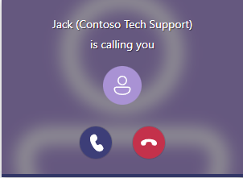
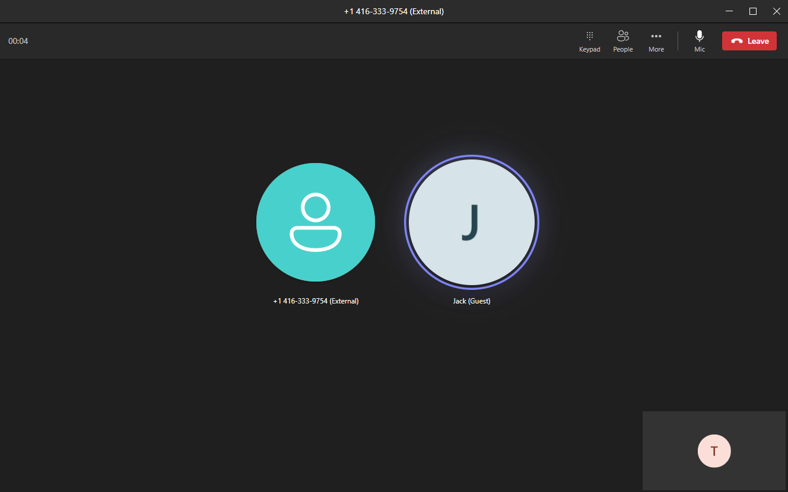

# Add a Microsoft Teams user to an existing call using Call Automation

[!INCLUDE [Public Preview Notice](../../includes/public-preview-include.md)]

In this quickstart, we use the Azure Communication Services Call Automation APIs to add, remove and transfer call to a Teams user.

## Prerequisites

- An Azure account with an active subscription.
- A Microsoft Teams phone license and a Teams tenant with administrative privileges. Teams phone license is a must in order to use this feature, learn more about Teams licenses [here](https://www.microsoft.com/en-us/microsoft-teams/compare-microsoft-teams-bundle-options). Administrative privileges are required to authorize Communication Services resource to call Teams users, explained later in Step 1.  
- A deployed [Communication Service resource](../../quickstarts/create-communication-resource.md) and valid connection string found by selecting Keys in left side menu on Azure portal.
- [Acquire a PSTN phone number from the Communication Service resource](../../quickstarts/telephony/get-phone-number.md). Note the phone number you acquired to use in this quickstart. 
- An Azure Event Grid subscription to receive the `IncomingCall` event.
- The latest [Azure Communication Service Call Automation API library](https://dev.azure.com/azure-sdk/public/_artifacts/feed/azure-sdk-for-net/NuGet/Azure.Communication.CallAutomation/versions/) for your operating system.
- A web service that implements the Call Automation API library, follow [this tutorial](../../quickstarts/call-automation/callflows-for-customer-interactions.md).

## Step 1: Authorization for your Azure Communication Services Resource to enable calling to Microsoft Teams users

To enable calling through Call Automation APIs, a [Microsoft Teams Administrator](/azure/active-directory/roles/permissions-reference#teams-administrator) or [Global Administrator](/en-us/azure/active-directory/roles/permissions-reference#global-administrator) must explicitly enable the Communication Services resource(s) access to their tenant to allow calling.

[Set-CsTeamsAcsFederationConfiguration (MicrosoftTeamsPowerShell)](/powershell/module/teams/set-csteamsacsfederationconfiguration)
Tenant level setting that enables/disables federation between their tenant and specific Communication Services resources.

[Set-CsExternalAccessPolicy (SkypeForBusiness)](/powershell/module/skype/set-csexternalaccesspolicy)
User policy that allows the admin to further control which users in their organization can participate in federated communications with Communication Services users.

## Step 2: Use the Graph API to get Azure AD object ID for Teams users and optionally check their presence
A Teams user’s Azure Active Directory (Azure AD) object ID (OID) is required to add them to or transfer to them from a Communication Services call. The OID can be retrieved through 1) Office portal, 2) Azure AD portal, 3) Azure AD Connect; or 4) Graph API. The example below uses Graph API.

Consent must be granted by an Azure AD admin before Graph can be used to search for users, learn more by following on the [Microsoft Graph Security API overview](/graph/security-concept-overview) document. The OID can be retrieved using the list users API to search for users. The following shows a search by display name, but other properties can be searched as well:

[List users using Microsoft Graph v1.0](/graph/api/user-list):
```rest
Request:
	https://graph.microsoft.com/v1.0/users?$search="displayName:Art Anderson"
Permissions:
	Application and delegated. Refer to documentation.
Response:
    "@odata.context": "https://graph.microsoft.com/v1.0/$metadata#users",
    "value": [
        {
            "displayName": "Art Anderson",
            "mail": "artanderson@contoso.com",
            "id": "fc4ccb5f-8046-4812-803f-6c344a5d1560"
        }
```
Optionally, Presence for a user can be retrieved using the get presence API and the user ObjectId. Learn more on the [Microsoft Graph v1.0 documentation](/graph/api/presence-get).
```rest
Request:
https://graph.microsoft.com/v1.0/users/fc4ccb5f-8046-4812-803f-6c344a5d1560/presence
Permissions:
Delegated only. Application not supported.  Refer to documentation.
Response:
    "@odata.context": "https://graph.microsoft.com/v1.0/$metadata#users('fc4ccb5f-8046-4812-803f-6c344a5d1560')/presence/$entity",
    "id": "fc4ccb5f-8046-4812-803f-6c344a5d1560",
    "availability": "Offline",
    "activity": "Offline"

```

## Step 3: Add a Teams user to an existing Communication Services call controlled by Call Automation APIs
You need to complete the prerequisite step and have a web service app to control a Communication Services call. Using the callConnection object, add a participant to the call.

::: zone pivot="programming-language-csharp"

```csharp
CallAutomationClient client = new CallAutomationClient('<Connection_String>');
AnswerCallResult answer = await client.AnswerCallAsync(incomingCallContext, new Uri('<Callback_URI>'));
await answer.Value.CallConnection.AddParticipantAsync(
    new CallInvite(new MicrosoftTeamsUserIdentifier('<Teams_User_Guid>'))
    {
        SourceDisplayName = "Jack (Contoso Tech Support)"
    });
```

::: zone-end

::: zone pivot="programming-language-java"

```java
CallAutomationClient client = new CallAutomationClientBuilder().connectionString("<resource_connection_string>").buildClient();
AnswerCallResult answer = client.answerCall(incomingCallContext, "<Callback_URI>"));
answer.getCallConnection().addParticipant(
    new CallInvite(new MicrosoftTeamsUserIdentifier("<Teams_User_Guid>"))
        .setSourceDisplayName("Jack (Contoso Tech Support)"));
```

::: zone-end

::: zone pivot="programming-language-javascript"

```typescript
const client = new CallAutomationClient("<resource_connection_string>");
const answer = await client.answerCall(incomingCallContext, "<Callback_URI>"));
answer.callConnection.addParticipant({
    targetParticipant: { microsoftTeamsUserId: "<Teams_User_Guid>" },
    sourceDisplayName: "Jack (Contoso Tech Support)"
});
```

::: zone-end

::: zone pivot="programming-language-python"

```python
call_automation_client = CallAutomationClient.from_connection_string("<resource_connection_string>")
answer = call_automation_client.answer_call(incoming_call_context = incoming_call_context, callback_url = "<Callback_URI>")
call_connection_client = call_automation_client.get_call_connection(answer.call_connection_id)
call_connection_client.add_participant(target_participant = CallInvite(
    target = MicrosoftTeamsUserIdentifier(user_id="<USER_ID>"),
    source_display_name = "Jack (Contoso Tech Support)"))
```

::: zone-end

-----

On the Microsoft Teams desktop client, Jack's call will be sent to the Microsoft Teams user through an incoming call toast notification.



After the Microsoft Teams user accepts the call, the in-call experience for the Microsoft Teams user will have all the participants displayed on the Microsoft Teams roster. Note that your application that is managing the call using Call Automation API will remain hidden to Teams user on the call screen. 


## Step 4: Remove a Teams user from an existing Communication Services call controlled by Call Automation APIs

::: zone pivot="programming-language-csharp"

```csharp
await answer.Value.CallConnection.RemoveParticipantAsync(new MicrosoftTeamsUserIdentifier('<Teams_User_Guid>'));
```

::: zone-end

::: zone pivot="programming-language-java"

```java
answer.getCallConnection().removeParticipant(new MicrosoftTeamsUserIdentifier("<Teams_User_Guid>"));
```

::: zone-end

::: zone pivot="programming-language-javascript"

```typescript
answer.callConnection.removeParticipant({ microsoftTeamsUserId: "<Teams_User_Guid>" });
```

::: zone-end

::: zone pivot="programming-language-python"

```python
call_connection_client.remove_participant(target_participant = MicrosoftTeamsUserIdentifier(user_id="<USER_ID>"))
```

::: zone-end

-----

### Optional feature: Transfer to a Teams user from an existing Communication Services call controlled by Call Automation APIs

::: zone pivot="programming-language-csharp"

```csharp
await answer.Value.CallConnection.TransferCallToParticipantAsync(new MicrosoftTeamsUserIdentifier('<Teams_User_Guid>'));
```

::: zone-end

::: zone pivot="programming-language-java"

```java
answer.getCallConnection().transferCallToParticipant(new MicrosoftTeamsUserIdentifier("<Teams_User_Guid>"));
```

::: zone-end

::: zone pivot="programming-language-javascript"

```typescript
answer.callConnection.transferCallToParticipant({ microsoftTeamsUserId: "<Teams_User_Guid>" });
```

::: zone-end

::: zone pivot="programming-language-python"

```python
call_connection_client.transfer_call_to_participant(target_participant = MicrosoftTeamsUserIdentifier(user_id = "<USER_ID>"))
```

::: zone-end

-----

### How to tell if your Tenant isn't enabled for this preview?


## Clean up resources

If you want to clean up and remove a Communication Services subscription, you can delete the resource or resource group. Deleting the resource group also deletes any other resources associated with it. Learn more about [cleaning up resources](../../quickstarts/create-communication-resource.md#clean-up-resources).

## Next steps

- Learn how to [record your calls](../../quickstarts/voice-video-calling/get-started-call-recording.md).
- Learn more about [Call Automation](../../concepts/call-automation/call-automation.md) and its features.
- Learn more about capabilities of [Teams Interoperability support with Azure Communication Services Call Automation](../../concepts/call-automation/call-automation-teams-interop.md)
- Learn about [Play action](../../concepts/call-automation/play-Action.md) to play audio in a call.
- Learn how to build a [call workflow](../../quickstarts/call-automation/callflows-for-customer-interactions.md) for a customer support scenario. 
