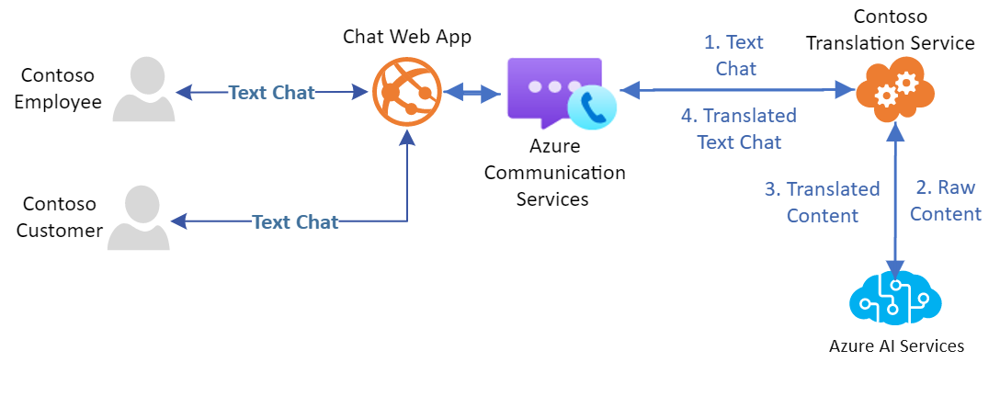

#  Translating chats to enable users to communicate in their preferred language

In this guide, learn how you can use [Azure AI APIs](../../../ai-services/index.yml) with the Chat SDK to build use cases like:

- Enable users to chat with each other in different languages.
- Help a support agent prioritize tickets by detecting a negative sentiment of an incoming message from a customer.
- Analyze the incoming messages for key detection and entity recognition, and prompt relevant info to the user in your app based on the message content.

One way to achieve the use cases above is by having your trusted service act as a participant on a chat thread. Let's say you want to enable language translation. This service (as illustrated in diagram below) is responsible for listening to the messages
exchanged by other participants [1], calling Azure AI APIs to translate content to desired language [2 and 3] and sending the translated result as a message in the chat thread [4].

This way, the message history contains both original and translated messages. In the client application, you can add logic to show the original or translated message. See [this quickstart](../../../ai-services/translator/quickstart-text-rest-api.md) to understand how to use AI APIs to translate text to different languages. 

## Sentiment analysis 

Similarly for sentiment analysis as the users are having a conversation the Azure AI language service can be used.

## Next steps

* [Troubleshooting](../../concepts/troubleshooting-info.md)
* Help and support [options](../../support.md)
