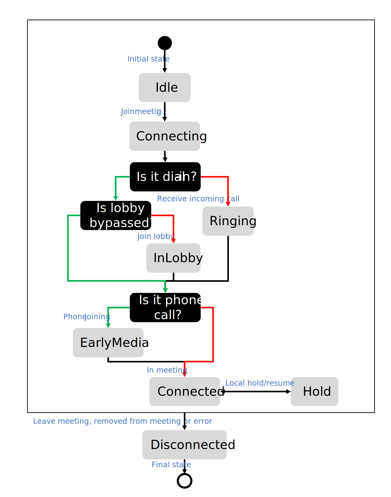
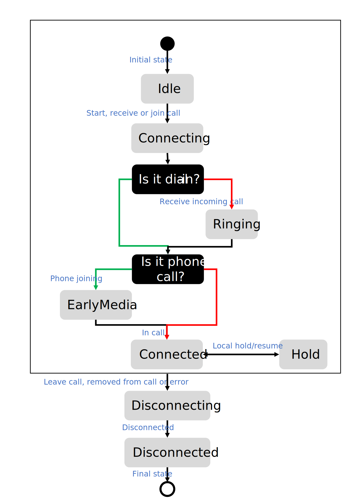
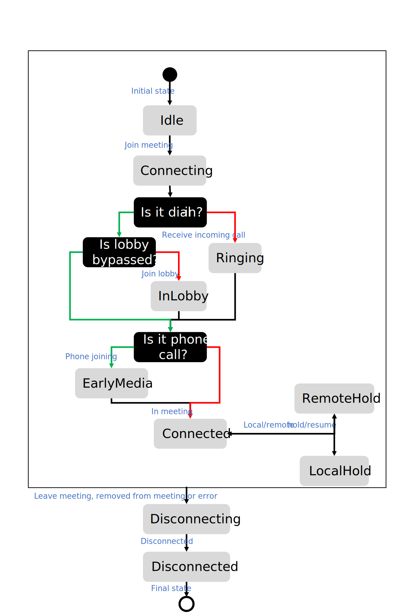

[!INCLUDE [Install SDK](../install-sdk/install-sdk-web.md)]

## Place a call

Start a synchronous one-to-one or group call with `startCall` API on `teamsCallAgent`. You can provide `MicrosoftTeamsUserIdentifier` or `PhoneNumberIdentifier` as a parameter to define the target of the call. The method returns the `TeamsCall` instance that allows you to subscribe to call events.

> [!NOTE]
> Start a group call with `teamsCallAgent` requires chat's `threadId` when calling `startCall` method. Created `TeamsCall` instance has property `threadId` capturing this thread. Communication Services Calling SDK does not keep participants in chat and call roster in sync. Microsft encourages developers to keep the roster in sync for the best user experience. Learn how to [manage chat thread](#manage-chat-thread).

Start a one-to-one Voice-over IP (VoIP) call to Teams user:
```js
const userCallee = { microsoftTeamsUserId: '<MICROSOFT_TEAMS_USER_ID>' };
const oneToOneCall = teamsCallAgent.startCall(userCallee);
```

Start a one-to-one phone call to E.164 phone number:
```js
const phoneCallee = { phoneNumber: '<PHONE_NUMBER_E164_FORMAT>' }
const oneToOneCall = teamsCallAgent.startCall(phoneCallee );
```
Start a group call to Teams user with Voice-over IP (VoIP) and phone number:
```js
const userCallee = { microsoftTeamsUserId: '<MICROSOFT_TEAMS_USER_ID>' }
const phoneCallee = { phoneNumber: '<PHONE_NUMBER_E164_FORMAT>'};
const groupCall = teamsCallAgent.startCall([userCallee, phoneCallee], { threadId: '<THREAD_ID>' });
```

## Join a call

### Join a Teams meeting

You can join Teams meetings with the method `join` on the `teamsCallAgent` instance. Teams users can join Teams meeting by providing a `TeamsMeetingLinkLocator`, `TeamsMeetingCoordinatesLocator`, or `TeamsMeetingIdLocator`.

Join Teams meeting with meeting URL:
```js
const meetingCall = teamsCallAgent.join({ meetingLink: '<MEETING_LINK>' });
```

Join Teams meeting with combination of thread ID, organizer ID, tenant ID, and message ID:
```js
const meetingCall = teamsCallAgent.join({ threadId: '<THREAD_ID>', organizerId: '<ORGANIZER_ID>', tenantId: '<TENANT_ID>', messageId: '<MESSAGE_ID>' });
```
Join Teams meeting with meeting code and passcode:
```js
const meetingCall = teamsCallAgent.join({ meetingId: '<MEETING_CODE>', passcode: '<PASSCODE>'});
```

### Join Teams meeting with meeting ID and passcode:

Developers can use multiple ways to join Teams meeting. One of them is meeting ID and passcode, which allows people to join the Teams meeting they are invited to from a device or application. You always need to provide both meeting ID and passcode to join the meeting. Passcode is case sensitive.
- Format of the meeting ID and passcode is:
  * Meeting ID: 12 digits.
  * Passcode: 6 characters
     
- How often do you need to refresh meeting ID & passcode?
   * Meeting ID and passcode does not change once created. Developers don't need to refresh neither of those for change.
   * Teams meeting organizer can't regenerate the meeting ID and passcode.
       
- Is there any difference in Teams meeting experience if the user joins through URL or meeting ID & passcode?
  * No. Users will have the same user experience if they join Teams meeting through Teams meeting URL or meeting ID & passcode. 

- How should developers store and manage passcode?
  * Meeting ID and passcode are coordinates to join the meeting. Developers should treat it as secret, which should be encrypted and if stored then behind access control.
  * If the coordinates are exposed, anyone can join the meeting and ruin the experience for everyone in the meeting.
    

- How to get meeting ID & passcode ?
     1. Graph API: Use Graph API to retrieve information about `onlineMeeting` resource and check the object in property `joinMeetingIdSettings`.
     1. Teams: In your Teams application go to `Calendar` app and open details of a meeting. Online meetings have meeting ID and passcode in the definition of the meeting. 
     1. Outlook: You can find the meeting ID & passcode in calendar events or in email meeting invites.
     1. Developers can't retrieve the meeting ID & passcode through calling SDK or retrieve it from verbose console logs.


- How can I verify the meeting ID & passcode is correct?
  * MeetingId and passcode verification can be done via : https://www.microsoft.com/en-us/microsoft-teams/join-a-meeting

## Receive a Teams incoming call

You can subscribe to `incomingCall` event on `teamsCallAgent` instance to register incoming calls to the Teams user. The event has a ` teamsIncomingCall ` property with `TeamsIncomingCall` instance that allows you to `accept` or `reject` the incoming call.

```js
const incomingCallHandler = async (args: { teamsIncomingCall: TeamsIncomingCall }) => {
    const incomingCall = args.teamsIncomingCall;
    // Get Teams incoming call ID
    const incomingCallId = incomingCall.id;
    // Get information about this Call. This API is provided as a preview for developers
    // and may change based on feedback that we receive. Do not use this API in a production environment.
    // To use this API please use 'beta' release of Azure Communication Services Calling Web SDK
    const callInfo = incomingCall.info;
    // Get information about caller
    const callerInfo = incomingCall.callerInfo
    // Accept the call
    const teamsCall = await incomingCall.accept();
    // Reject the call
    incomingCall.reject();
    // Subscribe to callEnded event and get the call end reason
    incomingCall.on('callEnded', args => {
        console.log(args.callEndReason);
    });
    // callEndReason is also a property of IncomingCall
    var callEndReason = incomingCall.callEndReason;
};
teamsCallAgent.on('incomingCall', incomingCallHandler);
```

## Enable and disable video
You can get your local video stream collection from the property `localVideoStreams` in the `TeamsCall` instance. If enabled, the collection will contain a screen-sharing stream, and camera video feeds. You can get remote participants' video streams by inspecting property `TeamsCall`.`remoteParticipants` where each participant has a collection of video streams in property `videoStreams`.

## Mute and unmute

You can use `mute` and `unmute` asynchronous APIs on the `TeamsCall` instance to mute or unmute Teams users locally. Local mute will prevent audio from being sent to other participants.

```js
//mute local device
await call.mute();
//unmute local device
await call.unmute();
```
## Mute other participants

To mute all other participants or mute a specific participant, you can use the asynchronous APIs `muteAllRemoteParticipants` on the call and `mute` on the remote participant:

```js
//mute all participants except yourself
await call.muteAllRemoteParticipants();

//mute a specific participant
await call.remoteParticipants[0].mute();
```

> [!NOTE]
> This API is provided as a preview for developers and may change based on feedback that we receive. Do not use this API in a production environment. To use this api please use 'beta' release of Azure Communication Services Calling Web SDK

## Manage remote participants

Other call participants are available in the `TeamsCall` instance under the property `remoteParticipants`. It is a collection of `RemoteParticipant` objects. You can list, add and remove other participants from the call.

> [!NOTE]
> Adding a participant method requires chat's `threadId`. Communication Services Calling SDK does not keep participants in chat and call roster in sync. Microsft encourages developers to keep the roster in sync for the best user experience. Learn how to [manage chat thread](#manage-chat-thread).

You can add new Teams user or phone number to the Teams call or Teams meeting by calling the method `addParticipant` on the object `TeamsCall`. The method accepts identifiers `MicrosoftTeamsUserIdentifier` or `PhoneNumberIdentifier` as input and returns synchronously the instance of `RemoteParticipant` and triggers the event `remoteParticipantsUpdated` on the `TeamsCall` instance.

You can remove a participant from the Teams call or Teams meeting by invoking the `removeParticipant` method on the `TeamsCall` instance asynchronously. The method accepts identifiers `MicrosoftTeamsUserIdentifier` or `PhoneNumberIdentifier` as an input. The method is resolved when `RemoteParticipant` is removed from the `remoteParticipants` collection, and the event `remoteParticipantsUpdated` on the `TeamsCall` instance is triggered.

List other call participants:
```js
const participants = call.remoteParticipants; // [remoteParticipant, remoteParticipant....]
```

Add Teams user and phone number to the Teams call or Teams meeting:
```js
const teamsUser = { microsoftTeamsUserId: '<MICROSOFT_TEAMS_USER_ID>' };
const phoneUser = { phoneNumber: '<PHONE_NUMBER_E164_FORMAT>' }
const remoteParticipant = call.addParticipant(teamsUser , { threadId: '<THREAD_ID>' });
const remoteParticipant2 = call.addParticipant(phoneUser , { threadId: '<THREAD_ID>' });
```

Remove Teams user and phone number from Teams call or Teams meeting:
```js
const teamsUser = { microsoftTeamsUserId: '<MICROSOFT_TEAMS_USER_ID>' };
const phoneUser = { phoneNumber: '<PHONE_NUMBER_E164_FORMAT>' }
await call.removeParticipant(teamsUser);
await call.removeParticipant(phoneUser);
```

## Remote participants

Remote participants represent an endpoint connected to the ongoing Teams call or Teams meeting. The class `remoteParticipant` has the following set of properties and collections:

- `identifier`: Returns one of the following identifiers: `CommunicationUserIdentifier`, `MicrosoftTeamsUserIdentifier`, `PhoneNumberIdentifier`, or `UnknownIdentifier`.

```js
const identifier = remoteParticipant.identifier;
```

- `state`: Returns a `string` that represents a state of a remote participant. The state can have one of the following values:

| State value | When | Description |
|-----------------------|-----------------------------------------------|-------------|
| `Idle` | Initial state | This is the first state of the participant |
| `Connecting` | After `Idle` | Transition state while a participant is connecting to the call. |
| `Ringing` | After `Connecting` | The participant received an `incomingCall` notification or Teams client is ringing |
|`Connected` | After `Ringing`, `Connecting`, `EarlyMedia` or `InLobby` | The participant accepted the call invitation or joined the call. The media flows towards the participant. |
|`Hold` | After `Connected` | The participant in the call has been put on hold.|
|`EarlyMedia` | After `Connecting` | The media is played before a participant connects to the call|
|`InLobby` | After `Ringing`, `Connecting` or `EarlyMedia` | The participant is in the Teams meeting lobby.|
|`Disconnected` | Final state | The participant is disconnected from the call. If the remote participant loses their network connectivity, their state changes to `Disconnected` after two minutes. |


States of remote participants in one-to-one or group calls:


States of remote participants in Teams meetings:


```js
const state = remoteParticipant.state;
```

- `callEndReason`: Returns an object containing additional information about the reason the call ended. Property `code` returns a number associated with the reason, and `subCode` returns a number associated with the code and the reason. You can find more information about [error codes](../../../../concepts/troubleshooting-info.md#calling-sdk-error-codes).

```js
const callEndReason = remoteParticipant.callEndReason;
const callEndReasonCode = callEndReason.code
const callEndReasonSubCode = callEndReason.subCode
```

- `isMuted`: Returns `Boolean` value representing a status of local mute.

```js
const isMuted = remoteParticipant.isMuted;
```

- `isSpeaking`: Returns `Boolean` value representing the status of non-empty audio being sent.

```js
const isSpeaking = remoteParticipant.isSpeaking;
```

- `videoStreams`: Returns collection of `RemoteVideoStream` objects sent by participants.

```js
const videoStreams = remoteParticipant.videoStreams; // [RemoteVideoStream, ...]
```
- `displayName`: Returns a `string` representing display name. Communication Services calling SDK does not set this value for Teams users.

```js
const displayName = remoteParticipant.displayName;
```

## Call

- `id`: Returns a string representing a unique call identifier.

```js
const callId = call.id;
```
•	`info`: Returns information about the call:

> [!NOTE]
> This API is provided as a preview for developers and may change based on feedback that we receive. Do not use this API in a production environment. To use this API, please use the 'beta' release of Azure Communication Services Calling Web SDK

•	`info`: Returns object containing information about the call. The property `threadId` is a string representing chat's thread ID shown in the Teams client.


```js
const callInfo = call.info;
const threadId = call.info.threadId;
```

•	`remoteParticipants`: Returns a collection of `remoteParticipant` objects representing other participants in the Teams call or Teams meeting.

```js
const remoteParticipants = call.remoteParticipants;
```

•	`callerInfo`: Returns the `CallerInfo` object if this is an incoming call. The property `identifier` can be one of following objects `CommunicationUserIdentifier`, `MicrosoftTeamsUserIdentifier`, `PhoneNumberIdentifier`, or `UnknownIdentifier`. The property `displayName` is a string representing the name to display if set.

```js
const callerIdentity = call.callerInfo.identifier;
const callerIdentity = call.callerInfo.displayName;
```

•	`state`: Returns a string representing the state of the call. The property can have one of the following values:


| State value | When | Description |
|-------------|------| ----------- |
|`None` | Initial state | The initial state of the call.|
|`Connecting` | After `None` | The state when a Teams call or Teams meeting is placed, joined, or accepted. |
|`Ringing` | After `Connecting` | The remote participant received the `incomingCall` event or Teams client is ringing. |
|`EarlyMedia` | After `Ringing` or `Connecting` | The media is played before the call is connected. |
|`Connected` | After `Ringing`, `EarlyMedia`, `InLobby`, `LocalHold` and `RemoteHold`| The call is connected. Media is flowing between local endpoints and remote participants.|
|`LocalHold` | After `Connected` | The call was put on hold by a local participant. No media is flowing between the local endpoint and remote participants.|
|`RemoteHold` | After `Connected` | The call was put on hold by a remote participant. No media is flowing between the local endpoint and remote participants. |
|`InLobby` | After `Ringing` or `Connecting` | The remote participant is in the Teams meeting lobby. No media is flowing between the local endpoint and remote participants. |
|`Disconnecting`| After any state | The transition state before the call goes to a `Disconnected` state.|
| `Disconnected`| Final state | The final state of the call. If the network connection is lost, the state changes to `Disconnected` after two minutes.|

States for one-to-one or group calls:


States for Teams meetings:


```js
const callState = call.state;
```

•	`callEndReason`: Returns object `CallEndReason` containing additional information about the call ended. The property `code` returns a number associated with the reason, and `subCode` returns a number associated with the code and the reason. You can find more information about [error codes](../../../../concepts/troubleshooting-info.md#calling-sdk-error-codes)

```js
const callEndReason = call.callEndReason;
const callEndReasonCode = callEndReason.code
const callEndReasonSubCode = callEndReason.subCode
```

•	`direction`: Returns a `string` representing the direction of the call. The property can have one of the following values: "Incoming' or `Outgoing`.

```js
const isIncoming = call.direction == 'Incoming';
const isOutgoing = call.direction == 'Outgoing';
```

•	`isMuted`: Returns `Boolean` value representing a status of local mute.

```js
const muted = call.isMuted;
```

•	`isScreenSharingOn`: Returns `Boolean` value true if you are sending screen sharing stream to other participants.

```js
const isScreenSharingOn = call.isScreenSharingOn;
```

•	`localVideoStreams`: Returns a collection of `LocalVideoStream` objects, representing video streams being sent to remote participants.

```js
const localVideoStreams = call.localVideoStreams;
```

## Manage chat thread
Providing a chat ID is mandatory for making group calls and adding participants to existing calls. Associated chat and call have a separate list of participants. Before adding participants to the call, add the user to the chat to provide the best user experience and satisfy information barrier requirements. Adding a user to the call without adding the user to the chat can result in exceptions if an information barrier is set up.

Consider the following scenario, where Alice makes a call to Bob, then Alice adds Charlie, and 3 minutes later, Alice removes Charlie from the call.

1. Create a chat thread between Alice, Bob and Charlie. Keep chat's `threadId` for later.
1. Alice calls Bob and Charlie using `startCall` method on `TeamsCallAgent` instance.
1. Add Dan to chat thread with `threadId` using [Chat Graph API to add member](/graph/api/chat-post-members?tabs=http&view=graph-rest-1.0&preserve-view=true)
1. Alice adds Dan to the call using `addParticipant` method on `call` and specifies the `threadId`
1. Alice removes Dan from the call using `removeParticipant` method on `call` and specifies the `threadId`
1. Remove Dan from chat thread with `threadId` using [Chat Graph API to remove member](/graph/api/chat-delete-members?tabs=http&view=graph-rest-1.0&preserve-view=true)

If Teams user stops call recording, the recording is placed into the chat associated with the thread. Provided chat ID impacts the experience of Teams users in Teams clients.

Recommendations for the management of chat ID:
- Escalation of the 1:1 phone call by adding another phone participant: Use Graph API to get the existing chat ID with only Teams user as a participant or create a new group chat with participants: Teams user ID and "00000000-0000-0000-0000-000000000000"
- Group call with single Teams user and multiple phone participants: Use Graph API to get existing chat ID with only Teams user as a participant or create a new group chat with participants: Teams user ID and "00000000-0000-0000-0000-000000000000"
- Group call with more than 2 Teams users: Use Graph API to get or create a group chat with the Teams users

## Send or receive a reaction from other participants
> [!NOTE]
> This API is provided as a preview for developers and may change based on feedback that we receive. To use this api please use 'beta' release of Azure Communication Services Calling Web SDK version 1.18.1 or higher

Within ACS you can send and receive reactions when on a group call:
- Like :+1:
- Love :heart:
- Applause :clap:
- Laugh :smile:
- Surprise :open_mouth:

To send a reaction you'll use the `sendReaction(reactionMessage)` API. To receive a reaction message will be built with Type `ReactionMessage` which uses `Reaction` enums as an attribute. 

You'll need to subscribe for events which provide the subscriber event data as:
```javascript
export interface ReactionEventPayload {
    /**
     * identifier for a participant
     */
    identifier: CommunicationUserIdentifier | MicrosoftTeamsUserIdentifier;
    /**
     * reaction type received
     */
    reactionMessage: ReactionMessage;
}
```

You can determine which reaction is coming from which participant with `identifier` attribute and gets the reaction type from `ReactionMessage`. 

### Sample on how to send a reaction in a meeting
```javascript
const reaction = call.feature(SDK.Features.Reaction);
const reactionMessage: SDK.ReactionMessage = {
       reactionType: 'like'
};
await reaction.sendReaction(reactionMessage);
```

### Sample on how to receive a reaction in a meeting
```javascript
const reaction = call.feature(SDK.Features.Reaction);
reaction.on('reaction', event => {
    // user identifier
    console.log("User Mri - " + event.identifier);
    // received reaction
    console.log("User Mri - " + event.reactionMessage.name);
    // reaction message
    console.log("reaction message - " + JSON.stringify(event.reactionMessage));
}
```

### Key things to note about using Reactions:
- Reactions won't work if the meeting organizer updates the meeting policy to disallow the reaction in a Teams interop call.
- Sending of reactions doesn't work on 1:1 calls.
