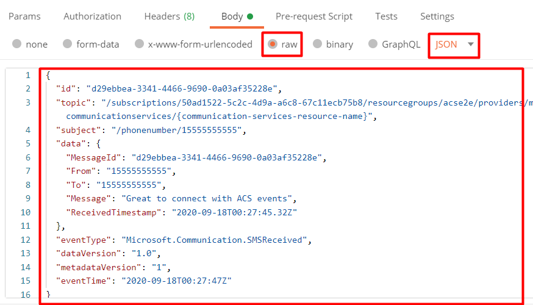
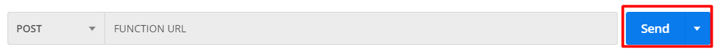

# Test your Event Grid handler locally

Testing Event Grid triggered Azure Functions locally can be complicated. You don't want to have to trigger events over and over to test your flow. It can also get expensive as triggering those events might require you perform an event that costs money like sending an SMS or placing a phone call. To help with testing, we show you how to use Postman to trigger your Azure Function with a payload that mimics the Event Grid event.

## Pre-requisites

- Install [Postman](https://www.postman.com/downloads/).
- Have a running Azure Function that can be triggered by Event Grid. If you don't have one, you can follow the [quickstart](../../../azure-functions/functions-bindings-event-grid-trigger.md?tabs=in-process%2Cextensionv3&pivots=programming-language-javascript) to create one.

The Azure Function can be running either in Azure if you want to test it with some test events or if you want to test the entire flow locally (press `F5` in Visual Studio Code to run it locally). If you want to test the entire flow locally, you need to use [ngrok](https://ngrok.com/) to hook your locally running Azure Function. Configure ngrok by running the command:

```bash

ngrok http 7071

```

## Configure Postman

1. Open Postman and create a new request.

    

2. Select the `POST` method.

3. Enter the URL of your Azure Function. Can either be the URL of the Azure Function running in Azure or the ngrok URL if you're running it locally. Ensure that you add the function name at the end of the URL: `/runtime/webhooks/EventGrid?functionName=<<FUNCTION_NAME>>`.

4. Select the `Body` tab and select `raw` and `JSON` from the dropdown. In the body, you add a test schema for the event you want to trigger. For example, if you're testing an Azure Function that is triggered by receiving SMS events, you add the following:

    ```json
    
    {
      "id": "Incoming_20200918002745d29ebbea-3341-4466-9690-0a03af35228e",
      "topic": "/subscriptions/50ad1522-5c2c-4d9a-a6c8-67c11ecb75b8/resourcegroups/acse2e/providers/microsoft.communication/communicationservices/{communication-services-resource-name}",
      "subject": "/phonenumber/15555555555",
      "data": {
        "MessageId": "Incoming_20200918002745d29ebbea-3341-4466-9690-0a03af35228e",
        "From": "15555555555",
        "To": "15555555555",
        "Message": "Great to connect with Azure Communication Services events",
        "ReceivedTimestamp": "2020-09-18T00:27:45.32Z"
      },
      "eventType": "Microsoft.Communication.SMSReceived",
      "dataVersion": "1.0",
      "metadataVersion": "1",
      "eventTime": "2020-09-18T00:27:47Z"
    }
    
    ```

    You can find more information for the different event types used for Azure Communication Services in the [documentation](../../../event-grid/event-schema-communication-services.md).

5. Select the `Headers` tab and add the following headers:

   - `Content-Type`: `application/json`
   - `aeg-event-type`: `Notification`

    

6. Select the `Send` button to trigger the event.

    

    At this point, an event should trigger in your Azure Function. You can verify the event by looking at the execution of your Azure Function. You can then validate that the function is doing its job correctly.
