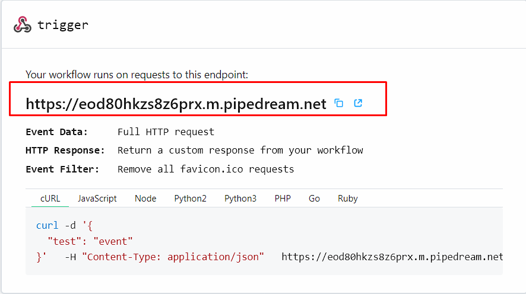
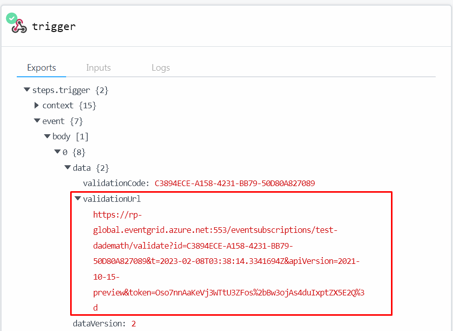

# Validate Azure Communication Services events

This document shows you how to validate that your Azure Communication Services resource sends events using Azure Event Grid viewer or RequestBin. 

> [!NOTE] 
> Using Azure Event Grid incurs additional costs. For more information, see [Azure Event Grid pricing](https://azure.microsoft.com/pricing/details/event-grid/).

## Pre-requisites

- An Azure account with an active subscription. [Create an account for free](https://azure.microsoft.com/free/?WT.mc_id=A261C142F).
- An active Communication Services resource and connection string. [Create a Communication Services resource](../../quickstarts/create-communication-resource.md).
- Install [Azure CLI](/cli/azure/install-azure-cli-windows?tabs=azure-cli).

If you already have an Azure Event Grid viewer deployed or would like to have a more robust viewer in place, you can follow instructions to [deploy it](/samples/azure-samples/azure-event-grid-viewer/azure-event-grid-viewer/). You need the endpoint generated by the Event Grid viewer.

Alternatively, if you want a quick and easy way to validate your events, you can use [RequestBin](https://requestbin.com/). RequestBin offers two modalities to pick from. If you want to quickly test your events, you can use the [public endpoint](https://requestbin.com/r) setup. These public endpoints make event data accessible to anyone with a URL. If you prefer to keep it private, you can create a RequestBin account and create a private endpoint. For more information, see RequestBin [public vs private endpoints](https://requestbin.com/docs/#public-vs-private-endpoints).



The next steps are the same for both options.

## Configure your Azure Communication Services resource to send events to your endpoint

1. Using [Azure CLI](/cli/azure/install-azure-cli-windows?tabs=azure-cli), we configure the endpoint we created in the pre-requisites to receive events from your Azure Communication Services resource. You need the resource ID for your Azure Communication Services resource found in the Azure portal.

    ```bash

    az eventgrid event-subscription create --name "<<EVENT_SUBSCRIPTION_NAME>>" --endpoint-type webhook --endpoint "<<URL>> " --source-resource-id "<<RESOURCE_ID>>"  --included-event-types Microsoft.Communication.SMSReceived 

    ```

    In the command, we only added the `Microsoft.Communication.SMSReceived` event type. You can add more event types to the command if you would like to receive more events. For a list of all the event types, see [Azure Communication Services events](../../../event-grid/event-schema-communication-services.md).

2. (Optional, only if using RequestBin) You need to copy the `validationURL` on the first event the gets posted to your endpoint. You need to paste that URL on your browser to validate the endpoint. The page should saw 'Webhook successfully validated as a subscription endpoint'.



## View events

Now that you've configured your endpoint to receive events, you can use it to view events as they come through.
