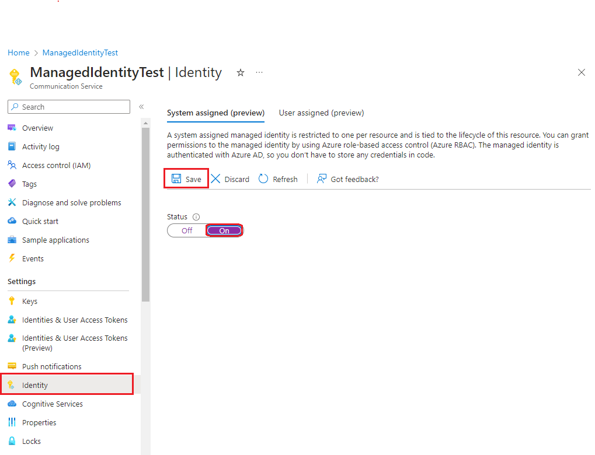
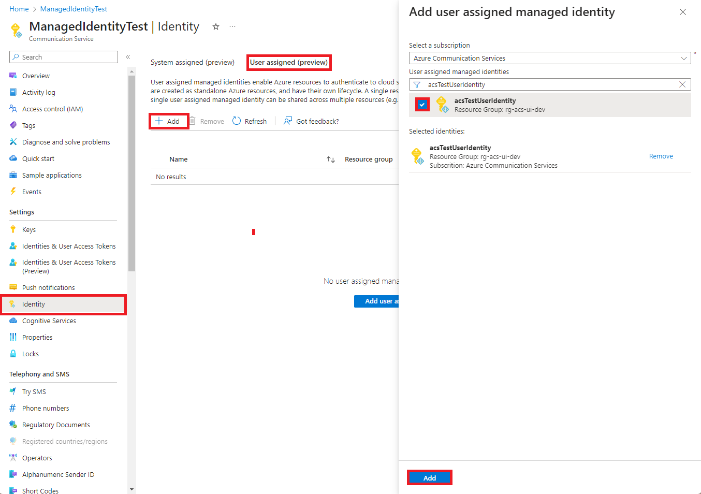

title: Azure Communication Services support for Managed Identity 
description: Learn about using Managed Identity with Azure Comnmunication Services
author: harazi
manager: mharbut
services: azure-communication-services

ms.author: harazi
ms.date: 07/24/2023
ms.topic: how-to
ms.service: azure-communication-services
ms.custom: managed-identity

---

# Introduction
Azure Communication Services (ACS) is a fully-managed communication platform that enables developers to build real-time communication features into their applications. By using Managed Identity with Azure Communication Services, you can simplify the authentication process for your application, while also increasing its security. For more information on using Managed Identity with ACS, refer to theThis document covers how to use Managed Identity with Azure Communication Services.

# Using Managed Identity with ACS

ACS supports using Managed Identity to authenticate with the service. By leveraging Managed Identity, you can eliminate the need to manage your own access tokens and credentials.

Your ACS resource can be assigned two types of identity:
1. A **System Assigned Identity** which is tied to your resource and is deleted when your resource is deleted.
   Your resource can only have one system-assigned identity.
2. A **User Assigned Identity** which is an Azure resource that can be assigned to your ACS resource. This identity is not deleted when your resource is deleted. Your resource can have multiple user-assigned identities.

To use Managed Identity with ACS, follow these steps:

1. Grant your Managed Identity access to the Communication Services resource. This can be done through the Azure portal or the Azure CLI.
2. Use the Managed Identity to authenticate with ACS. This can be done through the Azure SDKs or REST APIs that support Managed Identity.


-----

## Add a system-assigned identity

# [Azure portal](#tab/portal)

1. In the left navigation of your app's page, scroll down to the **Settings** group.

2. Select **Identity**.

3. Within the **System assigned** tab, switch **Status** to **On**. Click **Save**.

    

# [Azure CLI](#tab/cli)

Run the `az communication identity assign` command to assign a system-assigned identity:

```azurecli-interactive
az communication identity assign --system-assigned --name myApp --resource-group myResourceGroup
```
-----

## Add a user-assigned identity

Assigning a user-assigned identity to your ACS resource requires that you first create the identity and then add its resource identifier to your Communication service resource.

# [Azure portal](#tab/portal)

First, you'll need to create a user-assigned managed identity resource.

1. Create a user-assigned managed identity resource according to [these instructions](../../active-directory/managed-identities-azure-resources/how-manage-user-assigned-managed-identities#create-a-user-assigned-managed-identity).

2. In the left navigation for your app's page, scroll down to the **Settings** group.

3. Select **Identity**.

4. Select **User assigned** > **Add**.

5. Search for the identity you created earlier, select it, and select **Add**.

    

# [Azure CLI](#tab/cli)

1. Create a user-assigned identity.

    ```azurepowershell-interactive
    az identity create --resource-group <group-name> --name <identity-name>
    ```

2. Run the `az communication identity assign` command to assign a user-assigned identity:

```azurecli-interactive
az communication identity assign --name myApp --resource-group myResourceGroup --user-assigned <identity-id>
```

-----

# Next Steps
Now that you have learned how to use Managed Identity with Azure Communication Services, consider implementing this feature in your own applications to simplify your authentication process and improve security. 

- [Managed Identities ](https://learn.microsoft.com/en-us/azure/active-directory/managed-identities-azure-resources/overview)
- [Manage user-assigned managed identities](https://learn.microsoft.com/en-us/azure/active-directory/managed-identities-azure-resources/how-manage-user-assigned-managed-identities?pivots=identity-mi-methods-azp)
