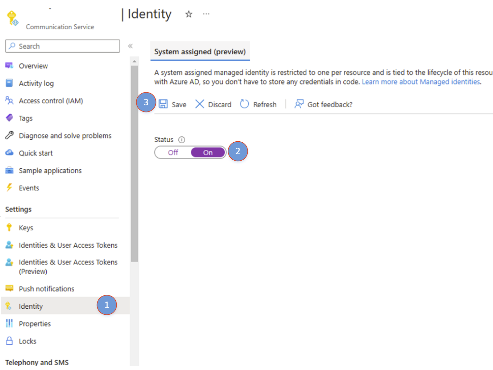
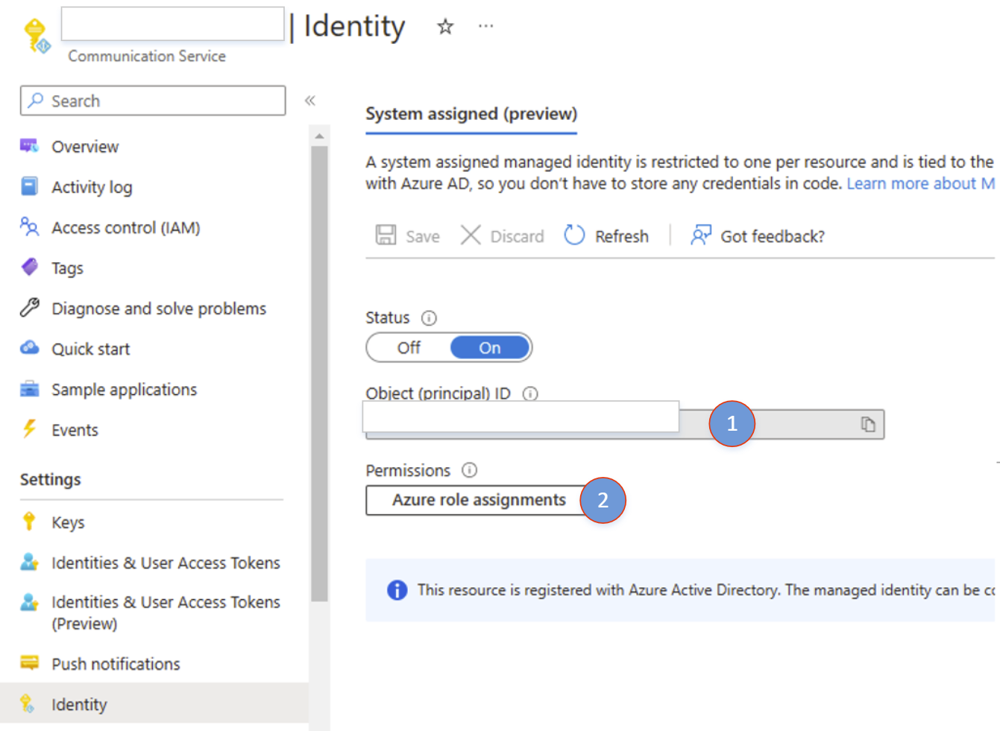
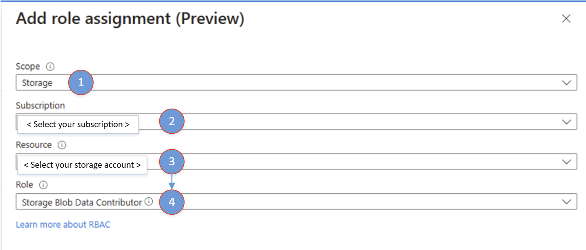
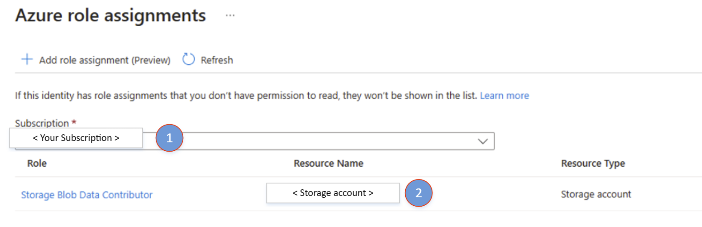

# Call recording: Bring your own Azure storage quickstart

[!INCLUDE [Private Preview](../../../includes/private-preview-include-section.md)]

This quickstart gets you started with Bring your own Azure storage for Call Recording. To start using Bring your own Azure Storage functionality, make sure you're familiar with the [Call Recording APIs](../../voice-video-calling/get-started-call-recording.md).

## Pre-requisite: Setting up Managed Identity and RBAC role assignments

### 1. Enable system assigned managed identity for Azure Communication Services



1. Open your Azure Communication Services resource. Navigate to *Identity* on the left.
2. System Assigned Managed Identity is disabled by default. Enable it and click on *Save*
3. Once completed, you're able to see the Object principal ID of the newly created identity.



4. Now that identity has been successfully created, click on *Azure role assignments* to start adding role assignments.

### 2. Add role assignment

1. Click on *"Add role assignment"*


2. On the *"Add role assignment"* panel, select the following values
     1. Scope: **Storage**
     2. Subscription: **Choose your subscription**
     3. Resource: **Choose your storage account**
     4. Role: **Azure Communication Services needs *"Storage Blob Data Contributor"* to be able to write to your storage account.**
    


3. Click on *"Save"*.
4. Once completed, you see the newly added role assignment in the *"Azure role assignment"* window.



## Start recording session with external storage specified

Use the server call ID received during initiation of the call.

::: zone pivot="programming-language-csharp"
[!INCLUDE [Test Call Recording BYOS with C#](../includes/recording-byos-private-csharp.md)]
::: zone-end

::: zone pivot="programming-language-java"
[!INCLUDE [Test Call Recording BYOS with Java](../includes/recording-byos-private-java.md)]
::: zone-end

### Notification on successful export

Use an [Azure Event Grid](../../../../event-grid/overview.md) web hook, or other triggered action, to notify your services when the recorded media is ready and have been exported to the external storage location.

Refer to this example of the event schema.

```JSON
{
    "id": "string", // Unique guid for event
    "topic": "string", // /subscriptions/{subscription-id}/resourceGroups/{group-name}/providers/Microsoft.Communication/communicationServices/{communication-services-resource-name}
    "subject": "string", // /recording/call/{call-id}/serverCallId/{serverCallId}
    "data": {
        "storageType": "string", // acsstorage, blobstorage etc.
        "recordingId": "string", // unique id for recording
        "recordingStorageInfo": {
            "recordingChunks": [
                {
                    "documentId": "string", // Document id for for the recording chunk
                    "contentLocation": "string", //Azure Communication Services URL where the content is located
                    "metadataLocation": "string", // Azure Communication Services URL where the metadata for this chunk is located
                    "deleteLocation": "string", // Azure Communication Services URL to use to delete all content, including recording and metadata.
                    "index": "int", // Index providing ordering for this chunk in the entire recording
                    "endReason": "string", // Reason for chunk ending: "SessionEnded", "ChunkMaximumSizeExceeded”, etc.
                }
            ]
        },
        "recordingStartTime": "string", // ISO 8601 date time for the start of the recording
        "recordingDurationMs": "int", // Duration of recording in milliseconds
        "sessionEndReason": "string" // Reason for call ending: "CallEnded", "InitiatorLeft”, etc.
    },
    "eventType": "string", // "Microsoft.Communication.RecordingFileStatusUpdated"
    "dataVersion": "string", // "1.0"
    "metadataVersion": "string", // "1"
    "eventTime": "string" // ISO 8601 date time for when the event was created
}
```

## Next steps

For more information, see the following articles:

- Download our [Java](https://github.com/Azure-Samples/communication-services-java-quickstarts/tree/main/ServerRecording) and [.NET](https://github.com/Azure-Samples/communication-services-dotnet-quickstarts/tree/main/ServerRecording) call recording sample apps 
- Learn more about [Call Recording](../../../concepts/voice-video-calling/call-recording.md)
- Learn more about [Call Automation](../../../concepts/call-automation/call-automation.md)

