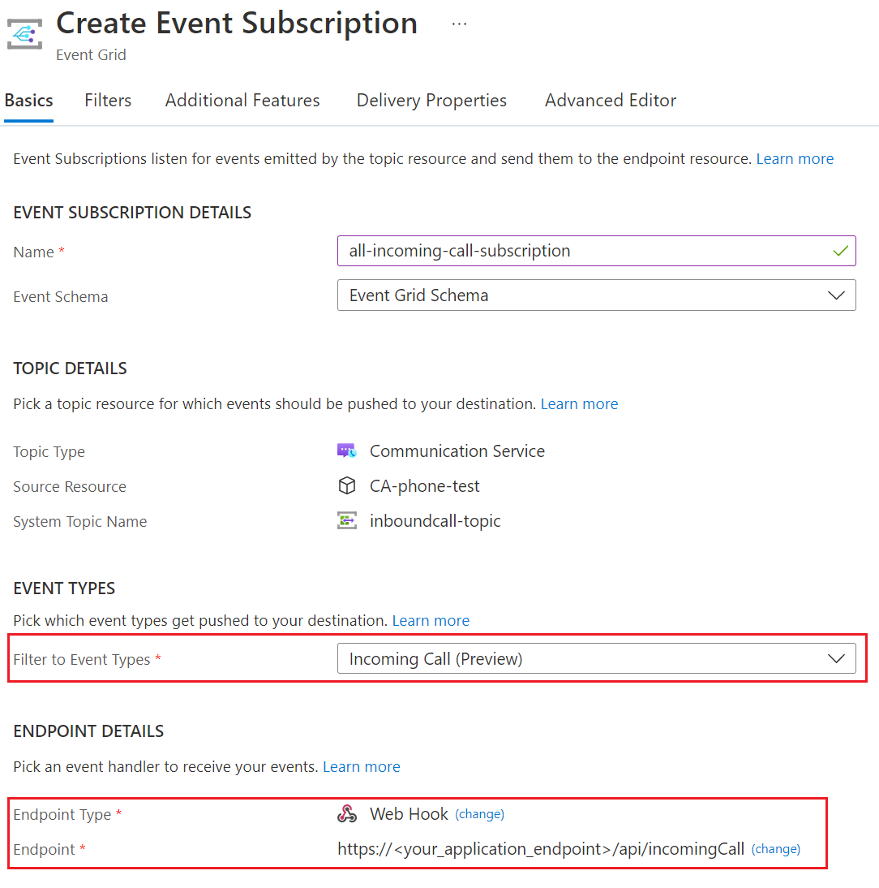

# Redirect inbound telephony calls with Call Automation

[!INCLUDE [Public Preview Notice](../../includes/public-preview-include.md)]

Get started with Azure Communication Services by using the Call Automation SDKs to build automated calling workflows that listen for and manage inbound calls placed to a phone number or received via ACS direct routing.

::: zone pivot="programming-language-csharp"
[!INCLUDE [Redirect inbound call with .NET](./includes/redirect-inbound-telephony-calls-csharp.md)]
::: zone-end

::: zone pivot="programming-language-java"
[!INCLUDE [Redirect inbound call with Java](./includes/redirect-inbound-telephony-calls-java.md)]
::: zone-end

## Subscribe to IncomingCall event

IncomingCall is an Azure Event Grid event for notifying incoming calls to your Communication Services resource. To learn more about it, see [this guide](../../concepts/call-automation/incoming-call-notification.md). 
1. Navigate to your resource on Azure portal and select `Events` from the left side menu.
2. Select `+ Event Subscription` to create a new subscription.
3. Filter for Incoming Call event.
4. Choose endpoint type as web hook and provide the public url generated for your application by ngrok. Make sure to provide the exact api route that you programmed to receive the event previously. In this case, it would be <ngrok_url>/api/incomingCall.

    

    If your application does not send 200Ok back to Event Grid in time, Event Grid will use exponential backoff retry to send the incoming call event again. However, an incoming call only rings for 30 seconds, and acting on a call after that will not work. To avoid retries after a call expires, we recommend setting the retry policy in the `Additional Features` tab as: Max Event Delivery Attempts to 2 and Event Time to Live to 1 minute. Learn more about retries [here](../../../event-grid/delivery-and-retry.md).
5. Select create to start the creation of subscription and validation of your endpoint as mentioned previously. The subscription is ready when the provisioning status is marked as succeeded.

This subscription currently has no filters and hence all incoming calls will be sent to your application. To filter for specific phone number or a communication user, use the Filters tab.

## Testing the application

1. Place a call to the number you acquired in the Azure portal (see prerequisites above).
2. Your Event Grid subscription to the IncomingCall should execute and call your application.
3. The call will be redirected to the endpoint(s) you specified in your application.

Since this call flow involves a redirected call instead of answering it, pre-call web hook callbacks to notify your application the other endpoint accepted the call aren't published.

## Clean up resources

If you want to clean up and remove a Communication Services subscription, you can delete the resource or resource group. Deleting the resource group also deletes any other resources associated with it. Learn more about [cleaning up resources](../../quickstarts/create-communication-resource.md#clean-up-resources).

## Next steps

- Learn more about [Call Automation](../../concepts/call-automation/call-automation.md) and its features. 
- Learn about [Play action](../../concepts/call-automation/play-Action.md) to play audio in a call.
- Learn how to build a [call workflow](../../quickstarts/call-automation/callflows-for-customer-interactions.md) for a customer support scenario. 