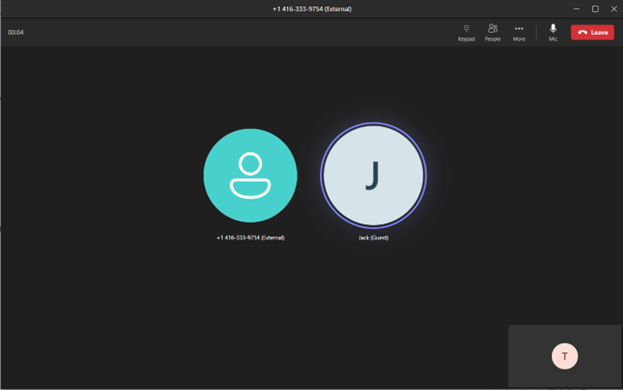

# Add a Microsoft Teams user to an existing call using Call Automation

[!INCLUDE [Private Preview Notice](../../includes/private-preview-include.md)]

In this quickstart, we’ll use the Azure Communication Services Call Automation APIs to add, remove and transfer to a Teams user.

You will need to be part of Azure Communication Services TAP program. It is likely that you’re already part of this program, and if you are not, please sign-up using https://aka.ms/acs-tap-invite. To access to the specific Teams Interop functionality for Call Automation, please submit your Teams Tenant Ids and Azure Communication Services Resource Ids by filling this form – https://aka.ms/acs-ca-teams-tap. You will need to fill the form every time you need a new tenant Id and new resource Id allow-listed.

## Prerequisites

- An Azure account with an active subscription.
- A Microsoft Teams tenant with administrative privileges.
- A deployed [Communication Service resource](../../create-communication-resource.md) and valid connection string found by selecting Keys in left side menu on Azure portal.
- [Acquire a PSTN phone number from the Communication Service resource](../../telephony/get-phone-number.md). Note the phone number you acquired to use in this quickstart. 
- An Azure Event Grid subscription to receive the `IncomingCall` event.
- The latest [Azure Communication Service Call Automation API library](./callflows-for-customer-interactions.md#install-the-nuget-package) for your operating system.
- A web service that implements the Call Automation API library, follow [this tutorial](./callflows-for-customer-interactions.md).

## Step 1: Authorization for your Azure Communication Services Resource to enable calling to Microsoft Teams users

To enable ad hoc calling through Call Automation APIs, a [Microsoft Teams Administrator](~/azure/active-directory/roles/permissions-reference#teams-administrator) or [Global Administrator](~/en-us/azure/active-directory/roles/permissions-reference#global-administrator) must explicitly enable the ACS resource(s) access to their tenant to allow ad hoc calling. They can further restrict ad hoc calling at the user level, so that only designated users in the tenant can communicate with ACS users.

[Set-CsTeamsAcsFederationConfiguration (MicrosoftTeamsPowerShell)](~/powershell/module/teams/set-csteamsacsfederationconfiguration?view=teams-ps)
This is the tenant level setting that enables/disables federation between their tenant and specific ACS resources.

[Set-CsExternalAccessPolicy (SkypeForBusiness)](~/powershell/module/skype/set-csexternalaccesspolicy?view=skype-ps)
This is a user policy that allows the admin to further control which users in their organization can participate in federated communications with ACS users.

## Step 2: Use the Graph API to get AAD object ID for Teams users and optionally check their presence
A Teams user’s AAD object ID (OID) is required to add them to or transfer to them from an ACS call. This can be retrieved through 1) Office portal, 2) Azure AD portal, 3) Azure AD Connect; or 4) Graph API. The example below uses Graph API.

Consent must be granted by an AAD admin before Graph can be used to search for users, learn more by following on the [Microsoft Graph Security API overview](~/graph/security-concept-overview) document. The OID can be retrieved using the list users API to search for users. The following shows a search by display name, but other properties can be searched as well:

[List users using Microsoft Graph v1.0](~/graph/api/user-list?view=graph-rest-1.0&tabs=http):
```rest
Request:
	https://graph.microsoft.com/v1.0/users?$search="displayName:Art Anderson"
Permissions:
	Application and delegated. Refer to documentation.
Response:
    "@odata.context": "https://graph.microsoft.com/v1.0/$metadata#users",
    "value": [
        {
            "displayName": "Art Anderson",
            "mail": "artanderson@contoso.com",
            "id": "fc4ccb5f-8046-4812-803f-6c344a5d1560"
        }
```
Optionally, Presence for a user can be retrieved using the get presence API and the user ObjectId. Learn more on the [Microsoft Graph v1.0 documentation](~/graph/api/presence-get?view=graph-rest-1.0&tabs=http).
```rest
Request:
https://graph.microsoft.com/v1.0/users/fc4ccb5f-8046-4812-803f-6c344a5d1560/presence
Permissions:
Delegated only. Application not supported.  Refer to documentation.
Response:
    "@odata.context": "https://graph.microsoft.com/v1.0/$metadata#users('fc4ccb5f-8046-4812-803f-6c344a5d1560')/presence/$entity",
    "id": "fc4ccb5f-8046-4812-803f-6c344a5d1560",
    "availability": "Offline",
    "activity": "Offline"

```

## Step 3: Add a Teams user to an existing ACS call controlled by Call Automation APIs
You will need to complete the pre-requisite step and have a web service app to control an ACS call. Using the callConnection object, add a participant to the call.

```csharp
CallAutomationClient client = new CallAutomationClient('<Connection_String>');
AnswerCallResult answer = await client.AnswerCallAsync(incomingCallContext, new Uri('<Callback_URI>'));
await answer.Value.CallConnection.AddParticipantAsync(
    new CallInvite(new MicrosoftTeamsUserIdentifier('<Teams_User_Guid>'))
    {
        SourceDisplayName = "Jack (Contoso Tech Support)"
    });
```




## Step 4: Remove a Teams user from an existing ACS call controlled by Call Automation APIs
```csharp
await answer.Value.CallConnection.RemoveParticipantAsync(new MicrosoftTeamsUserIdentifier('<Teams_User_Guid>'));
```

### Additional optional feature: Transfer to a Teams user from an existing ACS call controlled by Call Automation APIs
```csharp
await answer.Value.CallConnection.TransferCallToParticipantAsync(new CallInvite(new MicrosoftTeamsUserIdentifier('<Teams_User_Guid>')));
```
### How to tell if your Tenant is not enabled for this preview?


## Clean up resources

If you want to clean up and remove a Communication Services subscription, you can delete the resource or resource group. Deleting the resource group also deletes any other resources associated with it. Learn more about [cleaning up resources](../../quickstarts/create-communication-resource.md#clean-up-resources).

## Next steps

- Learn more about [Call Automation](../../concepts/call-automation/call-automation.md) and its features. 
- Learn about [Play action](../../concepts/call-automation/play-Action.md) to play audio in a call.
- Learn how to build a [call workflow](../../quickstarts/call-automation/callflows-for-customer-interactions.md) for a customer support scenario. 