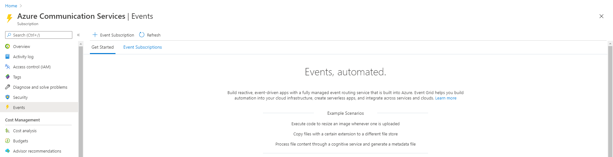
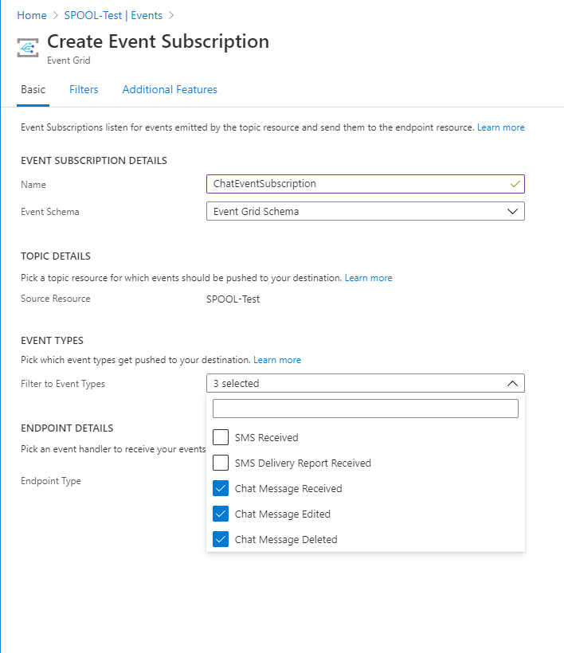
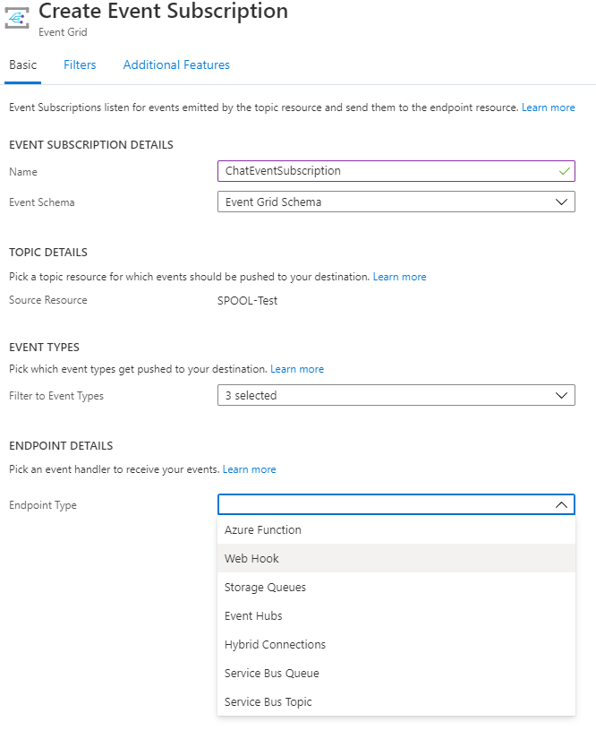
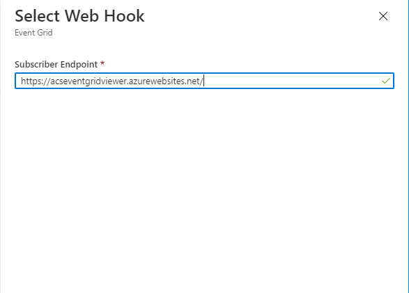

# Quickstart: Handle chat events

[!INCLUDE [Public Preview Notice](../../includes/public-preview-include.md)]

> [!WARNING]
> This document is under construction and needs the following items to be addressed: 
> - Screenshots should be updated (Richard will handle this)
> - Overall, this doc doesn't seem very useful to a new dev yet. Core content / journey needs to be drafted.
> - Show how to emit a chat event and consume using the event grid event viewer app instead of forcing the user to implement an api endpoint.
> - Explain how to delete the event subscription from the portal
> - Payloads to be provided by Vikram
> - This needs to be aligned / reference to/from the **Handle SMS events quickstart** and the **event handling** conceptual

Once you have chat working in your app, Chat emits events that you can subscribe to. This is enabled by using Azure Event Grid. Your service can listen to these events to execute custom business logic when specific operations have occured. The events can be used to track new activity for a user who might not be online and hence not receive chat activity via the SDK path. Using event subjects, you can track incoming activities for or on behalf of certain users by setting filters in the event subscription that look for specific user ids as recipient of the event. 

## Prerequisites
To be able to receive chat events, you need the following:
- An Azure account with an active subscription. [Create an account for free](https://azure.microsoft.com/free/?WT.mc_id=A261C142F). 
- An Azure Communication Service resource. For details, see [Create an Azure Communication Resource](../create-a-communication-resource.md).
- An implementation of Communication Services chat. To add chat to your application, see [Add chat to your app](./get-started-with-chat.md)

## About Azure Event Grid

Azure Event Grid is an eventing service for the cloud. In this article, you'll learn how to subscribe to communication service events, and trigger an event to view the result. 

## Enable Event Grid resource provider

If you haven't previously used Event Grid in your Azure subscription, you may need to register the Event Grid resource provider.

In the Azure portal:

1. Select **Subscriptions** on the left menu.
2. Select the subscription you're using for Event Grid.
3. On the left menu, under **Settings**, select **Resource providers**.
4. Find **Microsoft.EventGrid**.
5. If not registered, select **Register**. 

It may take a moment for the registration to finish. Select **Refresh** to update the status. When **Status** is **Registered**, you're ready to continue.

## Subscribe to the Chat Events using Web Hooks

In the portal, navigate to your Azure Communication Services Resource that you created. You can then subscribe to specific topics to tell Event Grid which of the chat events you want to track, and where to send the events.

Next, inside the Communication Service resource, select **Events** from the left menu of the **Communication Services** page.

Press **Add Event Subscription** to enter the creation wizard.

On the **Create Event Subscription** page, Enter a **name** for the event subscription. Then, enter a **name** for the **system topic**.

Select the events that you'd like to subscribe to from the dropdown menu. See the complete list of events available for chat [here](../../concepts/event-handling.md#available-event-types)

Select **Web Hook** for **Endpoint type**. 

       
For **Endpoint**, click **Select an endpoint**, and enter the URL of your web app. Then select **Confirm Selection**.

   
Now, on the **Create Event Subscription** page, select **Create** to create the event subscription. 

View your endpoint, and notice that a subscription validation event has been sent to it. Select the eye icon to expand the event data. Event Grid sends the validation event so the endpoint can verify that it wants to receive event data. 

## Using chat event 

Now, let's trigger a chat event to see how Event Grid emits the event to your endpoint. 

TODO: Explain how to emit an event and consume it using the Event Grid viewer app.

## Clean up resources

If you want to clean up and remove a Communication Services subscription, you can delete the resource or resource group. Deleting the resource group also deletes any other resources associated with it. You can find out more about cleaning up resources [here](../create-a-communication-resource.md#clean-up-resources).

