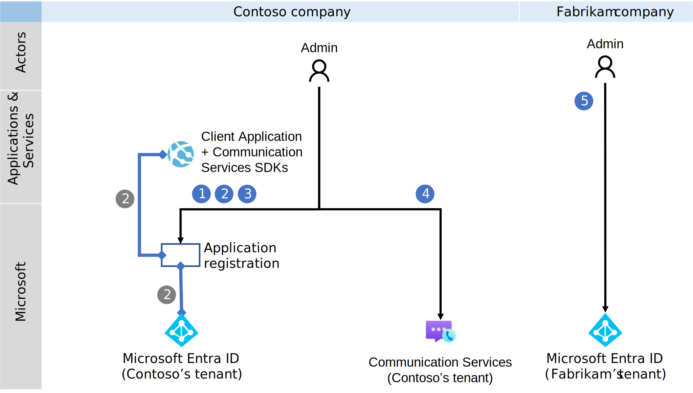

# Quickstart: Set up and obtain access tokens for Microsoft Entra ID users

[!INCLUDE [Public Preview Disclaimer](../../includes/public-preview-include.md)]

This quickstart demonstrates how to use the Communication Services Common SDK along with Azure Identity SDK in a console application to authenticate a Microsoft Entra ID user and obtain an Azure Communication Services access token. The resulting Azure Communication Services access token allows you to integrate calling and chat features using the Communication Services Calling and Chat SDKs.

## Prerequisites
- An Azure account with an active subscription. [Create an account for free](https://azure.microsoft.com/free/?WT.mc_id=A261C142F).
- An active Azure Communication Services resource and endpoint URI. For more information, see [Create an Azure Communication Services resource](../create-communication-resource.md).
- A Microsoft Entra ID instance.  For more information, see [Microsoft Entra ID overview](https://learn.microsoft.com/entra/fundamentals/whatis?source=docs).

## Introduction

Your application can support users from either the same tenant or different tenants. In this quickstart, you'll explore a multitenant scenario involving users, developers, and administrators from the fictional companies Contoso and Fabrikam. In this example, Contoso is providing a software as a service (SaaS) solution for Fabrikam.

The following sections walk you through the steps required for administrators, developers, and users. The included diagrams illustrate the multitenant scenario. If you're working in a single-tenant environment, complete all steps for both Contoso and Fabrikam within the same tenant.

## Administrator actions

The Administrator role has extended permissions in Microsoft Entra ID. Members of this role can set up and manage resources. In the following diagram, you can see all actions that have to be executed by Administrators.



1. The Contoso Administrator create a service principal for Communication Services Clients application in Contoso Microsoft Entra ID tenant. This step is required to allow the Contoso application to access Communication Services Clients application API permissions.
1. The Contoso Administrator creates or selects an existing *application* in Microsoft Entra ID. The property *Supported account types* defines whether users from various tenants can authenticate to the application. The property *Redirect URI* redirects a successful authentication request to the Contoso *client application*.
1. The Contoso Administrator adds required API permissions from Communication Services Clients application. For the all list of the permissions, see [Access tokens with Microsoft Entra ID](../../concepts/identity-model.md#access-tokens-with-microsoft-entra-id).
1. The Contoso Administrator creates or selects existing communication services. The Contoso Administrator grants Fabrikam Entra ID users access to Contoso Azure Communication Services resource. Azure Communication Services Common SDK will be used for  Microsoft Entra ID user authentication and in the background seamlessly obtain an Azure Communication Services access token for Microsoft Entra ID user.
1. The Fabrikam Administrator grants admin consent for the required Communication Services Clients application API permissions to the Contoso application.

<a name='step-1-create-a-service-principal-for-acs-clients-application'></a>

### Step 1: Create a service principal for Azure Communication Services Clients application
To enable the Contoso application to access Azure Communication Services Clients application API permissions, the Contoso Administrator must create a service principal for Azure Communication Services Clients application in the Contoso Microsoft Entra ID tenant.
The Contoso Administrator can create a service principal in Contoso tenant by one of the following methods:

- Use the [Microsoft Graph REST API](https://learn.microsoft.com/graph/api/serviceprincipal-post-serviceprincipals?view=graph-rest-1.0&tabs=http#request) to run the following request:

```http
POST https://graph.microsoft.com/v1.0/servicePrincipals
Content-Type: application/json

{
  "appId": "2a04943b-b6a7-4f65-8786-2bb6131b59f6"
}
```

This request can also be executed in [Graph Explorer](https://developer.microsoft.com/graph/graph-explorer/). Make sure to include your full tenant domain in the URL `https://developer.microsoft.com/graph/graph-explorer?tenant={tenant domain}`, sign in,and provide consent for `Application.ReadWrite.All` permission.

- Use the [Azure CLI](https://learn.microsoft.com/cli/azure/ad/sp?view=azure-cli-latest#az-ad-sp-create) to run the following command:

```azurecli-interactive
az ad sp create --id 2a04943b-b6a7-4f65-8786-2bb6131b59f6
```

<a name='step-2-create-an-entra-application-registration-or-select-an-entra-application'></a>

### Step 2: Create a Microsoft Entra application registration or select a Microsoft Entra application 

Users must be authenticated against Microsoft Entra applications with Azure Communication Services Clients application API permissions. If you don't have an existing application that you want to use for this quickstart, you can create a new application registration. 

The following application settings influence the experience:
- The *Supported account types* property defines whether the application is single tenant ("Accounts in this organizational directory only") or multitenant ("Accounts in any organizational directory"). For this scenario, you can use multitenant.
- *Redirect URI* defines the URI where the authentication request is redirected after authentication.

For more detailed information, see [Register an application with the Microsoft identity platform](/entra/identity-platform/quickstart-register-app#register-an-application). 


### Step 3: Add Azure Communication Services Clients permissions in the application

The application must declare Azure Communication Services Clients to have access to Azure Communication Services capabilities. Microsoft Entra ID user would be requesting a Microsoft Entra user token with these permissions. 

1. Navigate to your Microsoft Entra app in the Azure portal and select **API permissions**
1. Select **Add Permissions**
1. In the **Add Permissions** menu, select **APIs my organization uses**
1. Search for and select **Azure Communication Services Clients**
1. Select the permissions **VoIP** and **Chat**, then select **Add permissions**
1. Grant admin consent for all delegated permissions.


### Step 4: Create or select a Communication Services resource and grant Entra ID users access it 

The Azure Communication Services resource is used to authenticate all requests from Microsoft Entra ID users and to grant them access to the resource.

If you want to create a new Communication Services resource, see [Create and manage Communication Services resources](../create-communication-resource.md).

The Contoso administrator can provide Fabrikam Entra ID users with access to the Contoso Azure Communication Services resource through the Azure portal or by using the [Entra ID Assignment REST API](https://learn.microsoft.com/rest/api/communication/identity/communication-identity/entra-id-assignment).

In the Azure portal follow these steps:
1. Navigate to your Communication Services resource.
2. In the left pane, select **User access for Entra ID** under the **Settings** group.
3. Click the **Add** button to provide access to an Entra user, group, or entire tenant.
4. In the **Principal type** select the correct value. In this scenario Contoso Admin provides access for a group from Fabrikam tenant and chooses **Group**.
5. In the **Object ID** field, enter the object ID of the group from Fabrikam Microsoft Entra tenant.
6. In the **Tenant ID** field, enter the tenant ID of the Fabrikam Microsoft Entra tenant.
7. In the **Client ID** field, enter the client ID of Contoso application from [step 2](entra-id-authentication-integration.md#step-2-create-a-microsoft-entra-application-registration-or-select-a-microsoft-entra-application).
8. Click **Save and exit** to apply the changes.


### Step 5: Provide Administrator consent and group access to Azure Communication Services Clients application

Microsoft Entra tenant can be configured, to require Microsoft Entra administrator consent for Azure Communication Services Clients API permissions of the application. In such a case, the Microsoft Entra Administrator must grant permissions to the Contoso application for Azure Communication Services Clients API permissions. The Fabrikam Microsoft Entra Administrator provides consent via a unique URL. 

The following roles can provide consent on behalf of a company:
- Global admin
- Application admin
- Cloud application admin

If you want to check roles in Azure portal, see [List Azure role assignments](../../../role-based-access-control/role-assignments-list-portal.yml).

To construct an Administrator consent URL, the Fabrikam Microsoft Entra Administrator does the following steps:

1. In the URL *https://login.microsoftonline.com/{Tenant_ID}/adminconsent?client_id={Application_ID}*, the Administrator replaces {Tenant_ID} with the Fabrikam [Tenant ID](../../concepts/troubleshooting-info.md#get-a-directory-id), and replaces {Application_ID} with the Contoso [Application ID](../../concepts/troubleshooting-info.md#get-an-application-id).
1. The Administrator logs in and grants permissions on behalf of the organization.

The service principal of the Contoso application in the Fabrikam tenant is created if consent is granted. The Fabrikam Administrator can review the consent in Microsoft Entra ID by doing the following steps:

1. Sign in to the Azure portal as an administrator.
1. Go to **Microsoft Entra ID**.
1. On the **Enterprise applications** pane, set the **Application type** filter to **All applications**.
1. In the field for filtering the applications, enter the name of the Contoso application.
1. Select **Apply**.
1. Select the service principal by using the required name. 
1. Go to the **Permissions** pane.

You can see that the status of the Communication Services Clients application API permissions are *Granted for {Directory_name}*.


If you run into the issue "The app is trying to access a service '2a04943b-b6a7-4f65-8786-2bb6131b59f6'(Azure Communication Services Clients) that your organization '{GUID}' lacks a service principal for. You need to create a service principal for your tenant by following the instructions in the [Step 1: Create a service principal for Azure Communication Services Clients application](entra-id-authentication-integration.md#step-1-create-a-service-principal-for-azure-communication-services-clients-application).

The group access to Azure Communication Services Clients application should be only provided if the Contoso Administrator provided a group access to the Contoso Azure Communication Services resource in the previous step. For the user or entire tenant access to the Azure Communication Services resource, the Fabrikam Administrator can skip this step.

Group-based assignment requires Microsoft Entra ID P1 or P2 edition. The Fabrikam Administrator can provide access to the group from Fabrikam tenant by using the [Microsoft Entra admin center](https://entra.microsoft.com).
To provide access to the group, the Fabrikam Administrator does the following steps:
1. Login to [Microsoft Entra admin center](https://entra.microsoft.com) with **Global Administrator** or **Tenant Administrator** roles.
1. Navigate to **Identity > Applications > Enterprise applications** in the left panel menu.
1. In the search box, enter **Azure Communication Services Clients**, and then select the application from the search results.
1. In the left panel menu, select **Users and groups** and then select **Add user/group**.
1. On the **Add Assignment** pane, select **None Selected** under **Users and groups**.
1. Search for and select the group that you want to assign to the application.
1. Click on **Select** and then select **Assign** to assign the group to the application.


## Developer actions

The Contoso developer needs to set up the *client application* to authenticate users. In the client application, the developer creates a credential using Communication Common SDK along with any implementation of the `TokenCredential` from Azure Identity SDK capable of authenticating users against the Microsoft Entra ID application. 

The developer's required actions are shown in following diagram:


1. The Contoso developer initialize any implementation of `TokenCredential` from Azure Identity SDK which is capable of obtaining a Microsoft Entra user token for the application that was created earlier by the Contoso Administrator.
1. The Contoso developer initializes `AzureCommunicationTokenCredential` from Communication Services Common SDK with `TokenCredential` created in the step 1. The `AzureCommunicationTokenCredential` obtains an Azure Communication Services access token for Microsoft Entra ID user seamlessly in the background.

> [!NOTE]
> The following sections describe how to create `AzureCommunicationTokenCredential`.

::: zone pivot="programming-language-csharp"
[!INCLUDE [.NET](./includes/entra-id/support-entra-id-users-net.md)]
::: zone-end

::: zone pivot="programming-language-javascript"
[!INCLUDE [JavaScript](./includes/entra-id/support-entra-id-users-js.md)]
::: zone-end


## User actions

The user represents the Fabrikam users of the Contoso application. The user experience is shown in the following diagram:


1. The Fabrikam user uses the Contoso *client application* and is prompted to authenticate.
1. The Contoso *client application* uses the Azure Identity SDK to authenticate the user against the Fabrikam Microsoft Entra tenant for the Contoso application with Communication Services Clients permissions. Authentication is redirected to the *client application*, as defined in the property *Redirect URI* in the Contoso application.
1. The Communication Common SDK seamlessly obtains an Azure Communication Services access token for Fabrikam Entra ID user in the background.

Developers can integrate the Communication Services Calling SDK or Chat SDK by providing `AzureCommunicationTokenCredential`.

## Next steps

In this quickstart, you learned how to:

> [!div class="checklist"]
> * Create and configure an application in Microsoft Entra ID.
> * Use Communication Services Common SDK and Azure Identity SDK to integrate Microsoft Entra ID users to Azure Communication Services.

Learn about the following concepts:

- [Support Microsoft Entra ID users in Azure Communication Services](../../concepts/identity-model.md#microsoft-entra-id-integrating-with-entra-id)
- [Tenancy in Microsoft Entra ID](https://learn.microsoft.com/entra/identity-platform/single-and-multi-tenant-apps)
