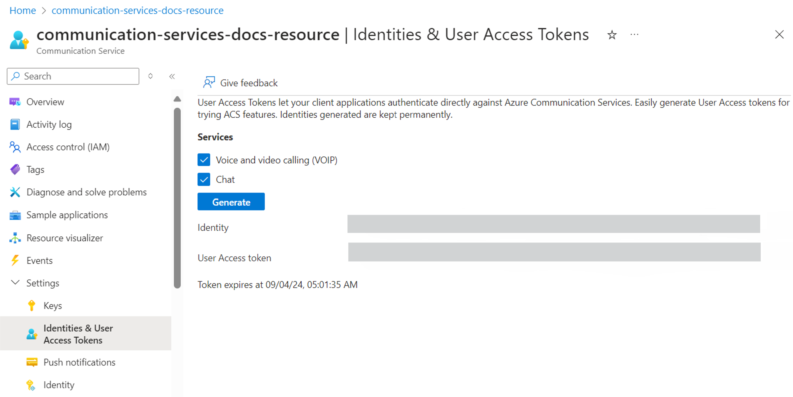

## Prerequisites

- An [Azure Communication Services resource](../../../create-communication-resource.md)

## Create the access tokens

In the [Azure portal](https://portal.azure.com), navigate to the **Identities & User Access Tokens** tab under the **Settings** option in the left side menu within your Communication Services resource. 

Choose the scope of the access tokens. You can select none, one, or multiple. Click **Generate**.

You'll see an identity and corresponding user access token generated. You can copy these strings and use them in the [sample apps](../../../../samples/overview.md) and other testing scenarios.

 
