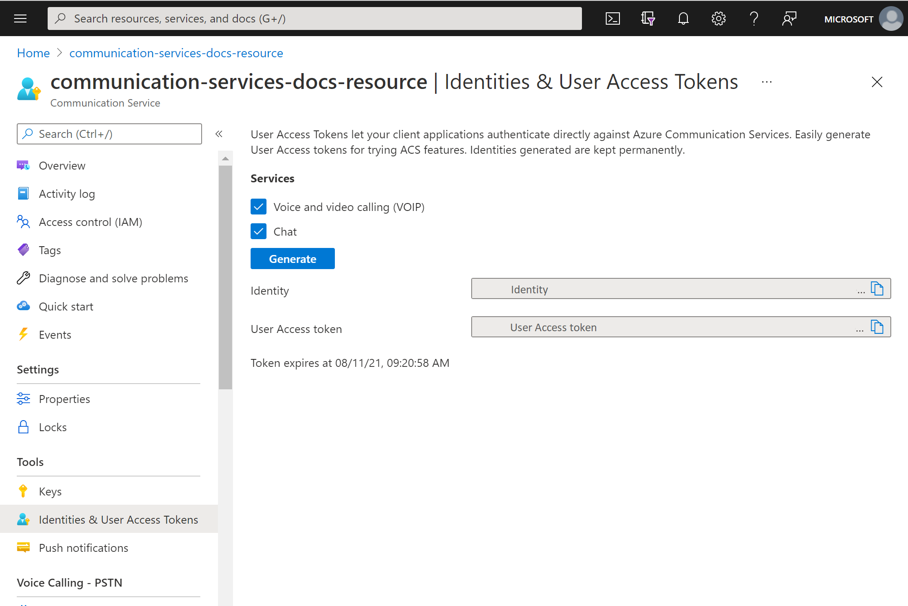

# Quickstart: Quickly create Azure Communication Services access tokens for testing

In the [Azure portal](https://portal.azure.com) Communication Services extension, you can generate a Communication Services identity and access token. This lets you skip creating an authentication service, which makes it easier for you to test the sample apps and simple development scenarios. This feature is intended for small-scale validation and testing and should not be used for production scenarios. For production code, refer to the [creating access tokens quickstart](../access-tokens.md).

The tool showcases the behavior of the ```Identity SDK``` in a simple user experience. Tokens and identities that are created through this tool follow the same behaviors and rules as if they were created using the ```Identity SDK```.  For example, access tokens expire after 24 hours.

## Prerequisites

- An [Azure Communication Services resource](../create-communication-resource.md)

## Create the access tokens

In the [Azure portal](https://portal.azure.com), navigate to the **Identities & User Access Tokens** blade within your Communication Services resource. 

Choose the scope of the access tokens. You can select none, one, or multiple. Click **Generate**.


You'll see an identity and corresponding user access token generated. You can copy these strings and use them in the [sample apps](../../samples/overview.md) and other testing scenarios.



## Next steps


You may also want to:

 - [Learn about authentication](../../concepts/authentication.md)
 - [Learn about client and server architecture](../../concepts/client-and-server-architecture.md)
 - [Deploy trusted authentication service hero sample](../../samples/trusted-auth-sample.md)
