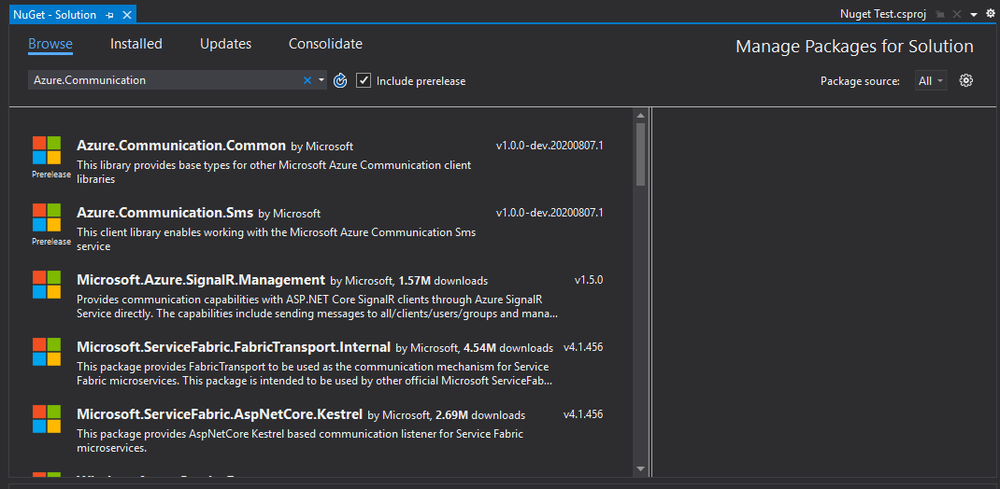

## .NET SDKs

TODO: SDK instructions

```dotnetcli

dotnet add TODO namespace

```

### Gaining Access to the Package Feed

To gain access to the package feed, create a `nuget.config` within your project. Within this file place the following contents:

```xml
<?xml version="1.0" encoding="utf-8"?>
<configuration>
    <packageSources>
        <add key="github" value="https://nuget.pkg.github.com/azure/index.json" />
    </packageSources>
    <packageSourceCredentials>
        <github>
            <add key="Username" value="YOUR GITHUB USERNAME" />
            <add key="ClearTextPassword" value="YOUR GITHUB PERSONAL ACCESS TOKEN" />
        </github>
    </packageSourceCredentials>
</configuration>
```

Within this file replace "YOUR GITHUB USERNAME" with your GitHub UserName sourced from GitHub and "YOUR PERSONAL ACCESS TOKEN" with a [GitHub Personal Access Token](https://github.com/settings/tokens). The token must have the `read:packages` scope.

Once this file has been created you **may need to restart your Project and/or Visual Studio** so that the file will be read and factored into the project configuration.

### Adding the Packages to your Project

Once your access to the Feed is setup, right click your project within the "Solution Explorer" of Visual Studio and select "Manage NuGet Packages", this will launch the NuGet Package Manager. Ensure that its "Package Source" drop-down is set to All and that the "Include prerelease" checkbox is checked.

Then if you search for `Azure.Communication` you should see the Communication Services packages in the available packages list.



If you're unsure what packages are required, double check the documentation you're referring to as it should list the required packages.

### Next steps

For more information, see the following articles:
- Generate User Access Tokens [here](../user-access-tokens.md)
- Get Started with Chat [here](../chat/get-started-with-chat.md)
- Get Started with SMS [here](../telephony-and-sms/send-sms.md)
- Get Started with Calling [here](../voice-and-video-calling/javascript.md)