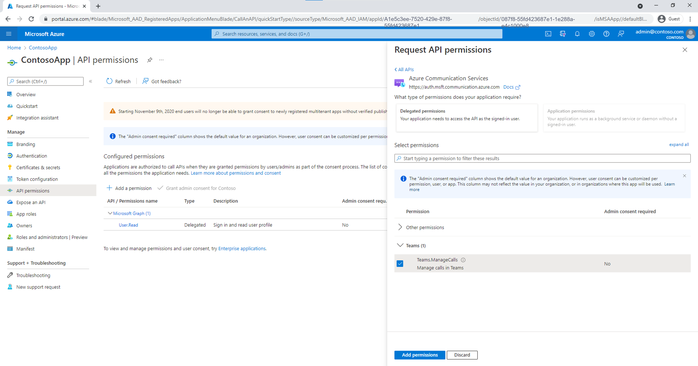
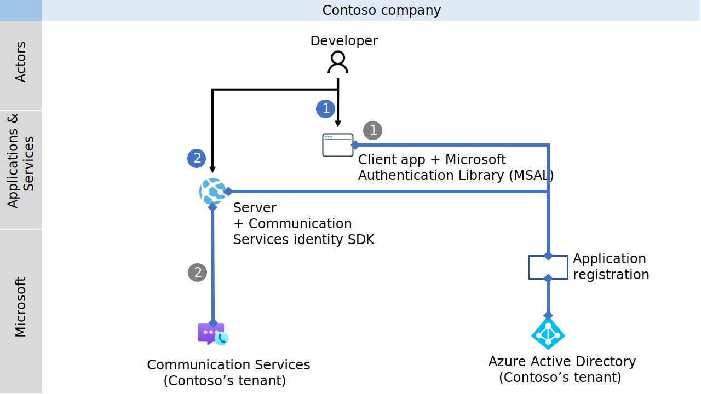
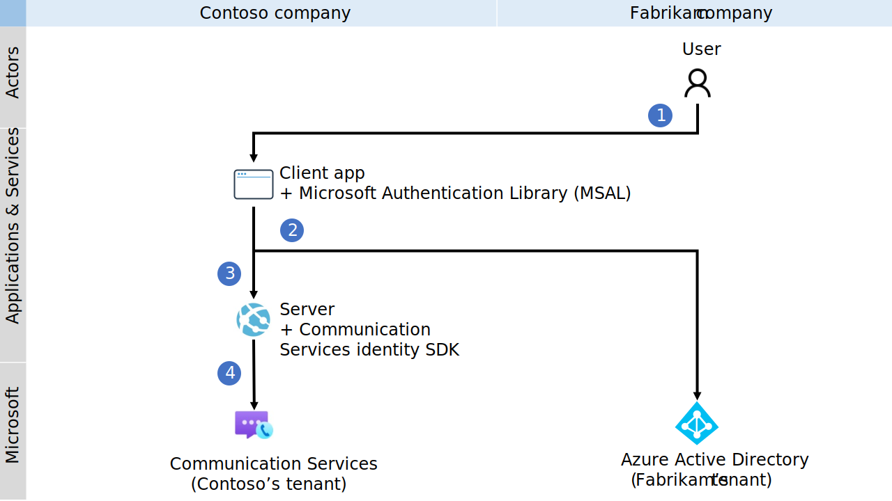

# Quickstart: Set up and manage access tokens for Teams users

In this quickstart, you'll build a .NET console application to authenticate a Microsoft 365 user by using the Microsoft Authentication Library (MSAL) and retrieving a Microsoft Azure Active Directory (Azure AD) user token. You'll then exchange that token for an access token of Teams user with the Azure Communication Services Identity SDK. The access token for Teams user can then be used by the Communication Services Calling SDK to integrate calling capability as Teams user.

> [!NOTE]
> When you're in a production environment, we recommend that you implement this exchange mechanism in back-end services, because requests for an exchange are signed with a secret.

## Prerequisites
- An Azure account with an active subscription. [Create an account for free](https://azure.microsoft.com/free/?WT.mc_id=A261C142F).
- An active Azure Communication Services resource and connection string. For more information, see [Create an Azure Communication Services resource](./create-communication-resource.md).
- An Azure Active Directory instance with users that have a Teams license.  For more information, see [Teams License requirements](./eligible-teams-licenses.md).

## Introduction

Teams identities are bound to tenants in Azure Active Directory. Your application can be used by users from the same or another tenant. In this quickstart, you'll work through a multitenant use case with multiple actors: users, developers, and administrators from fictional companies Contoso and Fabrikam. In this use case, Contoso is a company that's building software as a service (SaaS) for Fabrikam. 

The following sections will guide you through the steps for administrators, developers, and users. The diagrams demonstrate the multitenant use case. If you're working with a single tenant, execute all steps from Contoso and Fabrikam in a single tenant.

## Administrator actions

The Administrator role has extended permissions in Azure AD. Members of this role can set up resources and can read information from the Azure portal. In the following diagram, you can see all actions that have to be executed by Administrators.


1. The Contoso Administrator creates or selects an existing *application* in Azure Active Directory. The property *Supported account types* defines whether users from various tenants can authenticate to the application. The property *Redirect URI* redirects a successful authentication request to the Contoso *server*.
1. The Contoso Administrator adds API permissions to `Teams.ManageCalls` and `Teams.ManageChats` from Communication Services. 
1. The Contoso Administrator allows public client flow for the application.
1. The Contoso Administrator creates or selects existing communication services, which will be used for authentication of the exchanging requests. Azure AD user tokens will be exchanged for an access token of Teams user. For more information, see [Create and manage Communication Services resources](./create-communication-resource.md).
1. The Fabrikam Administrator grants Communication Services `Teams.ManageCalls` and `Teams.ManageChats` permissions to the Contoso application. This step is required if only Fabrikam Administrator can grant access to the application with the `Teams.ManageCalls` and `Teams.ManageChats` permissions. 

### Step 1: Create an Azure AD application registration or select an Azure AD application 

Users must be authenticated against Azure AD applications with the Azure Communication Service Teams.ManageCalls and Teams.ManageChats permissions. If you don't have an existing application that you want to use for this quickstart, you can create a new application registration. 

The following application settings influence the experience:
- The *Supported account types* property defines whether the application is single tenant ("Accounts in this organizational directory only") or multitenant ("Accounts in any organizational directory"). For this scenario, you can use multitenant.
- *Redirect URI* defines the URI where the authentication request is redirected after authentication. For this scenario, you can use **Public client/native (mobile & desktop)** and enter **`http://localhost`** as the URI.

For more detailed information, see [Register an application with the Microsoft identity platform](../../active-directory/develop/quickstart-register-app.md#register-an-application). 

When the application is registered, you'll see an [identifier in the overview](../concepts/troubleshooting-info.md#getting-application-id). This identifier, *Application (client) ID*, is used in the next steps.

### Step 2: Allow public client flows

On the **Authentication** pane of your application, you can see a configured platform for *Public client/native(mobile & desktop)* with a redirect URI pointing to *http://localhost*. At the bottom of the pane, you'll see an *Allow public client flows* toggle control, which for this quickstart should be set to **Yes**.

### Step 3: Add the Communication Services permissions in the application

The application must declare Teams.ManageCalls and Teams.ManageChats permissions to have access to Teams calling capabilities in the Tenant. Teams user would be requesting an Azure AD user token with this permission for token exchange. 

1. Navigate to your Azure AD app in the Azure portal and select **API permissions**
1. Select **Add Permissions**
1. In the **Add Permissions** menu, select **Azure Communication Services**
1. Select the permissions **Teams.ManageCalls** and **Teams.ManageChats**, then select **Add permissions**



### Step 4: Create or select a Communication Services resource

Your Communication Services resource is used to authenticate all requests for exchanging Azure AD user token for an access token of Teams user. You can trigger this exchange by using the Communication Services Identity SDK, which you can authenticate with an access key, or by using Azure role-based access control (Azure RBAC). You can get the access key either in the Azure portal or by configuring Azure RBAC on the **Access control (IAM)** pane by Communication Services resource.

If you want to create a new Communication Services resource, see [Create and manage Communication Services resources](./create-communication-resource.md).

### Step 5: Provide Administrator consent

Azure Active Directory tenant can be configured, to require Azure AD administrator consent for the Teams.ManageCalls and Teams.ManageChats permissions of the application. In such a case, the Azure AD Administrator must grant permissions to the Contoso application for Communication Services Teams.ManageCalls and Teams.ManageChats. The Fabrikam Azure AD Administrator provides consent via a unique URL. 

The following roles can provide consent on behalf of a company:
- Global admin
- Application admin
- Cloud application admin

If you want to check roles in Azure portal, see [List Azure role assignments](../../role-based-access-control/role-assignments-list-portal.md).

To construct an Administrator consent URL, the Fabrikam Azure AD Administrator does the following steps:

1. In the URL *https://login.microsoftonline.com/{Tenant_ID}/adminconsent?client_id={Application_ID}*, the Administrator replaces {Tenant_ID} with the Fabrikam [Tenant ID](../concepts/troubleshooting-info.md#getting-directory-id), and replaces {Application_ID} with the Contoso [Application ID](../concepts/troubleshooting-info.md#getting-application-id).
1. The Administrator logs in and grants permissions on behalf of the organization.

The service principal of the Contoso application in the Fabrikam tenant is created if consent is granted. The Fabrikam Administrator can review the consent in Azure AD by doing the following steps:

1. Sign in to the Azure portal as an administrator.
1. Go to Azure Active Directory.
1. On the **Enterprise applications** pane, set the **Application type** filter to **All applications**.
1. In the field for filtering the applications, enter the name of the Contoso application.
1. Select **Apply**.
1. Select the service principal by using the required name. 
1. Go to the **Permissions** pane.

You can see that the status of the Communication Services Teams.ManageCalls and Teams.ManageChats permissions are *Granted for {Directory_name}*.


If you run into the issue "The app is trying to access a service '1fd5118e-2576-4263-8130-9503064c837a'(Azure Communication Services) that your organization '{GUID}' lacks a service principal for. Contact your IT Admin to review the configuration of your service subscriptions or consent to the application to create the required service principal." your Azure Active Directory tenant lacks a service principal for the Azure Communication Services application. To fix this issue, use PowerShell as an Azure AD administrator to connect to your tenant. Replace `Tenant_ID` with an ID of your AAD tenancy. 

```script
Connect-AzureAD -TenantId "Tenant_ID"
```
If the command is not found, start PowerShell as an administrator and install the Azure AD package.

```script
Install-Module AzureAD
```
Then execute the following command to add a service principal to your tenant. Do not modify the GUID of the App ID.

```script
New-AzureADServicePrincipal -AppId "1fd5118e-2576-4263-8130-9503064c837a"
```


## Developer actions

The Contoso developer needs to set up the *client application* to authenticate users. The developer then needs to create an endpoint on the back-end *server* to process the Azure AD user token after redirection. When the Azure AD user token is received, it's exchanged for the access token of Teams user and returned to the *client application*. 

The developer's required actions are shown in following diagram:



1. The Contoso developer configures the Microsoft Authentication Library (MSAL) to authenticate the user for the application that was created earlier by the Administrator for Communication Services Teams.ManageCalls and Teams.ManageChats permissions.
1. The Contoso developer initializes the Communication Services Identity SDK and exchanges the incoming Azure AD user token for the access token of Teams user via the identity SDK. The access token of Teams user is then returned to the *client application*.

By using the MSAL, developers can acquire Azure AD user tokens from the Microsoft Identity platform endpoint to authenticate users and access secure web APIs. It can be used to provide secure access to Communication Services. The MSAL supports many different application architectures and platforms, including .NET, JavaScript, Java, Python, Android, and iOS.

For more information about setting up environments in public documentation, see [Microsoft Authentication Library overview](../../active-directory/develop/msal-overview.md).

> [!NOTE]
> The following sections describe how to exchange the Azure AD access token for the access token of Teams user for the console application.

::: zone pivot="programming-language-csharp"
[!INCLUDE [.NET](./includes/manage-teams-identity-net.md)]
::: zone-end

::: zone pivot="programming-language-javascript"
[!INCLUDE [JavaScript](./includes/manage-teams-identity-js.md)]
::: zone-end

::: zone pivot="programming-language-python"
[!INCLUDE [Python](./includes/manage-teams-identity-python.md)]
::: zone-end

::: zone pivot="programming-language-java"
[!INCLUDE [Java](./includes/manage-teams-identity-java.md)]
::: zone-end


## User actions

The user represents the Fabrikam users of the Contoso application. The user experience is shown in the following diagram:



1. The Fabrikam user uses the Contoso *client application* and is prompted to authenticate.
1. The Contoso *client application* uses the MSAL to authenticate the user against the Fabrikam Azure AD tenant for the Contoso application with Communication Services Teams.ManageCalls and Teams.ManageChats permissions. 
1. Authentication is redirected to the *server*, as defined in the property *Redirect URI* in the MSAL and the Contoso application.
1. The Contoso *server* exchanges the Azure AD user token for the access token of Teams user by using the Communication Services Identity SDK and returns the access token of Teams user to the *client application*.

With a valid access token for Teams user in the *client application*, developers can integrate the Communication Services Calling SDK and manage calls as Teams user.

## Next steps

In this quickstart, you learned how to:

> [!div class="checklist"]
> * Create and configure an application in Azure AD.
> * Use the Microsoft Authentication Library (MSAL) to issue an Azure AD user token.
> * Use the Communication Services Identity SDK to exchange the Azure AD user token for an access token of Teams user.


> [!div class="nextstepaction"]
> [Build trusted authentication service for Teams users](../samples/trusted-auth-sample.md)
> [Make a call as a Teams users to a Teams user](../quickstarts/voice-video-calling/get-started-with-voice-video-calling-custom-teams-client.md)

Learn about the following concepts:

- [Use cases for communication as a Teams user](../concepts/interop/custom-teams-endpoint-use-cases.md)
- [Azure Communication Services support Teams identities](../concepts/teams-endpoint.md)
- [Teams interoperability](../concepts/teams-interop.md)
- [Single-tenant and multi-tenant authentication for Teams users](../concepts/interop/custom-teams-endpoint-authentication-overview.md)
- [Create and manage Communication access tokens for Teams users in a single-page application (SPA)](https://github.com/Azure-Samples/communication-services-javascript-quickstarts/tree/main/manage-teams-identity-spa)
