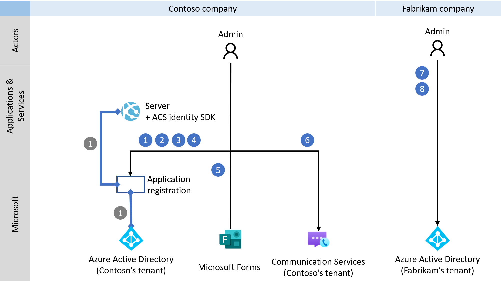
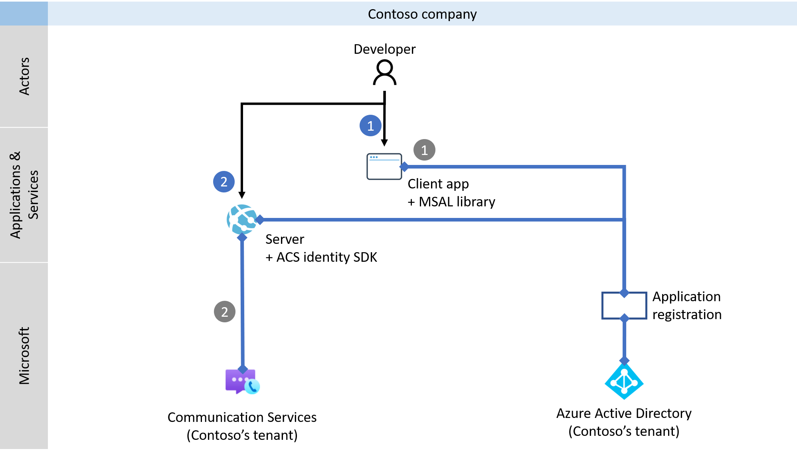
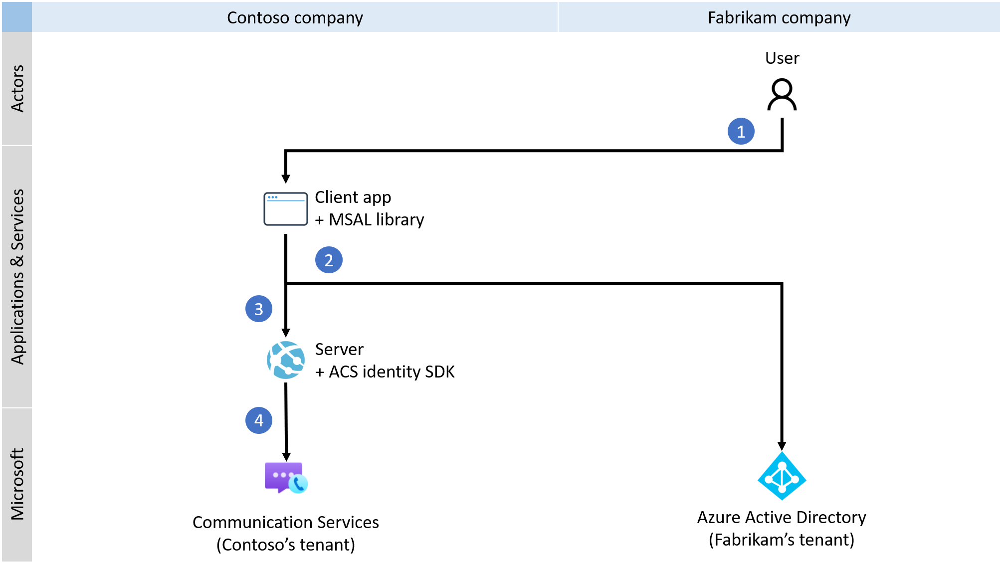

# Quickstart: Set up and manage Teams access tokens

> [!IMPORTANT]
> To enable or disable the custom Teams endpoint experience, [complete and submit this form](https://forms.office.com/r/B8p5KqCH19).

In this quickstart, you'll build a .NET console application to authenticate a Microsoft 365 user by using the Microsoft Authentication Library (MSAL) and retrieving an Azure Active Directory (Azure AD) user token. You'll then exchange that token for a Teams access token with the Azure Communication Services Identity SDK. The Teams access token can then be used by the Communication Services Calling SDK to build a custom Teams endpoint.

> [!NOTE]
> When you're in a production environment, we recommend that you implement this exchange mechanism in back-end services, because requests for an exchange are signed with a secret.

## Prerequisites
- An Azure account with an active subscription. [Create an account for free](https://azure.microsoft.com/free/?WT.mc_id=A261C142F).
- An active Azure Communication Services resource and connection string. For more information, see [Create an Azure Communication Services resource](./create-communication-resource.md).
- Enable a custom Teams endpoint experience by [completing and submitting this form](https://forms.office.com/r/B8p5KqCH19).
- An Azure Active Directory instance with users that have a Teams license.

## Introduction

Teams identities are bound to tenants in Azure Active Directory. Your application can be used by users from the same or another tenant. In this quickstart, you'll work through a multitenant use case with multiple actors: users, developers, and administrators from fictional companies Contoso and Fabrikam. In this use case, Contoso is a company that's building a software as a service (SaaS) solution for Fabrikam. 

The following sections will guide you through the steps for administrators, developers, and users. The diagrams demonstrate the multitenant use case. If you're working with a single tenant, execute all steps from Contoso and Fabrikam in single tenant.

## Administrator actions

The Administrator role has extended permissions in Azure AD. Members of this role can set up resources and can read information from the Azure portal. In the following diagram, you can see all actions that have to be executed by Administrators.



1. The Contoso Administrator creates or selects an existing *application* in Azure Active Directory. The property *Supported account types* defines whether users from various tenants can authenticate to the application. The property *Redirect URI* redirects a successful authentication request to the Contoso *server*.
1. The Contoso Administrator extends the application's manifest with Communication Services VoIP permission. 
1. The Contoso Administrator allows public client flow for the application.
1. The Contoso Administrator can optionally update.
1. The Contoso Administrator enables the experience by [completing and submitting this form](https://forms.office.com/r/B8p5KqCH19).
1. The Contoso Administrator creates or selects existing communication services, which will be used for authentication of the exchanging requests. Azure AD user tokens will be exchanged for Teams access tokens. For more information, see [Create and manage Communication Services resources](./create-communication-resource.md).
1. The Fabrikam Administrator sets up a new service principal for Communication Services in the Fabrikam tenant.
1. The Fabrikam Administrator grants Communication Services VoIP permission to the Contoso application. This step is required only if the Contoso application isn't verified. 

### Step 1: Create an Azure AD application registration or select an Azure AD application 

Users must be authenticated against Azure AD applications with the Azure Communication Service VoIP permission. If you don't have an existing application that you want to use for this quickstart, you can create a new application registration. 

The following application settings influence the experience:
- The *Supported account types* property defines whether the application is single tenant ("Accounts in this organizational directory only") or multitenant ("Accounts in any organizational directory"). For this scenario, you can use multitenant.
- *Redirect URI* defines the URI where the authentication request is redirected after authentication. For this scenario, you can use **Public client/native (mobile & desktop)** and enter **`http://localhost`** as the URI.

For more detailed information, see [Register an application with the Microsoft identity platform](../../active-directory/develop/quickstart-register-app.md#register-an-application). 

When the application is registered, you'll see an identifier in the overview. This identifier, *Application (client) ID*, is used in the following steps:

### Step 2: Allow public client flows

On the **Authentication** pane of your application, you can see a configured platform for *Public client/native(mobile & desktop)* with a redirect URI pointing to *localhost*. At the bottom of the pane, you'll see an *Allow public client flows* toggle control, which for this quickstart should be set to **Yes**.

### Step 3: (Optional) Update the publisher domain 
On the **Branding** pane, you can update your publisher domain for the application. This is useful for multitenant applications, where the application will be marked as verified by Azure. For more information, see [Configure an application's publisher domain](../../active-directory/develop/howto-configure-publisher-domain.md).

### Step 4: Define the Communication Services VoIP permission in the application

Go to the details of the application, select the **Manifest** pane, and then look for the property *requiredResourceAccess*. It's an array of objects that define the application's permissions. Extend the manifest with the VoIP permissions for the first-party application Communication Services. Add following object to the array:

> [!NOTE] 
> Do not change the GUIDs in the snippet, because they uniquely identify the application and permissions.

```json
{
   "resourceAppId": "1fd5118e-2576-4263-8130-9503064c837a",
   "resourceAccess": [
      {
         "id": "31f1efa3-6f54-4008-ac59-1bf1f0ff9958",
         "type": "Scope"
      }
   ]
}
```

To persist the changes, select **Save**. You can now see the *Azure Communication Services - VoIP* permission on the **API Permissions** pane.

### Step 5: Enable a custom Teams endpoint experience for the application

To enable the custom Teams endpoint experience for the application, the Azure AD Administrator [completes and submits this form](https://forms.office.com/r/B8p5KqCH19) .

### Step 6: Create or select a Communication Services resource

Your Communication Services resource is used to authenticate all requests for exchanging Azure AD user tokens for Teams access tokens. You can trigger this exchange by using the Communication Services Identity SDK, which you can authenticate with an access key or by using Azure role-based access control (RBAC). You can get the access key either in the Azure portal or by configuring Azure RBAC on the **Access control (IAM)** pane.

If you want to create new Communication Services resource, see [Create and manage Communication Services resources](./create-communication-resource.md).

### Step 7: Set up a Communication Services service principal

To enable a custom Teams endpoint experience in the Fabrikam tenant, the Fabrikam Azure AD Administrator must set up a service principal named Azure Communication Services with application ID *1fd5118e-2576-4263-8130-9503064c837a*. If you don't see this application on your **Enterprise applications** pane in Azure Active Directory, you'll need to add it manually.

The Fabrikam Azure AD Administrator connects to the Azure tenant via PowerShell. 

> [!NOTE]
> In the following command, replace [Tenant_ID] with the ID of your tenant, which you'll find in the Azure portal on the overview page of the Azure AD instance.

```azurepowershell
Connect-AzureAD -TenantId "[Tenant_ID]"
```

If you receive a "command isn't found" error, the AzureAD module isn't installed in PowerShell. Close PowerShell, and then reopen it as an administrator. You can now install the AzureAD package by running the following command:

```azurepowershell
Install-Module AzureAD
```

After you connect and authenticate to the Azure portal, set up the Communication Services service principal by running the following command: 

> [!NOTE]
> The parameter AppId refers to the first-party application Communication Services. Don't change this value.

```azurepowershell
New-AzureADServicePrincipal -AppId "1fd5118e-2576-4263-8130-9503064c837a"
```

### Step 8: Provide Administrator consent

If the Contoso application isn't verified, the Azure AD Administrator must grant permission to the Contoso application for Communication Services VoIP. The Fabrikam Azure AD Administrator provides consent via a unique URL. 

To construct an Administrator consent URL, the Fabrikam Azure AD Administrator does the following:

1. In the URL *https://login.microsoftonline.com/{Tenant_ID}/adminconsent?client_id={Application_ID}*, the Administrator replaces {Tenant_ID} with the Fabrikam tenant ID, and replaces {Application_ID} with the Contoso Application ID.
1. The Administrator logs in and grants permissions on behalf of the organization.

The service principal of the Contoso application in the Fabrikam tenant is created if consent is granted. The Fabrikam Administrator can review the consent in Azure AD by doing the following:

1. Sign in to the Azure portal as an administrator.
1. Go to Azure Active Directory.
1. On the **Enterprise applications** pane, set the **Application type** filter to **All applications**.
1. In the field for filtering the applications, enter the name of the Contoso application.
1. Select **Apply**.
1. Select the service principal by using the required name. 
1. Go to the **Permissions** pane.

You can see that the status of the Communication Services VoIP permission is *Granted for {Directory_name}*.

## Developer actions

The Contoso developer needs to set up the *client application* to authenticate users. The developer then needs to create an endpoint on the back-end *server* to process the Azure AD user token after redirection. When the Azure AD user token is received, it's exchanged for the Teams access token and returned to the *client application*. 

The developer's required actions are shown in following diagram:



1. The Contoso developer configures the MSAL library to authenticate the user for the application that was created earlier by the Administrator for Communication Services VoIP permission.
1. The Contoso developer initializes the Communication Services Identity SDK and exchanges the incoming Azure AD user token for the Teams access token via the SDK. The Teams access token is then returned to the *client application*.

By using the Microsoft Authentication Library, developers can acquire Azure AD user tokens from the Microsoft Identity platform endpoint to authenticate users and access secure web APIs. It can be used to provide secure access to Communication Services. The MSAL supports many different application architectures and platforms, including .NET, JavaScript, Java, Python, Android, and iOS.

For more information about setting up environments in public documentation, see [Microsoft Authentication Library overview](../../active-directory/develop/msal-overview.md).

> [!NOTE]
> The following sections describe how to exchange the Azure AD access token for the Teams access token for the console application in .NET.

### Create a new application

In a console window, such as cmd, PowerShell, or Bash, use the `dotnet new` command to create a new console app with the name `TeamsAccessTokensQuickstart`. This command creates a simple "Hello World" C# project with a single source file, *Program.cs*.

```console
dotnet new console -o TeamsAccessTokensQuickstart
```

Change your directory to the newly created app folder, and use the `dotnet build` command to compile your application.

```console
cd TeamsAccessTokensQuickstart
dotnet build
```
#### Install the package
While you're still in the application directory, install the Azure Communication Services Identity library for .NET package by using the `dotnet add package` command.

```console
dotnet add package Azure.Communication.Identity
dotnet add package Microsoft.Identity.Client
```

#### Set up the app framework

From the project directory, do the following:

1. Open the *Program.cs* file in a text editor.
1. Add a `using` directive to include the following namespaces: 
    - Azure.Communication
    - Azure.Communication.Identity
    - Microsoft.Identity.Client
1. Update the `Main` method declaration to support `async` code.

To begin, use the following code:

```csharp
using System;
using System.Text;
using Azure.Communication;
using Azure.Communication.Identity;
using Microsoft.Identity.Client;

namespace TeamsAccessTokensQuickstart
{
    class Program
    {
        static async System.Threading.Tasks.Task Main(string[] args)
        {
            Console.WriteLine("Azure Communication Services – Teams access tokens quickstart");

            // Quickstart code goes here
        }
    }
}
```

### Step 1: Receive the Azure AD user token via the MSAL library

Use the MSAL library to authenticate users against Azure AD for the Contoso application with Communication Services VoIP permission. Configure the client for the Contoso application (*parameter applicationId*) in the public cloud (*parameter authority*). The Azure AD user token will be returned to the redirect URI (*parameter redirectUri*). The credentials will be taken from the interactive pop-up window, which opens in your default browser.

> [!NOTE] 
> The redirect URI has to match the value defined in the application. Check the first step in the Administrator guide to see how to configure the redirect URI.

```csharp
const string applicationId = "Contoso's_Application_ID";
const string authority = "https://login.microsoftonline.com/common";
const string redirectUri = "http://localhost";

var client = PublicClientApplicationBuilder
                .Create(applicationId)
                .WithAuthority(authority)
                .WithRedirectUri(redirectUri)
                .Build();

const string scope = "https://auth.msft.communication.azure.com/VoIP";

var aadUserToken = await client.AcquireTokenInteractive(new[] { scope }).ExecuteAsync();

Console.WriteLine("\nAuthenticated user: " + aadUserToken.Account.Username);
Console.WriteLine("AAD user token expires on: " + aadUserToken.ExpiresOn);
```

The *aadUserToken* variable now carries a valid Azure AD user token, which will be used for the exchange.

### Step 2: Exchange the Azure AD user token for the Teams access token

The valid Azure AD user token authenticates users against Azure AD for the third-party application with Communication Services VoIP permission. The following code is used by the Communication Services Identity SDK to facilitate the exchange of the Azure AD user token for the Teams access token.

> [!NOTE]
> In the following code, replace "\<Connection-String>" with a valid connection string, or use Azure RBAC for authentication. For more information, see [Quickstart: Create and manage access tokens](./access-tokens.md).

```csharp
var identityClient = new CommunicationIdentityClient("<Connection-String>");
var teamsAccessToken = identityClient.ExchangeTeamsToken(aadUserToken.AccessToken);

Console.WriteLine("\nTeams access token expires on: " + teamsAccessToken.Value.ExpiresOn);
```

If all required conditions are met, you'll get a Teams access token that's valid for 24 hours.

#### Run the code
Run the application from your application directory with the `dotnet run` command.

```console
dotnet run
```

The output of the app describes each action that's completed:

```console
Azure Communication Services - Teams access tokens quickstart

Authenticated user: john.smith@contoso.com
Azure AD user token expires on: 6/10/2021 10:13:17 AM +00:00

Teams access token expires on: 6/11/2021 9:13:18 AM +00:00
```

## User actions

The user represents the Fabrikam users of the Contoso application. The user experience is shown in following diagram:



1. The Fabrikam user uses the Contoso *client application* and is prompted to authenticate.
1. The Contoso *client application* uses the MSAL library to authenticate the user against the Fabrikam Azure AD tenant for the Contoso application with Communication Services VoIP permission. 
1. Authentication is redirected to the *server*, as defined in the property *Redirect URI* in the MSAL and the Contoso application.
1. The Contoso *server* exchanges the Azure AD user token for the Teams access token by using the Communication Services Identity SDK and returns the Teams access token to the *client application*.

With a valid Teams access token in the *client application*, developers can integrate the Communication Services Calling SDK and build a custom Teams endpoint.

## Next steps

In this quickstart, you learned how to:

> [!div class="checklist"]
> * Create and configure an application in Azure AD.
> * Use the MSAL library to issue an Azure AD user token.
> * Use the Communication Services Identity SDK to exchange the Azure AD user token for a Teams access token.

Learn about the following concepts:

- [Custom Teams endpoint](../concepts/teams-endpoint.md)
- [Teams interoperability](../concepts/teams-interop.md)