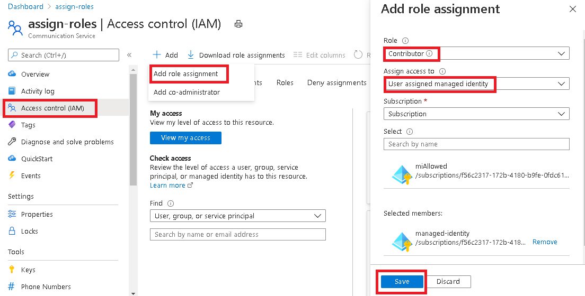

# Use managed identities
Get started with Azure Communication Services by using managed identities. The Communication Services Identity and SMS client libraries support Azure Active Directory (Azure AD) authentication with [managed identities for Azure resources](../../active-directory/managed-identities-azure-resources/overview.md).

This quickstart shows you how to authorize access to the Identity and SMS client libraries from an Azure environment that supports managed identities. It also describes how to test your code in a development environment.

## Prerequisites

 - An Azure account with an active subscription. [Create an account for free](https://azure.microsoft.com/free)
 - An active Communication Services resource and connection string. [Create a Communication Services resource](./create-communication-resource.md?pivots=platform-azp&tabs=windows).

## Setting Up

### Enable managed identities on a virtual machine or App service

Managed identities should be enabled on the Azure resources that you're authorizing. To learn how to enable managed identities for Azure Resources, see one of these articles:

- [Azure portal](../../active-directory/managed-identities-azure-resources/qs-configure-portal-windows-vm.md)
- [Azure PowerShell](../../active-directory/managed-identities-azure-resources/qs-configure-powershell-windows-vm.md)
- [Azure CLI](../../active-directory/managed-identities-azure-resources/qs-configure-cli-windows-vm.md)
- [Azure Resource Manager template](../../active-directory/managed-identities-azure-resources/qs-configure-template-windows-vm.md)
- [Azure Resource Manager client libraries](../../active-directory/managed-identities-azure-resources/qs-configure-sdk-windows-vm.md)
- [App services](../../app-service/overview-managed-identity.md)

#### Assign Azure roles with the Azure portal

1. Navigate to the Azure portal.
1. Navigate to the Azure Communication Service resource.
1. Navigate to Access Control (IAM) menu -> + Add -> Add role assignment.
1. Select the role "Contributor" (this is the only supported role).
1. Select "User assigned managed identity" (or a "System assigned managed identity") then select the desired identity. Save your selection.

#### Assign Azure roles with PowerShell

To assign roles and permissions using PowerShell, see [Add or remove Azure role assignments using Azure PowerShell](../../../articles/role-based-access-control/role-assignments-powershell.md)

::: zone pivot="programming-language-csharp"
[!INCLUDE [.NET](./includes/managed-identity-net.md)]
::: zone-end

::: zone pivot="programming-language-csharp"
[!INCLUDE [Java](./includes/managed-identity-java.md)]
::: zone-end