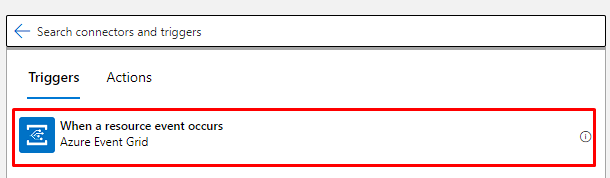
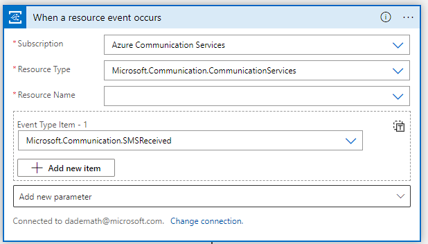
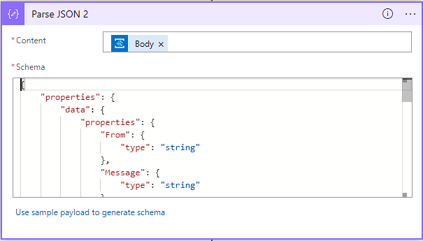
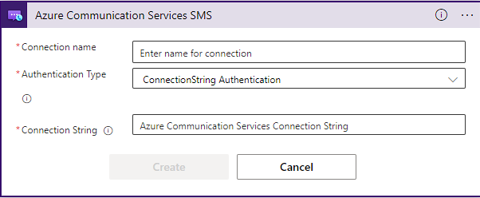
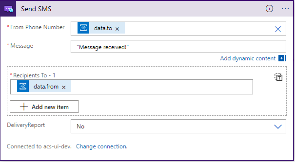

Logic Apps and Power Automate provide out of the box connectors to help handle events generated by Azure Communication Services through Event Grid. Both Logic Apps and Power Automate provide the same set of connectors. It's up to you to decide what you prefer, read about the [differences between the services](/microsoft-365/community/power-automate-vs-logic-apps) to inform your decision.

## Handling events with the Event Grid connector

1. Start by creating a new flow in your preferred environment. Pick the `When a resource event occurs` trigger to get started.

    

2. Now, lets configure it. The connector requires you to provide a subscription you want to use. (Should be the same subscription where your Azure Communication Services resource is). Specify the type of resource. In this case, choose `Microsoft.Communication.CommunicationServices`. Then you need to provide a resource name for the Azure Communication Services resource you want it to connect to. Finally, we need to pick the event types we want to receive, in this case: `Microsoft.Communication.SMSReceived`.

    

    The connector automatically sets up the event subscription on your behalf and configures the events it wants to receive.

3. To make our lives easier later on, add a `Parse JSON connector` to process response coming from the Event Grid connector. Configure the connector to take the `Body` object from the Event Grid connector and match it to our expected schema for the event:

    <details>
    <summary><b>Sample schema (open to see)</b></summary>

    ```json

        {
            "properties": {
                "data": {
                    "properties": {
                        "From": {
                            "type": "string"
                        },
                        "Message": {
                            "type": "string"
                        },
                        "MessageId": {
                            "type": "string"
                        },
                        "ReceivedTimestamp": {
                            "type": "string"
                        },
                        "To": {
                            "type": "string"
                        }
                    },
                    "type": "object"
                },
                "dataVersion": {
                    "type": "string"
                },
                "eventTime": {
                    "type": "string"
                },
                "eventType": {
                    "type": "string"
                },
                "id": {
                    "type": "string"
                },
                "metadataVersion": {
                    "type": "string"
                },
                "subject": {
                    "type": "string"
                },
                "topic": {
                    "type": "string"
                }
            },
            "type": "object"
        }

    ```

    </details>

    

At this point, you've successfully handled the SMS event. You then have multiple options of what to do with it ranging from logging the event to responding to the SMS. In the context of this document, we will show how to respond to it. Continue reading to learn the steps to respond to the SMS.

## Responding to the SMS

1. Start by adding the SMS connector into our flow and configuring it with the information for our Azure Communication Services resource. It allows the connector to access the resource and send the SMS on our behalf. You need the `connection string` for your resource.

    

2. Next, we configure the connector with the information for the sender and recipient. We use the information from the event we received to populate them. Fip the `to` and `from` numbers to send an SMS back to the original sender. Finally, add a message.

   

Now, you can save the flow and test it by sending an SMS to the phone number associated with your Azure Communication Services resource. You should receive back a text message.

From here, the possibilities are endless. From responding to a message with a pre-canned answer, to adding a bot or simply storing responses, you can add more logic to the flow.
