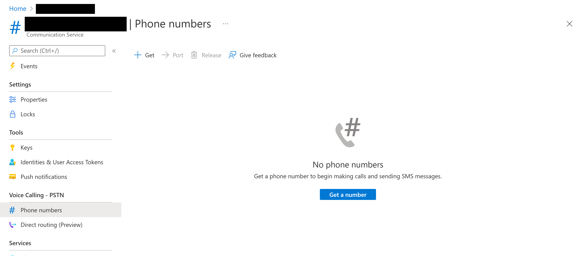
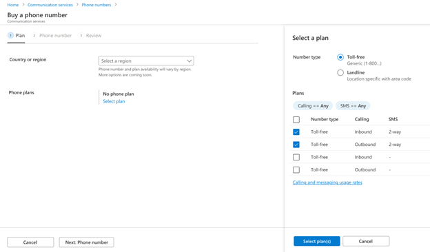
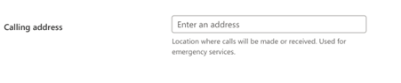
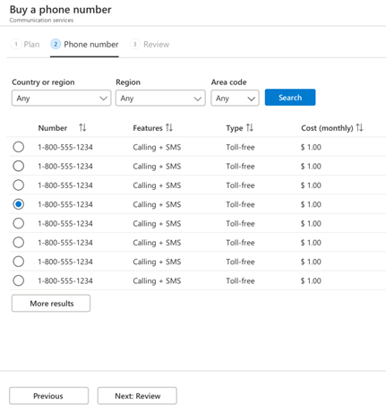
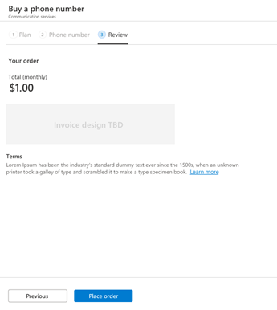
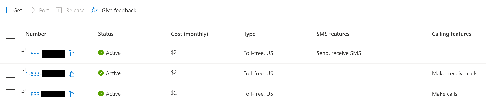
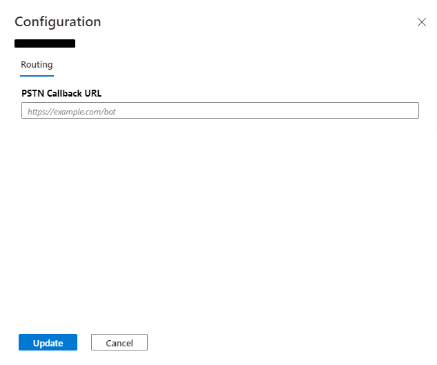

# Quickstart: Get a phone number using the Azure portal

[!INCLUDE [Public Preview Notice](../../includes/public-preview-include.md)]

Get started with Azure Communication Services by using the Azure portal to purchase a telephone number.

## Prerequisites

- An Azure account with an active subscription. [Create an account for free](https://azure.microsoft.com/free/?WT.mc_id=A261C142F).
- [An active Communication Services resource.](../create-a-communication-resource.md)

## Get a phone number

First, go to your Communication Services resource on the [Azure portal](https://portal.azure.com)

Navigate to the Phone Numbers blade in the resource menu:

Press the **Get** button to launch the wizard. The wizard on the "Phone numbers" blade will walk you through a series of questions that allows you to get the phone number that best fits your scenario. 

When you start selecting the number, you'll select the [Number Type](../../concepts/telephony-and-sms/plan-your-telephony-and-SMS-solution.md#phone-number-types-in-microsoft-direct-offer) and [Plans](../../concepts/telephony-and-sms/plan-your-telephony-and-SMS-solution.md#phone-number-types-in-microsoft-direct-offer) according to your needs.

<!-- TODO: high res version of this:  -->

You'll then be presented with the option to select a toll-free number. You can enable one-way inbound calling on your phone number. You can also enable two-way SMS.

Note that you cannot select a phone number with both inbound and outbound calling enabled. You may purchase a phone number with inbound calling enabled, and then configure the outbound caller ID to match the number of the inbound-calling-enabled phone number (what users see when you call them from your Communication Services application).

Next, the wizard will ask you for the purpose of using the number. We collect this information to apply the correct tax and emergency calling regulations.

Next, you'll provide the address where the number will be used. We collect this information for regulatory requirements.

Next, select the phone number that you want from the list:

Note that in order to make or receive calls or send/receive SMS messages, you need to consider two prices:

- **Monthly recurring charges** that cover the cost of leasing the selected phone number to you.
- **Pay-as-you-go costs** that are incurred when you make or receive calls. The price lists are [available here](../../concepts/pricing.md). These costs depend on number type and destinations called. For example, price-per-minute for a call from a Seattle regional number to a regional number in New York and a call from the same number to a UK mobile number may be different.

Finally, accept the price and tax details for the phone number.

<!-- todo: high res version of this:  -->

## Find your phone numbers on the Azure portal

Navigate to your Azure Communication Resource on the [Azure portal](https://portal.azure.com):

Select the Phone Numbers tab in the menu to manage your phone numbers.

To purchase a new number, follow the instructions [here](#get-a-phone-number).

## Configure your  phone numbers

When you select a phone number, configuration settings will be displayed for the number. These settings include routing configuration.

Here, you can add a callback address to your phone number. This allows you to direct any incoming calls to an external service or API endpoint.

## Clean up resources

You can release phone numbers from your account by selecting the phone number, then clicking the "Release" button above the list of numbers. 

>[!NOTE]
> When a resource is deleted, the phone numbers associated with that resource will be automatically released at the same time.
> For more information check out our quickstart on [Creating a Communication Resource](../create-a-communication-resource.md).

## Troubleshooting

Common questions and issues:

- Only US and Canada support purchasing phone numbers at this time. This is based on the billing address of the subscription the resource is associated with. At this time, you cannot move the resource to another subscription.

- When a phone number is deleted, the phone number will not be released or able to be repurchased until the end of the billing cycle.

- When a Communication Services resource is deleted, the phone numbers associated with that resource will be automatically released at the same time.

## Next Steps

In this quickstart you learned how to:

> [!div class="checklist"]
> * Purchase a phone number
> * Manage your phone number
> * Release a phone number

> [!div class="nextstepaction"]
> [Send an SMS](../telephony-and-sms/send-sms.md)
> [Get started with calling](../voice-and-video-calling/getting-started-with-calling.md)
