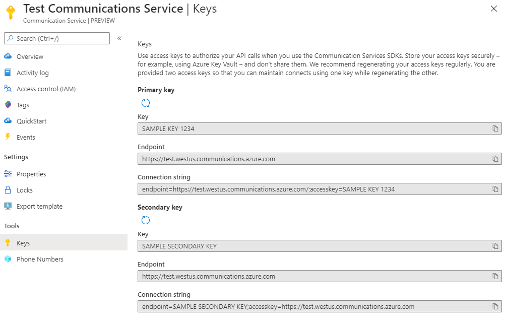

## Prerequisites

This quickstart also requires:
- **Deployed Azure Communication Service resource.** Check out the quick start for making an ACS resource in the Azure portal. [create an Azure Communication Resource](./create-a-communication-resource).
- **An ACS configured telephone number.** Sending SMS messages requires a telephone number, which ACS can help you obtain easily. Check out the quick start for telephone number management for more information. **NOTE:** For private preview, please contact Nikolay Muravlyannikov (nmurav@microsoft.com) or Phone@microsoft.com to aquire telephone numbers for your resource.
- **Download SMS SDK.** Download `Communication-SMS` Javascript SDK to send an SMS from Communication-Preview [Releases](https://github.com/Azure/communication-preview/releases).

## Installing local npm tarballs
For this quickstart you will need the tarballs for packages: sms, common and configuration.

After you've downloaded and unzipped a Release from the communication-preview repo ([here](https://github.com/Azure/communication-preview/releases)) you need to install the contained packages. Run `npm install <package>.tgz` to install a package.

Install `@azure/communication-common ` first because packages need to be installed in dependency order in order to succeed.

Navigate to the installed package in your `node_modules` folder to find a **README.md** for each package that explains usage with examples.

## Obtain a connection string
Connection strings provide addressing and key information necessary for service clients to connect and authenticate to Azure Communication Services to drive activity. You can get connection strings from the Azure portal or programmatically with Azure Resource Management (ARM) APIs.

In the Azure Portal, use the `Keys` page in `Settings` to generate keys.



## Authenticate the SMS client and send a SMS message
Once the module has been installed, we are ready to implement a few lines of code to create an SMS client and send a message. We will start by:
1. Adding necessary ACS SDK references for SMS
2. Creating our SMS client using the constructor `SmsClient`
3. Creating and sending a message using the `send` method

```javascript
var sms = require('@azure/communication-sms');

//Connection string from Azure portal
let connectionString = CONNECTION_STRING;

//Instatitate the SMS client
let smsClient = new sms.SmsClient(connectionString);

//Compose message to be sent
smsClient.send(
    from: "+15551111111", //From, phone number aquired by your account
    to: ["+15552222222"], //To, user's phone number. This is passed as an array of numbers, so multiple recipients can be added
    message: "Hello World 👋🏻 via Sms", //Message
);
```

## Send a SMS message and enable Delivery Reports
Lets modify above code to enable Delivery Report for the message sent. We will do this by:
1. Adding `send options` to our send method with `enableDeliveryReport` set to `true`
2. On success, the send method will return a `MessageId` which we can use to correlate with the `DeliveryReport` sent to `Event Grid`.

```javascript
smsClient.send(
    //Send Request
    {
    to: ["+18143216323"], //To, phone number aquired by your account
    from: "+18444020839", //From
    message: "Hello World 👋🏻 via Sms"
    },
    //Send Options
    {
        enableDeliveryReport: true
    }
).then((messageId) => {
    //Log the message Id, but you can insert additional logic here.
    console.log(messageId);
});
```

## Add EventGrid Subscription for Sms Events
Sms events in Azure Communication Service can be subscribed using EventGrid Subscription of the Azure communication resource. Below are sample instructions using Webhook.

//TODO
