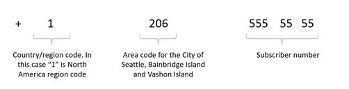
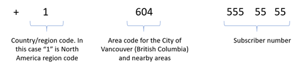

# Quickstart: Plan your Telephony and SMS solution

> [!IMPORTANT]
> Azure Communication Services is currently in public preview.
> This preview version is provided without a service level agreement, and it's not recommended for production workloads. Certain features might not be supported or might have constrained capabilities. 
> For more information, see [Supplemental Terms of Use for Microsoft Azure Previews](https://azure.microsoft.com/support/legal/preview-supplemental-terms/).

This document describes the telephony numbers and plans in Azure Communication Services and guides you to select the appropriate offer. Regardless of whether you are new to the telephony world or a seasoned professional, the information will help you make the right decision for your solution.
We will walk you through the decision flows on selecting a voice service provider, phone number types, plans (or capabilities) available from Microsoft, and suggest next steps.

## About phone numbers in Azure Communications Services

Azure Communication Services allows you to use phone numbers to receive telephony calls and send or receive SMS messages. You also can use phone numbers in your caller ID on outbound calls.  Microsoft offers a variety of options depending on the country and your needs.
If you want just to try Azure Communications Services or build a new project with no requirements to bring the existing phone number, the simplest way would be to get a new phone number from Microsoft in a matter of minutes.

> [!NOTE]
> Microsoft does not provide voice telephony services in each country. We keep expanding the countries rapidly. If your country is not served by Microsoft directly, you can interconnect the telephony via the SIP interface on your own or with our partners' help. The SIP interface does not allow interconnection with your own carrier for sending and receiving the SMS

If your customer has an existing phone number and they want to keep using in your solution (for example, 1 800 – COMPANY), you have several choices.
If Microsoft provides voice calling services in your country, you can port the phone number from the existing partner to Microsoft.
If you do not want to port the number (keep it with the existing partner) or Microsoft does not yet provide the voice calling services in your country, you can interconnect your partner via the Azure Communication Services SIP Interface (available soon)
The following diagram helps you to navigate through the available options, based on your scenario

Now let look at the phone number types and plans (capabilities) available in the Microsoft direct offer. If you want to interconnect your carrier, the phone number types and plans might or might not match the Microsoft offers. Note you cannot interconnect your carrier for SMS, you can only interconnect for making or receiving voice calls. Please consult your carrier on the phone number types and offers.
For the guide on how to interconnect your carrier, please proceed here [LINK]

## Microsoft direct offer of phone numbers and capabilities

Azure Communication Services provides excellent flexibility for developers. On most phone numbers, we allow you to configure an "a la carte" set of plans. Some developers only need an inbound calling plan; some might opt for inbound calling and outbound SMS plans. When you purchase numbers from or port your number to Microsoft, you can select plans that best suit your project.
The available plans depend on the country and phone number type. The diagram below represents the decision flow.

Let now dig deeper into the number types, plans, and countries where the numbers are available. Before you can select a phone number type, let’s review the international numbering plan.

### Optional reading. International public telecommunication numbering plan (E.164)

> [!NOTE]
> We recommend reviewing this information even if you are familiar with the E.164 phone numbering plan to better understand the number types and capabilities, offered in the Azure Communication Services direct offer.

The international public telecommunication numbering plan is defined in The International Telecommunication Union (ITU) recommendation E.164. Conforming numbers are limited to a maximum of 15 digits.
The phone number consists of
-	Prefix “+”
-	International dialing prefix or country/region code (one, two or three digits) 
-	(Optional) National destination code or Numbering plan, commonly referred to as area code. The length depends on the country. In the US, it is three digits. In Australia and New Zealand, one.  Germany, Japan, Mexico, and some other countries have variable lengths of the area codes. For example, in Germany, the area code can be 2 to 5 digits, in Japan 1 to 5
-	Subscriber number

> [!NOTE]
> The classification above does not fully conform to the ITU E.164 standard and intended to provide a simplified description. For example, the Subscriber number is future subdivided in the standard. If you are interested in learning about the international numbering plan more deeply, the ITU E.164 standard is an excellent place to start  

Here are some examples to better understand the numbering plan

A regional phone number in the US

A regional phone number in Canada

A Toll- free number in North America region

A Mobile phone number in the UK

Now as we understand the numbers types, let look at specific number types available in Azure Communication Services.

### Phone number types in Microsoft direct offer

Microsoft offers Regional, Toll-Free, and plans to offer the Short codes and Mobile numbers (in countries where applicable).
The table below summarizes the types of offers. 

| Phone number type | Example | Country availability | Common use case |
| ----------------- | ------- | -------------------- | --------------- |
| Regional | +1 (geographic area code) XXX XX XX | US, Canada, Puerto Rico | Assigning phone numbers to users in your applications or assigning to Interactive Voice Response (IVR) systems/Bots|
| Toll-Free | +1 (toll-free area code) XXX XX XX | US, Canada, Puerto Rico | Assigning to Interactive Voice Response (IVR) systems/Bots, SMS applications |

### Plans 

Let’s look at the plans or capabilities you can enable.
Microsoft offers multiple options to select capabilities that you can enable for the selected number. The capabilities vary by country due to different regulations.
Microsoft offers the following capabilities
- One-way outbound SMS, useful for notification and two-factor authentication scenarios
- Two-way inbound and outbound SMS, a predefined package which allows the SMS to be sent and received as part of one plan
- PSTN calling, you can select an inbound calling and use the Caller ID to place outbound calls         

**Next steps:**

*Quickstarts*

-	Use quick start to Search and aqcuire a phone number	
- Use quick start to make your first call or send an SMS

*More related concept documents*

-	Familiarize with call types available in ACS
-	Review call flows and SMS flows
-	Understand for what you will and will not be charged 
