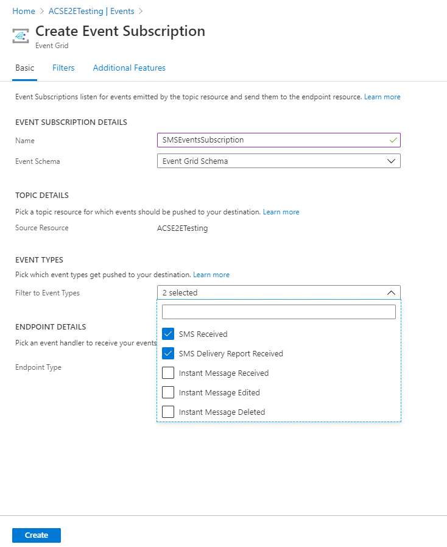
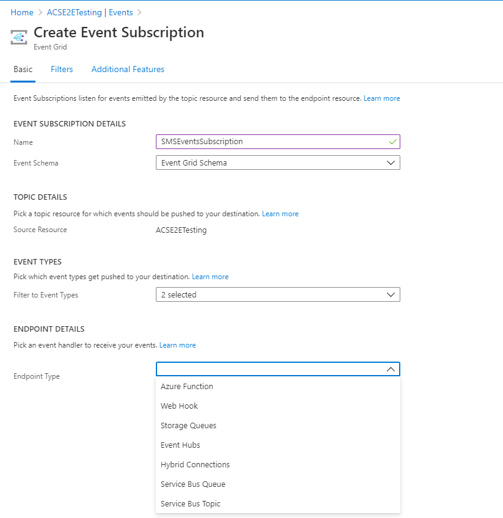
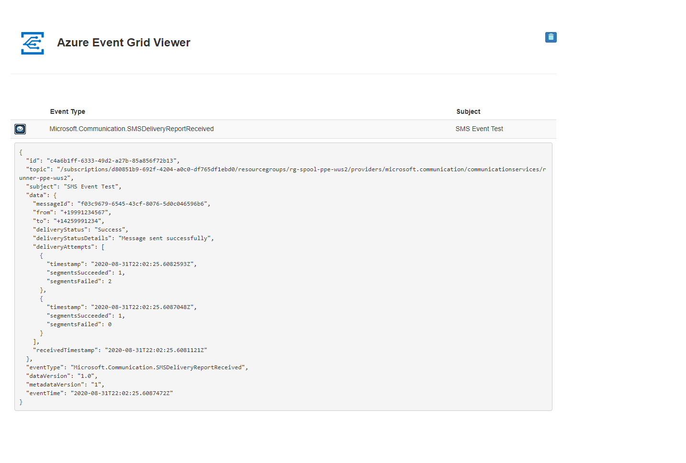

# Quickstart: Handle SMS events

[!INCLUDE [Public Preview Notice](../../includes/public-preview-include.md)]

> [!WARNING]
> This document is under construction and needs the following items to be addressed: 
> - Screenshots should be updated (Richard will handle this)
> - Show how to emit an sms event and consume using the event grid event viewer app instead of forcing the user to implement an api endpoint.
> - Explain how to delete the event subscription from the portal
> - This needs to be aligned / reference to/from the **Handle Chat events quickstart** and the **event handling** conceptual

Get started with Azure Communication Services by using Azure Event Grid to handle Communication Services SMS events. 

## Prerequisites
- An Azure account with an active subscription. [Create an account for free](https://azure.microsoft.com/free/?WT.mc_id=A261C142F). 
- An Azure Communication Service resource. Further details can be found in the [Create an Azure Communication Resource](../create-communication-resource.md) quickstart.
- An SMS enabled telephone number. [Get a phone number](../get-phone-number.md).
- Enable Delivery Reports for SMS. For more information on this look [here](../telephony-sms/send.md)

## About Azure Event Grid

Azure Event Grid is a cloud-based eventing service. In this article, you'll learn how to subscribe to events for communication service events, and trigger an event to view the result. Typically, you send events to an endpoint that processes the event data and takes actions. In this article, we'll send the events to a web app that collects and displays the messages.

## Enable Event Grid resource provider

If you haven't previously used Event Grid in your Azure subscription, you may need to register the Event Grid resource provider.

In the Azure portal:

1. Select **Subscriptions** on the left menu.
2. Select the subscription you're using for Event Grid.
3. On the left menu, under **Settings**, select **Resource providers**.
4. Find **Microsoft.EventGrid**.
5. If not registered, select **Register**. 

It may take a moment for the registration to finish. Select **Refresh** to update the status. When **Status** is **Registered**, you're ready to continue.

## Subscribe to the SMS Events using web hooks

In the portal, navigate to your Azure Communication Services Resource that you created. You can then subscribe to specific topics to tell Event Grid which of the SMS events you want to track, and where to send the events.

Next, inside the Communication Service resource, select **Events** from the left menu of the **Communication Services** page.

Press **Add Event Subscription** to enter the creation wizard.

On the **Create Event Subscription** page, Enter a **name** for the event subscription. Then, enter a **name** for the **system topic**.
   
Select the events you'd like to subscribe to from the dropdown menu. For SMS you'll have the option to choose `SMS Received` and `SMS Delivery Report Received`.

Select **Web Hook** for **Endpoint type**. 

       
For **Endpoint**, click **Select an endpoint**, and enter the URL of your web app. Then select **Confirm Selection**.

   
Now, on the **Create Event Subscription** page, select **Create** to create the event subscription. 

In order to display events from Azure Event Grid in near-real time, you can build the site that refreshes as messages are received. Please follow  This will provide the user with the experience of a real-time feed. In addition, the payload of each event should be available for inspection as well.

Now you can enable delivery reports or receive messages on your phone number to see them at your configured endpoint. When you receive a delivery report or a message, you will notice that  `SMS Received` and `SMS Delivery Report Received` events are sent to your endpoint. Select the eye icon to expand the event data.  

## Clean up resources

If you want to clean up and remove a Communication Services subscription, you can delete the resource or resource group. Deleting the resource group also deletes any other resources associated with it. You can find out more about cleaning up resources [here](../create-communication-resource.md#clean-up-resources).

## Next Steps

In this quickstart, you learned how to consume SMS events. You can receive SMS messages by creating an Event Grid subscription.

> [!div class="nextstepaction"] 
> [Send SMS](../telephony-sms/send.md)
